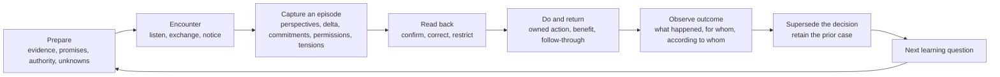

# ACT relational learning protocol

## From The Field to an evidence-bearing decision practice

**Working protocol — 28 July 2026**

> GrantScope should not tell ACT how valuable, warm or advanced a relationship is. It should help ACT remember what happened, preserve different perspectives, honour what is owed, notice what changed, and make the next decision with better evidence.

This protocol is the relational companion to [GrantScope as the evidence and decision layer](./goods-relationship-led-funding-intelligence.md). It corrects the parts of that memo that still relied on universal scores, relationship levels and pipeline-like progression.

It is designed to be learned through use. The model should change because real episodes expose missing distinctions, not because a dashboard needs more fields.

### Evidence labels

- **Verified** — present in current code, live data, or a canonical ACT concept.
- **Inferred** — the most plausible interpretation of verified evidence.
- **Proposed** — the operating practice to trial.
- **Unknown** — deliberately unresolved until a person with the right knowledge or authority addresses it.

---

## 1. The answer first

The unit of learning is not a contact, a pipeline stage, a warmth score or a grant.

It is a **relational episode around a real matter**:

```text
people and organisations
  + a shared matter
  + evidence and perspectives
  + authority and permission
  + contributions and returns
  + commitments and tensions
  + a decision or changed understanding
  + what happened afterwards
```

A relationship is the living pattern that becomes visible across those episodes. It must not be stored as one number or one stage.

The smallest useful ACT loop is:



GrantScope should assemble the memory and evidence around this loop. Humans remain responsible for relationship, interpretation, consent, authority, commitment and judgment.

---

## 2. What ACT has already built

The prior relational work in `/Users/benknight/Code/act-global-infrastructure` is not a discarded side project. It contains important philosophy, working capture tools, data plumbing and hard-won corrections.

There is one repository-status contradiction to resolve separately: `DEPRECATED.md` says the repository moved to `act-ecosystem` in January 2026, while its latest Git commit is dated 28 July 2026 and current operational files continue to live there. This protocol treats the repository as current prior art but makes no claim that it is the approved long-term code home.

### 2.1 The lineage worth carrying forward

| Existing ACT idea or mechanism | What it already understood | Treatment here |
|---|---|---|
| `wiki/concepts/soul.md` | Dashboards become harmful when they become the work; showing up and returning what people gave matters more | **Keep as the first product test** |
| `wiki/concepts/lcaa-method.md` | Listen → Curiosity → Action → Art → Listen is a non-linear practice, not a delivery funnel | **Keep as the human rhythm** |
| `wiki/concepts/the-field.md` | Relationships are a field to read and tend, not leads to move; one person can hold many relationships | **Keep, then make matter-specific and evidence-bearing** |
| `wiki/concepts/relationship-first-crm.md` | Belonging and shared doing must not be reduced to money | **Keep the refusal; retire the ladder as relationship truth** |
| `wiki/concepts/ecosystem-value-exchange.md` | Reciprocity matters; community holds rights and ACT owes benefit and return | **Keep as directional contribution/return obligations, not an exchange ladder** |
| `wiki/concepts/consent-as-infrastructure.md` | Consent is scoped, changing and revocable, not a boolean | **Keep as an evented permission record** |
| `wiki/concepts/governed-proof.md` | Claims need provenance, authority, confidence, gaps, review and publication boundaries | **Keep as the evidence discipline** |
| `wiki/concepts/alma.md` | ALMA is an evidence-graded catalogue with independent dimensions, not a process, agent or single ranking | **Keep the separation between catalogue, judgment and governed use** |
| `wiki/concepts/evidence-as-by-product.md` | Evidence should be captured as work happens; contrary signals must survive | **Keep as the capture rule** |
| `wiki/concepts/beautiful-obsolescence.md` | A good system builds handover, correction, export and ACT's irrelevance into the work | **Keep as an outcome test** |
| `wiki/concepts/social-soil-canvas.md` | A review should produce one decision, one pattern and one proof target rather than another backlog | **Keep as the monthly reflection ritual** |
| Goods Community Impact Cycle review | Authority → local goals → events → voice → claims → interpretation → decision → return → next goal | **Keep as the bridge from episodes to community-defined outcomes** |
| `scripts/field-capture.mjs` | Frictionless, append-only capture works better than retrospective reconstruction | **Reuse the append-only pattern** |
| `scripts/lib/field-warmth.mjs` | Machine warmth had zero correlation with Ben's hand-read rings; contact volume can only be a factual signal | **Keep the empirical correction** |
| `scripts/build-person-pages.mjs` | A useful brief combines institutional soil, public evidence, shared history and human reflection | **Evolve into authored perspectives and bounded evidence** |
| `scripts/build-morning-read.mjs` | A small daily surface is more usable than an exhaustive CRM | **Reuse the bounded surface; change its triggers** |
| `scripts/field-workbench.mjs` | Human review should supersede machine suggestions and writes should be gated | **Reuse the review and audit pattern; replace energy/ring verdicts** |

### 2.2 The internal contradiction

The ACT work contains two different logics.

The deeper logic says:

- people are not leads;
- community is not a segment to extract from;
- relationships are contextual and plural;
- evidence should accumulate through work;
- consent and authority are ongoing;
- shared doing matters more than contact volume; and
- the system should help people tend, learn, return and hand over.

The inherited CRM logic still says:

- `cold → warm → engaged → active → partner`;
- relationship temperature is `0–100`;
- people sit in universal rings or tiers;
- email recency can trigger “cooling”;
- “warm but unasked” is “latent gold”;
- a person can be judged “warm enough to ask”; and
- a single human read is stored as ground truth.

Those cannot both govern the new model.

### 2.3 What the live system shows

**Verified in the shared Supabase project on 28 July 2026:**

- `relationship_pipeline` contains **1,000** rows, all in only two stages: 877 `active` and 123 `warm`.
- Its average `love_score` is **0.00** in both stages, while money and strategic scores are populated.
- `relationship_health` contains **2,256** rows, all with a temperature; average temperature is **12.67**.
- 381 health rows contain machine sentiment, while none contains a relationship summary.
- `communications_history` contains **30,982** rows.
- `opportunity_context_events` contains only **137** rows, dominated by 94 Gmail context events and 15 Notion context events.
- Only three context events are labelled `relationship`, three `warm_intro`, and the canonical `opportunity_decisions` table contains only four near-identical `research` decisions.

**Inferred:** ACT has substantial contact and scoring infrastructure, but almost no structured memory of human judgment, mutual commitments, permission, tension, return or changed understanding.

That is the gap to fill.

---

## 3. What the model must distinguish

These distinctions are non-negotiable because collapsing them creates false certainty.

| Do not collapse | Distinction |
|---|---|
| Person ↔ relationship | One person can participate in several relationships, roles and matters |
| Organisation ↔ person | Institutional power, employment and personal connection are different facts |
| Contact ↔ relationship | An address, CRM row or email thread proves contactability or interaction, not trust |
| Interaction ↔ episode | A message is a source event; an episode is the bounded human meaning made around a matter |
| Statement ↔ commitment | “We should” is not “I will do this by then” |
| Commitment ↔ decision | A promise between people is not automatically an ACT governance decision |
| Decision ↔ action | Choosing a direction is not evidence that work happened |
| Action ↔ outcome | Sending, meeting or applying is not evidence of benefit |
| Outcome ↔ significance | What happened and what it meant, to whom, are different claims |
| Contribution ↔ return | What another party contributed and what ACT returned are directional obligations |
| Permission ↔ authority | Permission to use something does not establish authority to speak for a community |
| Public role ↔ access | A board page suggests a research route, not a warm introduction |
| Payment ↔ relationship | Money proves a transaction, not present intent or relational quality |
| Recency ↔ care | Time since contact can be factual; it cannot say that a relationship is cold or neglected |
| Confidence ↔ truth | Confidence belongs to a claim and its evidence, not to a person |
| Unknown ↔ negative | Missing evidence stays unknown; it is not silently treated as “no” |

---

## 4. The relational ontology

### 4.1 Party

A person, organisation, community, ACT project or recognised collective participating in a matter.

Every party reference needs:

- a canonical ID where one exists;
- the role **in this matter**, not a universal identity label;
- provenance for institutional or public roles;
- any protection floor that follows the party;
- an authority basis where the party represents others; and
- an explicit distinction between confirmed person and possible connector.

### 4.2 Relationship thread

A **relationship thread** is a durable, matter-specific context involving two or more parties.

Examples:

- Goods and a foundation exploring match-eligible productive capacity;
- Goods, a community-controlled organisation and a delivery partner designing a local manufacturing node;
- ACT and a buyer resolving a product trial and repeat order;
- a funder, community authority and ACT considering a shared evidence claim.

It is not “the relationship between ACT and Organisation X” in the abstract.

A thread holds:

```text
thread_id
title
matter_or_initiative
project_refs[]
party_refs[]
purpose
community_authority_refs[]
protection_floor
visibility
current_learning_question
opened_at
closed_at
```

`open` and `closed` describe whether the matter is active. They are not relationship stages.

### 4.3 Relational episode

A **relational episode** is a bounded encounter or exchange that changes, tests or confirms something in a relationship thread.

It may be:

- a meeting;
- a phone or video call;
- a meaningful email exchange;
- an introduction;
- a site visit;
- shared delivery work;
- a community deliberation;
- a decision review;
- a moment of tension or repair;
- delivery of something owed; or
- an observed outcome.

Routine messages may remain source events until a human says they form a substantive episode.

### 4.4 Perspective

A perspective is an attributable interpretation:

```text
speaker_or_author
what_they_said_or_understood
source_ref
captured_by
confidence
visibility
confirmed_at
contested_by[]
```

No perspective silently overwrites another.

Ben's read, an AI draft, a funder's view and a community authority's interpretation are different perspectives. For claims about community priorities, meaning, permission or authority, the relevant community/rightsholder interpretation governs.

### 4.5 Commitment

A commitment is directional:

```text
promisor
recipient_or_beneficiary
what
due_or_review_date
acceptance_state
evidence_of_acceptance
state
completion_evidence
changed_or_released_by
```

Useful states are:

```text
proposed
offered
accepted
fulfilled
changed
declined
overdue
released
contested
```

These are commitment states, not stages of the relationship.

### 4.6 Contribution and return

Record movement in both directions without turning it into a balance score.

```text
from_party
to_party
contribution_or_return
kind
intended_benefit
evidence_ref
recipient_interpretation
occurred_at
```

Kinds may include time, knowledge, story, cultural authority, introduction, labour, money, product, platform, attribution, evidence, infrastructure, repair or handover.

The system may show that a return is still owed. It must not decide that two unlike contributions are “balanced”.

### 4.7 Permission and authority

Permission is scoped and evented:

```text
permission_type
rightsholder
scope
context
granted_or_declined
effective_from
review_or_expiry
withdrawn_at
source_ref
system_of_record
```

Types include collection, processing, internal use, sharing, attribution, publication, syndication and AI use.

Authority records who can decide or speak in a particular context. Authority may be:

```text
unknown
asserted
evidenced
confirmed_by_rightsholder
contested
expired
```

These values are not a ranking.

### 4.8 Tension, dissent and repair

Relational memory becomes dishonest when it records only positive movement.

A restricted event may record:

```text
what_is_in_tension
whose_perspectives_differ
material_effect
visibility
acknowledgement
repair_commitment
review_date
resolution_or_accepted_difference
```

Do not machine-infer tension from sentiment. Do not expose sensitive notes to people who do not have a legitimate need to see them.

### 4.9 Decision, action and outcome

- **Decision** — what ACT or another authorised body chose, why, and on which evidence.
- **Action** — a concrete next step with an owner and date.
- **Outcome** — what observably happened.
- **Significance** — what that outcome meant, according to an attributed party.
- **Superseding decision** — a new judgment that preserves, rather than mutates, the prior case.

---

## 5. The human relational episode

The episode is deliberately short enough to use.

### 5.1 Before — five-minute evidence brief

GrantScope assembles:

- the matter and why it is active now;
- the relevant people, organisations and roles;
- prior episodes and the last confirmed understanding;
- open ACT commitments and returns owed;
- commitments made to ACT;
- current permission and authority boundaries;
- known tensions or contradictions, with access controls;
- verified money, delivery and program facts;
- what is unknown; and
- **one next learning question**.

The person preparing adds:

- what value ACT can return in this encounter;
- what must not be assumed;
- whether this is a conversation, an ask, a repair, a decision or simply listening; and
- whose authority is required before anything can move.

### 5.2 During — listen before classifying

The human does not fill a CRM form during the encounter.

Listen for:

- what matters to each party;
- what each party thinks is happening;
- what has changed since the last episode;
- decisions and commitments stated explicitly;
- what is offered, requested or owed;
- uncertainty, dissent or refusal;
- permission and attribution boundaries; and
- language the party uses for the matter.

The purpose is not to extract fields. It is to understand enough to act responsibly.

### 5.3 After — ten-minute reflection

Capture only the material delta:

1. What happened?
2. What did each party appear to understand or value?
3. What changed in **our** understanding?
4. What remains unknown or contested?
5. What commitments were explicitly made, by whom, to whom and by when?
6. What did the other party contribute?
7. What does ACT owe or need to return?
8. What permission or authority changed?
9. Was a decision made?
10. What is the next learning question?

The capture author labels inference as inference. AI may propose an extraction, but a human confirms it.

### 5.4 Read-back and correction

For material commitments, community claims, public attribution or sensitive interpretations:

- send a short read-back in ordinary language;
- let the relevant party correct it;
- record confirmation, correction, restriction or non-response;
- do not treat non-response as consent; and
- link to Empathy Ledger when it owns consent or community evidence.

### 5.5 Follow-through

When work happens, append an event:

- fulfilled;
- partly fulfilled;
- changed by agreement;
- blocked;
- declined;
- released;
- overdue; or
- outcome observed.

Do not advance a relationship stage.

### 5.6 Reflection and learning

After an outcome, ask:

- What did we predict?
- What happened?
- According to whom did it help, harm or not matter?
- Which assumption was wrong?
- Which prior decision should be superseded?
- What should the next brief remember?
- Did this increase the other party's ability to act without ACT?

This is the LCAA return to Listen. It is a rhythm, not a gated workflow.

---

## 6. The relationship portrait

GrantScope may derive a current **portrait** from episodes. It must display evidence and disagreement, not collapse them.

A useful portrait contains:

```text
The matters connecting us
The people and organisations involved
What each party says matters
What we currently understand
What remains unknown or contested
Authority and permission boundaries
What has moved in each direction
Open commitments to ACT
Open commitments by ACT
Returns or repairs owed
Decisions and their evidence
Observed outcomes and attributed significance
The next learning question
The next mutual move, if one exists
```

There is no overall:

- relationship score;
- warmth;
- temperature;
- health percentage;
- maturity stage;
- trust score;
- sentiment;
- reciprocity balance; or
- “relationship advancement”.

Factual contact recency may be shown with its source. It is not interpreted as care, trust or cooling unless a human has explicitly agreed a cadence in that relationship thread.

---

## 7. How attention is chosen without ranking people

GrantScope should not sort people by worth. It can sort **matters requiring attention** by deterministic conditions.

An item enters the bounded weekly queue when:

1. an ACT commitment or return is due or overdue;
2. a promised response or review date has arrived;
3. permission or authority needs review;
4. new authoritative evidence contradicts a prior decision;
5. an outcome has occurred but has not been interpreted;
6. a material unknown blocks a current decision;
7. a party has requested a decision, repair or response;
8. a human explicitly marks the matter for the next review; or
9. a current opportunity deadline makes a named decision necessary.

Within a condition, order by:

- the due or review date;
- the date authoritative evidence changed;
- the severity of an unfulfilled ACT obligation; then
- the date a human requested review.

Do not use:

- email count;
- social proximity;
- a universal score;
- likely donation size;
- institutional prestige;
- machine sentiment; or
- “warm enough to ask”.

An empty queue slot is valid.

---

## 8. What each system owns

| System | Owns | Must not be asked to own |
|---|---|---|
| **GrantScope / CivicGraph** | Canonical parties; public and institutional evidence; relationship threads; interpreted episodes; decisions; linked actions/outcomes; prior-case memory | Raw private narrative; consent authority it does not hold; a scalar relationship truth |
| **HighLevel** | Contact execution; owner; concrete next action; due date; explicit grant, ask or commercial deal after human promotion | Relationship meaning, trust, community authority, a universal lifecycle |
| **Gmail / calendar / messaging sources** | Raw communication and meeting evidence | Interpretation of relationship quality |
| **Xero** | Invoices, payments and accounting basis | Present intent, trust, impact or relationship stage |
| **Goods Asset Register** | Products, orders, assets, deployment and operational evidence | Community significance or consent |
| **Empathy Ledger** | Community/story authority, consent, attribution, release, return and governed qualitative evidence | Generic CRM segmentation |
| **Notion / Drive** | Drafts, briefs, proposals, meeting artifacts and working narrative | A competing current-state pipeline |
| **ACT wiki** | Durable concepts, governance decisions, patterns and lessons | Live task execution |
| **Executed agreement repository** | Signed commitments and legal instruments | Informal relational interpretation |

HighLevel may still use a pipeline for a real grant application, philanthropic ask or commercial deal. Promotion must be a separate, explicit decision. A relational episode never creates a pipeline record automatically.

---

## 9. What automation and AI may do

### May do

- assemble an evidence brief;
- resolve likely entities and show uncertainty;
- retrieve prior episodes and open commitments;
- detect duplicate records and contradictory facts;
- propose episode fields from a human-authored note;
- draft a read-back;
- remind the owner of an explicit due date;
- retrieve similar prior cases;
- show the source and age of every factual claim; and
- propose which question the evidence still cannot answer.

### May not do

- infer trust, intent, authority, consent or commitment;
- rank people by relationship value;
- label a person warm, cold, healthy or risky;
- infer community significance from story frequency or sentiment;
- convert a public role into access;
- decide that silence means agreement;
- decide that contributions are balanced;
- advance a relationship stage;
- send outreach, make an introduction request or represent community views without human approval;
- silently rewrite a prior decision; or
- train on restricted community material outside its permission scope.

The machine can keep time and assemble evidence. It cannot hold the relationship.

---

## 10. The first Goods learning slice

Do not build the universal relational platform first.

Build one Goods-only loop:

> evidence-backed opening → human judgment → linked people and organisations → owned action or return → observed outcome → prior-case memory

### 10.1 Reuse what GrantScope already has

| Need | Existing GrantScope part | Minimal change |
|---|---|---|
| Evidence-bearing candidate | `act_opportunity_observatory` and the source panel in `act-record-review.tsx` | Present no more than five Goods records; retain explicit unknowns |
| Human read | The existing decision action path | Ask only what changed and what should happen or be learned next |
| Decision memory | `opportunity_decisions` | Keep the short human read as append-only JSON and allow a later read to supersede it |
| Existing context | Project, source, people and organisation refs already on the matter | Carry them through automatically; do not ask the reviewer to re-enter them |
| Event memory | `opportunity_context_events` | Add a linked event only when there is a real promise, return, action or outcome |
| Weekly work | `ActTodayFocus` | Show at most five explicitly triggered matters |
| Completion | daily-action API | Append an outcome event; do not advance a stage |
| Learning | `act-recommendation-memory.ts` | Retrieve prior cases; stop adjusting recommendation scores |

### 10.2 The whole capture

GrantScope does the reading first. For each matter it presents:

```text
what appears to be happening
why it is here now
what the evidence supports
what remains unknown
what ACT may already owe or have promised
the most useful next question
```

The human is not asked to complete that structure. The human capture is only:

```text
what changed in my understanding?
next move: act / listen / verify / revisit / close
next learning question (optional)
promise or return: who / what / by when (optional, revealed only when needed)
```

Project, source, organisation, people and evidence references come from the matter already being read. A promise or return is recorded only when someone has actually made one. These choices concern this matter; they are not relationship stages and they do not create pipeline work.

### 10.3 Deterministic queue order

1. Official evidence changed since the last review.
2. A deadline is inside 30 days and no human decision exists.
3. A named evidence gap blocks a current decision.
4. A human-set revisit date is due.
5. Everything else stays out of the weekly five.

Within each group: deadline, evidence-change time, then title.

### 10.4 Prior-case memory, not model training

Show useful precedents such as:

- prior Goods cases blocked by applicant eligibility;
- a past partner route used where a community-controlled applicant was required;
- a confirmed institution with no confirmed introduction;
- a monitored round that reopened while the same evidence gap remained;
- an action completed with no response; or
- a decision superseded after community authority changed.

Do not add or subtract points because of those cases. Five cases are material for reflection, not a trained model.

### 10.5 One-week acceptance criteria

- Five or fewer Goods cases are presented.
- The first screen is a plain-language read of what is happening, not a form.
- The reviewer is never asked to reproduce project, source, organisation, people or evidence already known by the system.
- The only always-visible human prompts are what changed, the next move and the next learning question.
- Promise/return details are optional and hidden until needed.
- Completing work appends an event and outcome; it does not advance a relationship stage.
- A later review can see and supersede the prior decision.
- No numeric score, warmth, temperature or relationship level is shown or changed.
- Recording a read never creates a pipeline item.
- No HighLevel opportunity is created without a separate explicit promotion.
- The five-case retrospective may remove a prompt; it adds a prompt only when several real cases could not be understood without it.

### 10.6 Use the first slice

After the migration is released:

1. Open the ACT **Curiosity** view (`/org/act?view=opportunities`).
2. Read one of the five-or-fewer matters. GrantScope supplies what is happening, why now, evidence and unknowns, prior case memory, anything ACT owes, and a suggested next question.
3. Add one short note about what changed and choose **Act**, **Listen**, **Verify**, **Revisit** or **Close**.
4. Add a promise or return only if somebody actually made one.
5. A real promise or return appears in **Today**. Marking it done appends an outcome event; it does not advance a relationship or opportunity stage.
6. When a matter returns because evidence changed or its revisit date arrived, the new read supersedes the earlier one while keeping the earlier case visible.

That is the whole first operating loop. There is no setup exercise, relationship scoring session or backfill form.

---

## 11. Event contract for the pilot

The list below is a future vocabulary, not an MVP schema. The first slice adds no general relationship tables and no corresponding form. It stores the short human read on `opportunity_decisions` and uses `opportunity_context_events.metadata` only for a real linked promise, return, action or outcome.

If recurring cases later justify a general append-only envelope, it may use:

```text
event_id
schema_version
org_profile_id
thread_ref
episode_ref
project_ref
initiative_ref
decision_ref
party_refs[]
event_type
occurred_at
recorded_at
recorded_by
source_system
source_ref
visibility
payload
supersedes_event_id
```

Event families:

```text
source_observed
perspective_recorded
understanding_changed
authority_asserted
authority_confirmed
permission_granted
permission_changed
permission_withdrawn
contribution_made
return_owed
return_completed
commitment_offered
commitment_accepted
commitment_changed
commitment_fulfilled
commitment_released
tension_recorded
repair_committed
repair_observed
decision_made
decision_superseded
action_owned
action_completed
outcome_observed
significance_interpreted
learning_recorded
```

Do not create all of these as required UI fields. They are a vocabulary discovered through actual cases. The capture screen should ask only for the material delta.

---

## 12. Community protection is a floor, not an exclusion

The existing Field correctly refuses to score, ladder or drip community people. The next model must go further.

The operating rule is: **no number without a voice, and no voice reduced to a number.** Operational events may be counted. Their meaning comes from community-defined goals and attributed interpretation.

A protection floor follows a person, community and relevant context:

- no automated nurture;
- no relationship score;
- no public-web profiling for leverage;
- scoped access to notes and evidence;
- community/rightsholder authority over community claims;
- consent checked at use time, not only collection time;
- contributions never treated as surrendered assets;
- ACT returns and benefit obligations visible;
- correction, restriction, withdrawal and erasure honoured;
- attribution on the rightsholder's terms; and
- export and handover available.

Protection must not make community invisible to the relationship memory. The system should record, within permission:

- what authority exists;
- what was contributed;
- what ACT owes;
- what was returned;
- what the community says mattered;
- what remains contested; and
- what may not be stored or reused.

When content cannot be recorded, retain only the minimum governed metadata needed to honour the obligation, with a reference to the authoritative system.

---

## 13. How to know whether the practice is working

### 13.1 Operational guardrails

Counts may be used to reveal obligations and system failure:

- open ACT commitments without an owner, recipient or date;
- overdue returns or repair commitments;
- permissions or authority records due for review;
- decisions blocked by named unknowns;
- conflicting claims awaiting resolution;
- actions with no observed outcome;
- decisions superseded after new evidence;
- community-linked matters without an authority reference;
- episodes awaiting read-back; and
- cases where a source is being asked to prove more than it can.

These are not scores of relationship quality.

### 13.2 Meaningful learning questions

The recurring review asks:

- What changed in our understanding?
- Whose view changed it?
- What did we stop assuming?
- What promise did we keep, change or fail to keep?
- What did the other party say was useful?
- What did ACT return?
- What tension or dissent remains?
- Did a decision improve because prior memory was available?
- Did the work increase community control, capability or ability to proceed without ACT?
- What should the system forget, restrict, correct or hand over?

### 13.3 Explicit anti-metrics

Do not report these as evidence of relational success:

- number of contacts;
- number of emails or meetings;
- response rate without context;
- warmth or temperature;
- sentiment;
- tier or ring movement;
- pipeline advancement;
- total network size;
- introductions requested;
- stories collected;
- “engagement” as a composite; or
- funding received without the use, authority, cost and outcome.

An activity count may describe workload. It does not describe meaning.

---

## 14. Learning cadence

### After each substantive episode

- capture the material delta;
- link evidence;
- record commitments, returns, permission and uncertainty;
- send a read-back where needed.

### Weekly

- review no more than five Goods matters selected by explicit triggers;
- inspect overdue ACT obligations first;
- make or supersede decisions;
- assign concrete actions;
- leave weak items out.

### Monthly

- read a small set of full cases, including one that went nowhere;
- look for repeated evidence gaps, unkept promises, missing roles and bad system boundaries;
- use the Social Soil discipline to name one thing to stop, one thing to start and one proof target;
- finish with one decision and one durable pattern, not a larger backlog;
- change one capture prompt, queue rule or evidence rule at a time;
- record why the rule changed and which cases justified it.

### Quarterly

- ask selected counterparties whether the memory and follow-through were useful to them;
- review community return, correction and withdrawal experience;
- inspect whether the system is creating surveillance, performance or extraction;
- retire fields that do not change decisions or help honour obligations;
- test whether more work can be handed over.

No silent learning from clicks. No invisible model-weight changes.

---

## 15. Immediate operating practice

Use [the relational episode template](../templates/relational-episode.md) for the next five substantive Goods conversations or decision reviews.

For each:

1. create the five-minute brief;
2. conduct the encounter without treating the template as an interview form;
3. capture the ten-minute delta;
4. confirm material commitments, authority and public claims;
5. complete or consciously renegotiate the action;
6. record the outcome and attributed significance; and
7. note which part of the template helped, got in the way or was missing.

After five episodes, change the model once.

The first implementation decision should be based on those five records:

- If the opportunity-decision fields are enough, extend the existing decision/event path.
- If multi-party, matter-specific history is consistently lost, add relationship threads and episodes.
- If consent or community return cannot be represented safely, stop and integrate the Empathy Ledger authority model before expanding.
- If a field is never used to make a decision, honour a promise or change understanding, remove it.

That is how the system continues to learn without becoming another ornate CRM.
