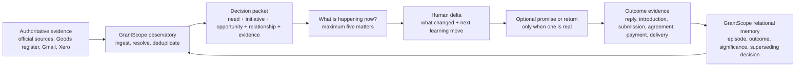
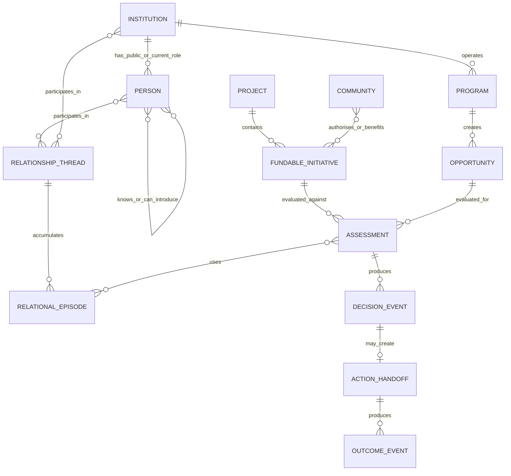

# GrantScope as the evidence and decision layer

## A relationship-led funding intelligence system for Goods and ACT

**Decision memo — 28 July 2026**

> GrantScope should not become a better grant directory. It should become the evidence and decision layer connecting ACT projects, communities, funders, people, relationships and concrete actions.

Audit basis: repository `93fb091348af25877b1d147a529d5b408ca85775` on branch `feat/ghl-goods-opportunity-tracking`; live GrantScope/Supabase data; direct Goods Asset Register evidence; current HighLevel, Notion, Gmail and Xero records; and official QBE and Northern Territory sources. No production data was changed during this session.

**Relational correction, 28 July 2026:** The original session still reproduced part of the machinery it criticised: a universal 100-point priority score, R0–R4 relationship levels, and HighLevel as owner of a relationship stage. Those constructs are superseded by [the ACT relational learning protocol](./act-relational-learning-protocol.md), developed from ACT's existing LCAA, The Field, relationship-first CRM, consent, holds/owes, governed-proof and evidence-as-by-product work in `/Users/benknight/Code/act-global-infrastructure`. The evidence audit and opportunity model below remain useful; relationship meaning is now represented through attributable episodes, commitments, permissions, contributions/returns, tensions, decisions and outcomes rather than scores or stages.

### Evidence labels

- **Verified** — directly supported by live data, code, a current authoritative internal record, or an official external source.
- **Inferred** — the most plausible explanation of the verified facts, but not itself directly recorded.
- **Proposed** — a strategy, operating rule, schema change, or action recommended here.
- **Unknown** — a material fact that must be resolved by a human or authoritative source.

---

## 1. The answer first

**Proposed:** The smallest coherent system is one bounded read that presents **no more than five matters in total**. A matter appears because evidence changed, a real obligation is due, a decision is needed, a permission boundary matters, or a named review date arrived. It does not matter whether the source system called it an opportunity, relationship or action.

GrantScope should automatically assemble the evidence packets and prior relational episodes. A human should interpret and decide. HighLevel may hold an operational next action or a real deal after explicit promotion. Outcomes should return to GrantScope as append-only learning.



The test is simple:

> If GrantScope cannot say **what the money is for, who or what community has authority, why the route is credible, what evidence is missing, and who should do what by when**, the item is not ready for the weekly queue.

This requires consolidation, not another large feature build. The essential product is:

- one canonical register of ACT projects and fundable initiatives;
- one evidence-gated opportunity record;
- one short human interpretation that can supersede an earlier interpretation;
- one relational portrait built from attributable evidence and episodes;
- one bounded weekly desk;
- one explicit action or deal handoff when needed; and
- one outcome and learning callback.

Do **not** start with a new recommender model, more generic grant feeds, autonomous outreach, or a public dashboard.

---

## 2. What the current system actually is

### 2.1 The useful foundation already exists

**Verified:** The codebase is already moving toward the right lifecycle:

`Observe → Verify → Decide → Act → Learn`

The new `act_opportunity_observatory`, evidence gate, structured benchmark review, ACT Operating Desk, relationship follow-up APIs, HighLevel mirror, communications history, Xero data and CivicGraph entities are individually useful.

**Inferred:** The central failure is not missing features. It is missing governance over identity, evidence states and system boundaries.

### 2.2 Volume is being mistaken for decision readiness

**Verified, live on 28 July 2026:**

- `grant_opportunities`: 25,717 rows.
- `alma_funding_opportunities`: 1,803 rows.
- ACT recommendation materialized view: 5,774 rows.
- `act_opportunity_observatory`: 0 rows.
- Only 530 legacy ALMA rows met the broad “verified and open/current” recommendation filter.
- Of those 530, 487 had no deadline, all were last verified more than 30 days earlier, 53 had no source URL, 216 lacked eligible organisation types, and 322 lacked an amount.

The legacy verifier treats a successful HTTP response as verification in `scripts/verify-alma-opportunities.mjs`, while the triage route marks a classified `open_grant` as verified. The newer `scripts/lib/grant-evidence-gate.mjs` correctly demands an official source, a named opening, timing, eligibility, amount, concrete project fit and retrieval provenance.

**Inferred:** The system currently rewards the appearance of coverage. It does not reliably distinguish “a page exists” from “ACT can make a defensible decision now.”

**Proposed:** Only the evidence gate may confer the state `verified_current`. URL liveness, ingestion recency, search-result evidence and official-source verification must remain separate states.

### 2.3 The current recommendation queue is not a useful weekly queue

**Verified:**

- The legacy UI exposes thousands of recommendation rows and defaults to a score threshold.
- Its score is dominated by keyword theme, geography, eligibility arrays, timing and historical track-record signals.
- Null deadlines receive a positive timing score rather than being treated as unknown.
- A reproduced actionability check left one actionable recommendation across the portfolio and zero for Goods.
- Eleven project codes are currently in recommendation scope, even though the page describes six projects.

**Inferred:** A universal similarity score is answering “what looks vaguely relevant?” when Ben needs “what deserves scarce human effort this week?”

**Proposed:** Retire `/ops/grant-recommendations` as the primary work surface. Keep it temporarily as a legacy audit/debug view. The evidence-gated ACT Operating Desk should become the only weekly decision surface.

### 2.4 Human decisions and financial history are mixed together

**Verified:**

- `act_grant_recommendation_decisions`: 89 rows — 62 `passed`, 26 `won`, one `watching`.
- Many `won` rows are historical Xero paid invoices backfilled as outcomes, not successful grant-application decisions.
- `opportunity_decisions`: four rows, all near-duplicate Goods `research` decisions.
- The current decision schemas cannot consistently record a concrete use of funds, applicant route, eligibility confidence, effort, relationship route, evidence gaps, owner, next action and due date.

**Inferred:** The system cannot learn correctly while “we were paid historically,” “we pursued this,” “we passed,” and “we won an application” share the same outcome vocabulary.

**Proposed:** Separate:

- historical money;
- opportunity assessment;
- pursuit decision;
- operational stage;
- submission/ask;
- outcome; and
- payment/delivery proof.

### 2.5 The current benchmark is not safe for model evaluation

**Verified:**

- 100 benchmark cases exist.
- The label distribution is 74 `not_relevant`, one `relevant`, and 25 unlabelled.
- The builder maps legacy `watching → relevant` and `passed → not_relevant`.
- Only a minority of cases have the new structured human review.
- A pass caused by timing, effort, applicant structure or stale evidence therefore becomes semantic irrelevance.

**Inferred:** Training or tuning against this benchmark would teach the system to reproduce historical workflow artefacts, not human judgment.

**Proposed:** Preserve reviewed cases, discard inherited labels as ground truth, and rebuild a balanced benchmark that separately labels:

1. relevance to the project;
2. evidence completeness;
3. eligibility and applicant path;
4. pursue-now judgment; and
5. relationship/action value.

### 2.6 Project identity is not coherent enough for matching

**Verified:**

- `projects` contains 81 ACT rows with active, archived and overlapping records.
- The recommendation registry has 12 rows and 11 in scope.
- Project-code aliases conflict: for example, CivicGraph, Civic Scope and shared ACT core records do not consistently use one identity.
- The recommendation page still describes six projects.

**Inferred:** Raw `projects` is a portfolio/activity ledger, not a reliable registry of fundable initiatives.

**Proposed:** Make `org_projects.id` the canonical project identity and introduce explicit project aliases. Treat fundable initiatives as a separate layer beneath projects.

---

## 3. Goods truth reset

### 3.1 Goods operational evidence belongs to Goods

**Verified:** The Goods Asset Register explicitly defines its hierarchy:

- `canon.ts` and `asset-canonical.ts` own current figures;
- `DECISIONS.md` owns human rulings;
- `CONTEXT.md` owns language and interpretation;
- other notes are secondary or historical.

Current canonical internal figures are:

- **540 deployed beds**: 177 Stretch and 363 Basket;
- **22 washing machines in community**;
- **11 communities served**, with 12 distinct communities touched; and
- **3,540 kg recycled HDPE**, calculated for Stretch Beds only.

Sources:

- `/Users/benknight/Code/Goods Asset Register/v2/src/lib/data/asset-canonical.ts`
- `/Users/benknight/Code/Goods Asset Register/v2/src/lib/data/canon.ts`
- `/Users/benknight/Code/Goods Asset Register/STRATEGY.md`

**Unknown:** The washer register still contains ten stale deployed rows. The figure 22 is a current manual ruling pending restatus, not a clean database roll-up.

**Verified:** GrantScope still contains conflicting older claims:

- 496 beds, nine communities and approximately 2,660 kg in one canonical-number service;
- 520 beds and 41 washers in another proof service; and
- incomplete asset-lifecycle rows.

**Inferred:** GrantScope cannot be trusted as a decision layer if it silently republishes a stale copy of the evidence it is supposed to connect.

**Proposed:** GrantScope should store a versioned reference and a small evidence snapshot, not become the operational owner of Goods assets. Every displayed Goods figure should show source, `as_of`, method and any manual ruling.

### 3.2 Modelled coverage is not community demand

**Verified:**

- `goods_communities` has 1,542 rows.
- Its roll-up claims 72,134 beds and 8,430 washers.
- The estimator derives those numbers from population assumptions and defaults; they are not direct requests.
- None of the live community rows has a populated `signal_source`; one has a `proof_line`.
- The Goods Demand Register contains 158 open records with approximately $16.37 million nominal value.
- The sync workflow can create synthetic community contacts and deterministic placeholder email addresses, then create opportunities with estimated monetary values.

**Inferred:** These data are useful for place research and hypothesis generation, but they currently contaminate relationship, demand and forecast surfaces.

**Proposed:** Rename the concept to `modelled_need_signal`. It may create a research task, never a qualified demand record, revenue forecast, community-authorised need, or relationship.

A community signal becomes decision-grade only when it carries:

- a named community or authorised organisation;
- the person or group who expressed the need;
- the source artifact or interaction;
- the date and current status;
- the authority/consent basis;
- the concrete goods or outcome requested;
- a buyer/funder path, if known; and
- a revalidation date.

### 3.3 Goods has real money evidence, but several legitimate bases

**Verified:** The current Goods canonical records distinguish several financial cuts, including all-sources cash, a Goods-only FY26 workpaper and a narrower Xero receivables basis. Live Xero also provides transaction-level evidence.

**Verified:** These are not interchangeable. For example, Snow-linked history appears as:

- $397,384.91 across six ACT-GD-tagged paid invoices;
- $402,929.79 when an identifiable untagged invoice is included; and
- $493,130 in a historical GHL won record.

**Inferred:** The right response is not to choose the largest or newest number. It is to name the accounting basis.

**Proposed:** Xero remains authoritative for transaction facts. Goods’ signed reconciliation remains authoritative for the external headline. GrantScope should link the two and display reconciliation status.

### 3.4 Goods has a real production thesis and a real evidence gap

**Verified:**

- Stretch Bed is the current direct-sale product.
- Washing machines remain prototype/register-interest.
- Basket Bed sales are discontinued.
- A 40-bed Maningrida end-to-end production run occurred.

**Unknown:** Sustained production time, cost, yield, diesel/material/labour actuals and reliable community-site capacity have not been measured sufficiently for repeatable unit economics.

**Inferred:** A measured production run is more fundable and more strategically useful than another generic “scale Goods” proposal.

---

## 4. The Goods funding thesis

### 4.1 What Goods is financing

**Proposed thesis:**

> Goods should finance a repeatable, community-authorised system that gets durable essential goods into communities, proves the economics of local production and maintenance, and progressively replaces permanent subsidy with buyer revenue and community-controlled productive capacity.

This is not a single “grant need.” It is a capital stack with distinct uses, risks and evidence.

| Funding object | What money actually buys | Best-fit capital | Minimum evidence |
|---|---|---|---|
| Shared ACT infrastructure | GrantScope, Empathy Ledger, CRM/accounting integration, evidence governance and shared support | Explicit shared-service allocation, unrestricted philanthropy, infrastructure grant | Cost allocation and named cross-project value |
| Goods operations | Design, quality, sales, service, field support and back office | Product/service margin, contracts, carefully scoped operating support | Operating budget and pathway to earned revenue |
| Community delivery | Deployment subsidy, participation, consent, handover and wraparound support | Philanthropy or community/program grants through an eligible vehicle | Community authority, delivery plan, budget and outcome evidence |
| Productive assets | Equipment, tooling and site infrastructure | Capex grant, catalytic grant or patient investment | Asset ownership, utilisation, maintenance and governance |
| Inventory/working capital | Materials, work in progress and stock against real orders | Purchase-order finance, working-capital loan, recoverable grant | Buyer commitment, cash-conversion cycle and repayment source |
| Local enterprise | Training, governance, paid work, operations and an ownership pathway | Capacity grant plus procurement revenue and patient capital | Community partner, authority, roles, economics and transfer milestones |
| Research | A bounded test such as a measured production run | Research/catalytic grant | Hypothesis, method, budget, community authority and stopping rule |
| Expansion | New sites, capacity, buyers or territories | Signed procurement, capex and working capital matched to verified demand | Repeatable economics, buyer evidence and delivery capacity |

### 4.2 What each capital source should do

**Proposed:**

- **Philanthropy** should buy the community side: authority, participation, wraparound delivery, evidence, access, early proof and work that markets will not initially pay for.
- **Grants** should fund eligible, time-bounded capability, research, local jobs, equipment or infrastructure with a named applicant and public/community benefit.
- **Catalytic capital** should de-risk transition points: measured production, cost-down, governance, productive capacity and evidence needed to crowd in other capital.
- **Repayable investment** should fund inventory, equipment or working capital only when repayment is supported by orders, margin or contracted cash flow.
- **Procurement** should pay for repeatable production and delivery. It is the mechanism that makes grants and philanthropy finite.
- **Corporate and in-kind support** should provide materials, logistics, equipment, skilled help or introductions where those inputs are concrete and valued.

### 4.3 What Goods should not seek yet

**Proposed — do not pursue:**

- money attached only to broad thematic alignment;
- speculative national expansion without community authority, buyers and delivery capacity;
- equipment without a named owner, operator, utilisation plan and maintenance pathway;
- working capital without orders or a credible repayment source;
- unbounded “innovation” pilots without a decision they will enable;
- claims of community ownership or transfer before governance and control are real;
- clinical, wellbeing or cost-saving claims without evidence;
- grants that require a direct ACT applicant when the eligible and legitimate route is a community-controlled or NT-based partner; or
- proposals that hide shared ACT infrastructure inside a Goods delivery budget.

### 4.4 Near-term funding sequence

**Proposed:**

1. Confirm community authority and the buyer/problem.
2. Define a concrete fundable initiative, budget and evidence gap.
3. Fund the community side and one bounded proof.
4. Obtain repeat buyer or procurement evidence.
5. Use catalytic capital for productive assets and transition costs.
6. Use repayable capital for inventory/working capital only after cash-flow proof.
7. Expand only when the operating, community and financial evidence agree.

For the next 90 days, Goods should maintain only three to five fundable initiatives. A useful initial set is:

1. **Measured production and cost-down run** — production economics, quality, tooling and repeatability.
2. **Community-authorised delivery and wraparound** — one or two named community cases with governed qualitative and operational evidence.
3. **Productive-capacity transition** — equipment, governance and local-enterprise milestones.
4. **Order-backed inventory** — activated only when a buyer commitment exists.
5. **Evidence and transfer infrastructure** — only where explicitly separated from shared ACT costs.

The names, budgets, applicant entities and active status require Ben’s decision.

---

## 5. Canonical relationship-led model

### 5.1 The entities must stop impersonating one another

**Proposed definitions:**

| Entity | Definition |
|---|---|
| Project | A durable ACT body of work such as Goods, JusticeHub or Empathy Ledger |
| Fundable initiative | A concrete, time-bounded use of funds with a budget, owner, delivery logic and evidence |
| Community | A place, group or community-controlled organisation with an explicit authority and evidence relationship to an initiative |
| Institution | A foundation, government body, investor, buyer, corporate or delivery organisation |
| Person | A human connected to an institution or ACT, with provenance for each role or interaction |
| Program | A recurring institutional mechanism, such as Catalysing Impact |
| Round | A time-bounded opening under a program |
| Opportunity | A specific actionable route: round, invitation, procurement need, investment conversation or partnership |
| Relationship thread | A durable, matter-specific context involving two or more parties; one person may participate in several different threads |
| Relational episode | A bounded encounter or exchange that changes, tests or confirms understanding, authority, permission, commitment, reciprocity, tension or action |
| Assessment | Human judgment about an opportunity × initiative combination |
| Decision | Apply, build relationship, verify, monitor, decline or close, with reasons |
| Action | The next human step with one owner and one due date |
| Outcome | What observably happened; kept separate from its significance to each party |

This means:

- “Snow Foundation” is an institution.
- A Snow contact is a person.
- Prior invoices are financial history.
- A current first-mover ask is an opportunity.
- Direct correspondence is relationship evidence.
- “Ask Snow for match-eligible support for the measured Goods production run” is an action attached to an initiative.

### 5.2 Canonical graph



**Proposed rule:** Source facts remain typed and dated:

- `public_role`;
- `contact_record`;
- `direct_interaction`;
- `responsive_relationship`;
- `verified_mutual_connection`;
- `introduction_offered`;
- `introduction_made`;
- `trusted_champion`; or
- `financial_history`.

A public board role is not a warm relationship. A contact record is not contact. An imported Gmail address is not a known person.

A relational episode then records the human meaning made around those facts:

- attributable perspectives;
- changed understanding;
- directional commitments;
- contributions and returns;
- scoped permission and authority;
- tension, dissent or repair;
- a decision and its reasons;
- a concrete action; and
- the observed outcome and its significance according to a named party.

No episode assigns warmth, trust, temperature or a relationship stage.

---

## 6. System-of-record map

### 6.1 Target ownership

| Domain | Canonical system | GrantScope responsibility | Transition decision |
|---|---|---|---|
| ACT projects and aliases | GrantScope `org_projects` | Canonical IDs, portfolio tier and links | Consolidate hard-coded and legacy project codes |
| Fundable initiatives | Existing project and source records for the pilot | Show the concrete use already present in evidence | Add a canonical register only if real reviews repeatedly lose this distinction |
| Opportunity/program/round evidence | GrantScope | Observatory, official evidence, versioning, eligibility and assessment | Make evidence gate mandatory |
| Organisation/foundation identity | GrantScope/CivicGraph | Canonical entity and source resolution | HighLevel stores the GrantScope ID |
| Public people/roles/grantee history | GrantScope/CivicGraph | Research evidence with provenance and last verification | Never label as warm automatically |
| Relational episodes, decisions and learning | GrantScope | Canonical interpreted memory with evidence, authorship, visibility and supersession | Never reduce to a person-wide stage or score |
| Operational contacts | HighLevel | Read/snapshot references for decision context | A contact record proves contactability, not relationship quality |
| Real next action, promise or return | HighLevel or the canonical delivery system when one is actually made | Show the linked action and outcome | Do not manufacture a task simply because a matter was read |
| Raw communications | Gmail and HighLevel | Metadata, governed summary, entity/project links and source reference | Repair identity/project linkage |
| Invoices and payments | Xero | Transaction links, project attribution and reconciliation status | Do not infer relationship stage from money |
| Goods products, assets and operational canon | Goods Asset Register | Versioned reference/snapshot and drift alerts | Remove static competing figures |
| Community qualitative evidence, consent and story return | Empathy Ledger / community-governed evidence source | Link governed evidence and authority state | Do not copy unrestricted narrative into CRM |
| Proposal drafts, meeting notes and working context | Notion/Drive | Link the artifact to the initiative, decision and action | Notion ceases to be a second live pipeline |
| Human read and learning | GrantScope | Short append-only interpretation and prior-case history | Do not turn the read into a checklist |
| Commitment agreement | Executed agreement repository | Reference and status | “Legally committed” requires an executed artifact; interpersonal commitments remain directional episode events |
| Realised money | Xero | Reconciliation and outcome event | Separate from “won” decision labels |

### 6.2 Current contradictions to resolve

**Verified:**

- Current Notion pages alternately say Notion is the opportunity source of truth and that HighLevel is the live CRM/pipeline.
- `notion_opportunities` is months behind the live Notion workspace.
- The current Notion register has dozens of opportunities, many partially linked to GHL, while buyer and demand records remain unreconciled.
- HighLevel is the freshest contact and deal-execution system, but the Supabase mirror retains substantially more contacts and Goods opportunities than the direct API inventory.
- `goods_relationships` contains duplicate GHL opportunity IDs and duplicated Snow, QBE, Minderoo, PRF and other institution records.
- GrantScope can edit `goods_relationships`, but the sync is one-way from HighLevel; those edits do not become CRM tasks.

**Proposed boundary:**

- GrantScope tells the team **why this matters and what decision was made**.
- GrantScope remembers **what happened, whose perspectives and authority matter, what changed, what is owed, what was decided and why**.
- HighLevel or another delivery system tells the team **who is doing a concrete next action and when**.
- Notion/Drive holds **working narrative and application artifacts**.
- Gmail proves **what was actually communicated**.
- Xero proves **what was actually invoiced or paid**.
- Goods proves **what was actually made, deployed and learned**.

---

## 7. Minimal schema changes

The first usable slice needs no wholesale data-model rewrite, no new relationship ontology and no new fundable-initiative table. The richer models below are deliberately deferred until real cases prove that the existing project and source references lose something material.

### 7.1 Do not add a new initiative model yet

Reuse the project, source, organisation, people and evidence references already assembled for the selected matter. Do not ask a human to re-enter them. Add an initiative table only if several reviewed cases cannot retain the concrete use of funds through existing project/source refs.

### 7.2 Add one small human-read payload

Keep `opportunity_decisions` append-only and add only:

```text
judgment jsonb
supersedes_id uuid
```

For the first slice, `judgment` contains only:

```text
what_changed
next_move: act / listen / verify / revisit / close
next_learning_question (optional)
promise_or_return (optional: who / what / by when)
```

Do not put evidence checklists, confidence, relationship quality, strategic weighting or inferred fields into this payload.

### 7.3 Link only real actions and outcomes

Add `decision_id` to the existing `opportunity_context_events` envelope. Create an event only when there is a real promise, return, action or outcome. A general relationship schema should be created only after five real cases show which distinctions recur.

```text
id
assessment_id
event_type
source_system
source_ref
payload
occurred_at
recorded_by
created_at
```

Event types include:

```text
reviewed
edited_by_human
handed_to_highlevel
action_completed
reply_received
introduction_requested
introduction_made
meeting_held
submitted
committed
declined
withdrawn
expired
invoice_raised
payment_received
delivery_confirmed
learning_recorded
```

Relational event families are defined in the companion protocol and include perspectives, understanding changes, authority, permission, directional commitments, contributions/returns, tension/repair, decisions, actions, outcomes and significance. Each event retains its author, parties, source references, visibility and any superseded event.

### 7.4 Use views instead of more duplicate tables

**Proposed:**

- `v_act_relationship_evidence` — typed, dated source facts from HighLevel, Gmail, Xero, public roles and verified connectors.
- `v_act_relationship_portraits` — matter-specific episodes, perspectives, permissions, commitments, returns, tensions, decisions and outcomes without a composite score.
- `v_act_decision_packets` — initiative + opportunity + institution + relational portrait + evidence gate + last decision.
- `v_act_weekly_queue` — maximum eligible cards after gates, diversity and staleness rules.
- `v_act_outcome_learning` — decisions, effort, actions and outcomes.

### 7.5 Alter the observatory only enough to cover non-grant routes

Add:

```text
opportunity_kind
institution_entity_id
program_ref
round_ref
canonical_opportunity_ref
source_valid_until
```

Values for `opportunity_kind`:

```text
grant
philanthropic_ask
procurement
investment
loan
partnership
in_kind
research
```

### 7.6 Migration rule

**Proposed:**

1. Backfill structured assessments from both existing decision tables without inventing missing evidence.
2. Mark inherited fields as `unknown`, not false.
3. Preserve historical records as append-only events.
4. Stop new writes to `act_grant_recommendation_decisions`.
5. Create a pipeline/deal record only after a separate, explicit promotion decision.
6. Never delete legacy rows until counts, links and audit exports reconcile.

---

## 8. Human review and learning loop

### 8.1 What automation should do

**Proposed — automatic before the weekly review:**

- ingest official-source changes and selected research signals;
- resolve organisations, people, projects, communities and duplicates;
- classify opportunity kind and capital lane;
- retrieve and timestamp official evidence;
- check the evidence gates;
- join each candidate to active fundable initiatives;
- attach actual HighLevel, Gmail, Xero and foundation evidence;
- detect stale deadlines, expired rounds, duplicate asks and conflicting status;
- create a bounded candidate set; and
- explain every attention trigger, evidence condition and missing fact.

### 8.2 What humans must do

**Proposed — never automate away:**

- decide whether a community has authorised the need and use;
- decide whether the initiative is real enough to fund;
- confirm the legitimate applicant or partner path;
- judge strategic value and opportunity cost;
- distinguish a possible connector from a usable relationship;
- record different parties' perspectives without silently reconciling them;
- confirm commitments, authority and permission rather than infer them;
- identify what ACT owes or must return;
- choose the ask, instrument and framing;
- decide whether to pursue, build relationship, verify, monitor or close;
- select the owner and due date;
- approve external contact, application or representation; and
- interpret outcomes and change the strategy.

### 8.3 Human interpretation

The system shows its read. The human adds only:

```text
what_changed
next_move
next_learning_question
promise_or_return (only when real)
```

Everything else is source context, system synthesis or a later outcome—not more input fields.

### 8.4 Learning cadence

**Proposed:**

- **After each substantive episode:** capture the material delta, commitments, returns, permission, uncertainty and any required read-back.
- **Weekly:** record accept/reject/edit, action, overdue ACT obligations and immediate outcomes for no more than five Goods matters.
- **Monthly:** read a small set of full cases, including one that went nowhere; change one capture prompt, evidence rule or queue trigger at a time.
- **Quarterly:** ask selected counterparties whether the memory and follow-through were useful to them; review community return, correction, restriction, withdrawal and handover.

Do not “train the system” by silently learning from clicks. A saved item may mean curiosity, a pass may mean timing, and a paid invoice is not a successful recommendation.

---

## 9. Evidence conditions and attention control

### 9.1 Gates before a pursuit decision

An item cannot receive the decision `apply_now` unless all six hard gates pass:

1. **Current reality:** an official or otherwise authoritative source confirms the opportunity or invitation is current.
2. **Named route:** a program, round, ask, procurement path or investment conversation is identifiable.
3. **Concrete use:** an active fundable initiative states what the money will buy.
4. **Legitimate applicant:** eligibility and the applicant/partner route are confirmed.
5. **Community authority:** required community authority or partner legitimacy is evidenced.
6. **Feasible timing:** the deadline and internal preparation window are workable.

Unknown is not a weak pass. It is a named evidence gap and usually produces `verify`.

The gates answer whether a particular pursuit decision is defensible. They do not rank the value of an institution, person, community or relationship.

### 9.2 Keep the decision dimensions separate

After the gates, show the human the material dimensions without adding them together:

| Dimension | Reader-facing question | Representation |
|---|---|---|
| Concrete initiative fit | What named use would this support? | Evidence and `yes / no / unknown` |
| Community authority and benefit | Who authorised the need and who says the benefit matters? | Authority reference, perspective and review date |
| Timing | What decision or action is actually needed now? | Date, trigger and uncertainty |
| Net funding value | What is usable after restrictions, match and delivery cost? | Amount range and assumptions |
| Evidence readiness | Which claims are supportable and which are missing or contested? | Governed claim states |
| Relationship route | What direct episode, confirmed contact or agreed introduction supports the route? | Typed source facts and episode references |
| Learning value | Which uncertainty would this case resolve? | One learning question |
| Capacity and effort | What would ACT stop or defer to do this properly? | Human effort band and trade-off |

There is no composite score. A high dollar value cannot compensate for absent community authority; a direct contact cannot compensate for ineligibility; institutional prestige cannot compensate for no concrete use.

### 9.3 Claim confidence and staleness

Confidence belongs to a claim or decision, never to a person or whole relationship:

- **A — decision-grade:** all material facts for this decision are source-backed and current.
- **B — usable with one non-critical gap:** the named gap cannot invalidate eligibility, authority or timing.
- **C — investigate:** a material fact is missing or contradictory.
- **D — research lead only:** a thematic or network signal without an actionable route.

Staleness rules:

- closing-soon timing evidence older than seven days must be refreshed;
- other official opportunity evidence older than 30 days cannot remain `apply_now`;
- factual contact recency is displayed without interpreting the relationship as cold, warm or weaker;
- a human-agreed follow-up cadence may create a due reminder for that thread only;
- community authority and permission carry their own review or expiry dates;
- financial history never goes stale as a fact, but it cannot prove current intent; and
- a conflicting material source automatically moves the decision to `verify`.

### 9.4 Relationship evidence is typed, not levelled

The system may record:

- a public role;
- a contact record;
- a direct interaction;
- a response;
- a confirmed mutual connection;
- an introduction offered;
- an introduction made;
- a commitment accepted;
- a commitment fulfilled;
- a contribution or return;
- a permission or authority change;
- a tension or repair; and
- an attributed interpretation of an outcome.

Those facts do not form an R0–R4 ladder. A direct interaction may be meaningful in one matter and irrelevant in another. A long-standing relationship may contain trust, disagreement, unfulfilled commitments and different roles at the same time.

A possible connector remains a possible connector. A connector becomes actionable only when the person and route are confirmed for this matter; an agreed introduction is recorded as a commitment, not as a stronger human rank.

### 9.5 Attention triggers and queue controls

An item enters the bounded weekly queue when:

- an ACT commitment or return is due or overdue;
- a promised response or review date has arrived;
- permission or authority needs review;
- new authoritative evidence contradicts a prior decision;
- an outcome has occurred but has not been interpreted;
- a material unknown blocks a current decision;
- a party has requested a decision, repair or response;
- a human explicitly marks the matter for review; or
- a current opportunity deadline makes a named decision necessary.

Within the same trigger, order by due date, evidence-change time, severity of an unfulfilled ACT obligation, then human-request date.

Additional controls:

- maximum five opportunity decisions or relational matters in a Goods review;
- no more than two cards from one institution;
- no duplicate opportunity × initiative pairing;
- expired and stale candidates are closed automatically only after deterministic evidence, otherwise queued for verification;
- no person is prioritised by email count, social proximity, sentiment, institutional prestige or likely donation value; and
- do not fill the quota with weak cards; an empty slot is a valid outcome.

### 9.6 Evaluation targets

Before any queue-rule change becomes operational:

- at least **80%** of presented cards are judged useful enough to decide or intentionally verify;
- false-positive rate is no more than **10%**;
- 100% of promoted cards have an authoritative source, concrete initiative and applicant path;
- every queued item exposes the deterministic trigger that placed it there;
- no material deterioration occurs on Goods or other priority-project slices; and
- a human-readable explanation exists for every promoted or blocked item.

Relationship practice is evaluated separately through kept commitments, returns completed, permission/authority review, decisions improved by prior memory, and attributed learning. None becomes a composite relationship-quality score.

The current benchmark cannot establish these results and must not be presented as if it can.

---

## 10. Foundation and people strategy

### 10.1 The institution comes first

For every priority foundation or funding institution, GrantScope should assemble one dossier:

- canonical organisation identity and aliases;
- official current programs and rounds;
- purposes, geography, exclusions and typical instrument;
- current and past grantees, clearly labelled as public evidence;
- ACT invoices/payments and their accounting basis;
- actual ACT communications and meetings;
- known people and their evidence level;
- current asks/opportunities;
- prior decisions and reasons;
- active next action in HighLevel; and
- unresolved identity, amount or relationship conflicts.

### 10.2 Ingest people as evidence, not implied access

**Proposed sources:**

- official staff, board, committee and program pages;
- ACNC, annual reports and other public filings;
- foundation reports and grantee announcements;
- HighLevel contacts and companies;
- Gmail interactions and meeting participants;
- named event or network participation;
- verified connector statements; and
- human-entered relationship knowledge with a source and review date.

Each role requires:

```text
person_id
institution_id
role_type
title
source_ref
valid_from
valid_to
last_verified_at
evidence_class
```

Each actual ACT relationship requires separate evidence:

```text
relationship_thread
matter_or_initiative
party_refs[]
relational_episode_refs[]
perspectives[]
authority_and_permission_refs[]
commitment_refs[]
contribution_and_return_refs[]
tension_or_repair_refs[]
decision_and_outcome_refs[]
current_learning_question
notes_access_level
```

### 10.3 Board and staff maps are routes, not relationships

**Verified:** The current target view and UI overstate public board overlap as a “warm bridge.” Public grantee counts and ACT pass decisions also increase the current funder temperature.

**Proposed:** Replace the current blended score with separate, inspectable evidence:

- thematic alignment as a research fact;
- institutional history as dated transactions and programs;
- direct interactions as source events;
- confirmed contacts as identified parties;
- possible connectors as hypotheses;
- agreed introductions as commitments; and
- decision relevance as a human judgment for the current matter.

Do not drive “warm-path” language from a computed field. Explain the actual route and what remains unconfirmed.

### 10.4 How the graph should produce an action

The system should explain a route as evidence:

```text
Ben
  → direct, dated episode with Sally about this matter
  → Sally works with Snow
  → Snow has material Goods history
  → current Goods initiative needs match-eligible philanthropic support
  → ask Sally to confirm the right Snow pathway and paperwork
```

It should not produce:

```text
Person appears on a board
  → therefore ACT has a warm relationship
  → therefore put the foundation in the apply queue
```

No outreach should be sent automatically. The graph recommends the next human move and shows why.

---

## 11. The lightweight operating read

### 11.1 Automatic preparation

GrantScope refreshes the existing evidence, notices explicit changes or obligations, carries forward the relevant source and identity links, and prepares at most five plain-language reads. Those are system responsibilities, not a ten-step human routine.

### 11.2 The review

Read the five or fewer matters. For each one:

1. check whether GrantScope's synthesis is materially right;
2. write what changed in your understanding;
3. choose the next learning move: act, listen, verify, revisit or close;
4. add the next question if there is one; and
5. record a promise or return only if somebody actually made one.

Stop when there is no material change. An empty review is valid. There is no target duration, quota of decisions or requirement to create work.

### 11.3 Opportunity card

Every card shows:

```text
Opportunity / institution
Capital lane
Official source and checked date
Deadline or governed rolling status
Fundable initiative and exact use of funds
Community authority state
Applicant/partner route
Amount, match and restrictions
Relationship route with source and episode evidence
Evidence gaps
Confidence and staleness
Attention trigger and separate decision dimensions
Recommended decision and reason
```

### 11.4 Relational-matter card

Every card shows:

```text
Institution and relevant people
Why the institution matters to a current initiative
The matter connecting the parties
Relevant episodes and attributable perspectives
Authority and permission boundary
Open commitments, contributions, returns or repair
Last verified human interaction, shown as a fact
Financial/program history, with basis
Possible connector and confirmation state
Current ask or decision to unlock
Current learning question
Proposed mutual move, or why no action is appropriate
Owner, recipient/beneficiary and due date after review
```

### 11.5 Handoff contract

When Ben chooses an action-bearing decision:

1. GrantScope writes the decision, evidence snapshot and reason.
2. GrantScope creates or links one action in the appropriate delivery system.
3. A HighLevel deal/opportunity is created only after a separate explicit `promote_to_pipeline` decision for a real ask, application or commercial deal.
4. The delivery system becomes authoritative for owner, next action and due date; GrantScope retains the relational and decision context.
5. Notion/Drive may hold the working brief, application or meeting notes.
6. HighLevel/Gmail/Xero/Goods outcomes flow back as events.

An item is not “actioned” merely because it was copied into another database.

---

## 12. Interface design: the Weekly Decision Desk

### 12.1 Default view

The default page is an operating desk, not a searchable directory.

Top strip:

```text
5 opportunity decisions
5 relational matters
2 deadlines inside 30 days
3 overdue actions
1 canonical evidence conflict
```

Main lanes:

1. **Apply now**
2. **Relationship first**
3. **Verify**
4. **Monitor**
5. **Close**

Each card renders the chain:

```text
Community need
  → fundable initiative
  → institution/opportunity
  → relational evidence and obligations
  → evidence
  → decision
  → action
```

### 12.2 Human interaction

The system read is visible before any input. The always-visible capture is only:

- what changed;
- act, listen, verify, revisit or close; and
- the next learning question.

Promise/return details are hidden unless requested. Promotion of a real ask or deal to HighLevel remains a separate explicit action.

### 12.3 Supporting views

Keep secondary views for:

- opportunity/source audit;
- institution and relationship dossier;
- project/fundable-initiative readiness;
- community evidence and authority;
- deadlines;
- outcomes and learning;
- source freshness and identity conflicts; and
- legacy recommendation debugging during transition.

Avoid portfolio vanity counts on the operating page. Counts are useful only when they alter a decision.

---

## 13. Worked example

### 13.1 Real Goods opportunity: QBE Foundation — Catalysing Impact Stage 2

**Verified:**

- QBE officially launched Catalysing Impact with Social Impact Hub for purpose-driven enterprises, including matched funding up to $400,000: [QBE official program announcement](https://www.qbe.com/newsroom/news/qbe-foundation-catalysing-impact-initiative).
- Goods’ current internal records say it is in the 2026 cohort.
- Gmail/communications evidence includes March 2026 induction activity and a July QBE hackathon meeting.
- HighLevel contains an open Goods Supporter Journey record for $400,000 at `Cultivating`.
- Another GHL Grants record says `Grant Submitted`, while a separate ACT-CORE record says `lost`.
- Current Goods records say signed match-eligible commitments are $0.

**Inferred:** This is a real active program relationship, not a newly discovered open grant. The live opportunity is the Stage 2 transition/match decision.

**Credible Goods use:**

- measured production run;
- transition capex and cost-down;
- governance and transfer infrastructure; and
- evidence that separates production economics from community wraparound.

**Unknown and blocking:**

- current 2026 official terms and source;
- exact decision/application date;
- acceptable match paperwork and instrument;
- correct applicant/contracting entity;
- whether $400,000 is Goods’ actual ask or the program maximum; and
- which current GHL record is canonical.

**Proposed card state:** `VERIFY — ACTIVE PROGRAM`, confidence C.

**Proposed next action:** Ben and the Goods lead obtain the current Stage 2 terms, reconcile the three GHL records, name the exact initiative/budget and confirm acceptable match evidence. Target: within seven days of this review. Until then, do not display it as a generic `open $400k grant`.

**Learning value:** This single card tests whether GrantScope can represent program participation, matched capital, contradictory CRM states, a concrete Goods use and a real human next action without reducing the situation to a directory listing.

### 13.2 Real foundation relationship: Snow Foundation

**Verified:**

- Xero contains material paid Goods history: $397,384.91 across six ACT-GD-tagged invoices, or $402,929.79 when one identifiable untagged invoice is included.
- HighLevel contains a $100,000 Snow first-mover ask at `Ask made`.
- Direct Goods/Snow correspondence and meetings exist.
- A July 2026 Snow contact introduced Goods/ACT to a community, demonstrating an active relationship route.
- Snow is duplicated across Goods relationships, funder context and GHL records.
- A historical GHL won record says $493,130, conflicting with Xero-supported totals.

**Inferred:** Snow is an existing, evidenced relational context rather than a newly discovered prospect, and it is not automatically a current opportunity. The most valuable move is to turn the prior history into clarity or a match-eligible commitment around a named Goods initiative.

**Unknown and blocking:**

- the canonical Snow organisation and current primary contact;
- the approved historical-funding basis;
- whether the $100,000 ask is still active;
- the exact use of funds;
- whether Snow support can satisfy QBE match terms; and
- the state of any acquittal/evidence corrections.

**Proposed relational portrait:** Direct correspondence, meetings, material transaction history and a recent introduction are evidenced. The current ask, primary relationship owner, match use and any accepted commitment remain unknown or conflicting. Record the introduction and any future promise as discrete episodes/commitments; do not turn them into a relationship level.

**Proposed next action:** Consolidate Snow to one institution record, retain transaction-level Xero history by basis, confirm the current ask and purpose with the ACT relationship owner, and ask whether the appropriate next move is a match-eligible letter, recoverable commitment or direct grant. Owner and due date must be recorded in the appropriate delivery system during the weekly review; create or link a HighLevel deal only if the ask is explicitly promoted.

**What the system must not do:** discover Snow again, manufacture a generic prospect brief, inflate warmth from board data, or treat historical payments as proof of a current funding opportunity.

### 13.3 Secondary real round for evidence-gate testing

**Verified:** The NT Community Benefit Fund Major Community Grants Round 1 is currently open from 1 July to 31 August, offers $15,001–$250,000, and requires an NT-based nonprofit or regional council with a physical NT presence: [official round information](https://nt.gov.au/community/grants-and-volunteers/grants/community-benefit-fund-major-community-grants/what-you-need-to-know-to-apply), [official conditions](https://nt.gov.au/community/grants-and-volunteers/grants/community-benefit-fund-major-community-grants/conditions-you-need-to-know).

**Verified:** ACT has a real communications history with Our Community Shed around a Goods/CBF pathway.

**Inferred:** A community/NT partner-led asset or infrastructure proposal may fit; a direct ACT application may not.

**Proposed:** Use this as a second evidence-gate test. It cannot become `apply_now` until the current project, partner authority, applicant eligibility, prior application status and community-approved budget are confirmed.

---

## 14. 30-day roadmap

### Week 1 — establish truth and governance

**Actions:**

- approve the system-of-record map;
- reconcile Goods canonical figures and add source/as-of display;
- relabel modelled demand and synthetic CRM records;
- choose three to five active Goods fundable initiatives;
- decide project aliases and portfolio tier;
- reconcile QBE, Snow and other duplicated priority institutions; and
- freeze new writes to legacy recommendation decisions except for migration needs.

**Acceptance tests:**

- one source and basis for every displayed Goods headline;
- no estimated demand appears as commitment, revenue or community-authorised need;
- every active Goods initiative has a concrete use, owner, budget band and evidence state;
- one canonical QBE record and one canonical Snow institution identity are designated.

**Risks:**

- choosing a canonical figure before the washer restatus is complete;
- losing useful history during deduplication; and
- attempting to cleanse the whole portfolio instead of priority Goods records.

**Defer:**

- new ranking models;
- broad foundation crawling; and
- public-facing UI changes.

### Week 2 — build the minimum decision record

**Actions:**

- add `act_fundable_initiatives`;
- expand `opportunity_decisions`;
- add the append-only event ledger;
- build relationship-evidence and decision-packet views;
- backfill existing decisions with unknowns preserved; and
- implement the GrantScope → execution handoff reference.

**Acceptance tests:**

- QBE and Snow worked examples render from canonical records;
- no field is inferred silently during backfill;
- every assessment shows provenance and rules version;
- an action-bearing decision creates or links one owned action; a real ask/deal reaches HighLevel only after explicit promotion.

**Risks:**

- creating another parallel schema without stopping old writes; and
- treating the HighLevel mirror as current when direct API reconciliation is incomplete.

**Defer:**

- autonomous action creation for anything outside the reviewed queue.

### Week 3 — make the Weekly Decision Desk operational

**Actions:**

- adapt the existing ACT Operating Desk;
- implement no more than five combined opportunity or relational-matter cards for the Goods pilot;
- enforce evidence gates, queue caps and decision reasons;
- display owner/action/due from HighLevel; and
- add canonical-drift and overdue-action alerts.

**Acceptance tests:**

- the page can be reviewed in 75 minutes;
- every card is traceable to evidence;
- `apply_now` cannot bypass a failed gate;
- every promoted item has one owner and due date;
- an empty slot remains empty rather than being filled with noise.

### Week 4 — run two real cycles

**Actions:**

- run the review twice with Goods;
- record every correction, decision, action and outcome;
- measure precision@5 and false positives;
- close stale/duplicate items;
- publish the first learning note; and
- decide whether the system is ready for one other ACT project.

**Acceptance tests:**

- at least 80% of presented cards are judged useful enough to advance or intentionally verify;
- no false `apply_now` card;
- at least 90% of promoted actions are owned and dated;
- at least 80% of due actions are completed or consciously rescheduled with a reason;
- QBE and Snow have clearer state than at the start of the month.

---

## 15. 90-day roadmap

### Days 31–45 — source and identity reliability

**Build:**

- official adapters for priority Goods opportunities;
- canonical organisation and alias reconciliation;
- Gmail/person/project link repair;
- HighLevel direct-API versus mirror reconciliation;
- Goods evidence-version drift check; and
- institution dossiers for the top 10 relationship routes.

**Acceptance:**

- no duplicate current QBE/Snow/Minderoo/Centrecorp/priority institution cards;
- at least 95% of weekly relationship evidence linked to a canonical person and institution;
- source freshness visible on every opportunity.

### Days 46–60 — relational memory

**Build:**

- typed source evidence, relationship threads and relational episodes;
- attributable perspectives, directional commitments, contributions/returns, permission, authority and tension/repair;
- introduction-request, read-back, return and outcome events;
- privacy/access rules for relationship notes; and
- a relational-matter queue triggered by obligations, evidence changes, permissions, outcomes and named review dates.

**Acceptance:**

- zero public-role-only “warm” labels;
- every proposed route cites a direct interaction, confirmed contact or agreed introduction;
- possible connectors remain visibly unconfirmed;
- commitments and returns are directional, attributable and reviewable; and
- no score or stage is assigned to a whole person or relationship.

### Days 61–75 — benchmark and learning

**Build:**

- balanced structured benchmark across active ACT projects;
- separate relevance and pursue-now labels;
- held-out evaluation slice;
- monthly rule-change report; and
- effort/outcome capture.

**Acceptance:**

- at least 30 reviewed positive and 30 reviewed negative cases overall;
- meaningful Goods-specific positives and negatives;
- precision@5 at least 80% and false positives no more than 10% over four cycles;
- no inherited label treated as ground truth without review.

### Days 76–90 — portfolio expansion

**Build:**

- extend to JusticeHub, Healthy Village, Family Matters, Empathy Ledger and ACT core/shared infrastructure in a chosen order;
- project-specific fundable initiatives and capital lanes;
- portfolio diversity rules;
- cross-project institution and relationship view; and
- outcome comparison by project and capital lane.

**Acceptance:**

- four consecutive weekly cycles remain inside the 60–90 minute budget;
- no project is represented only by keywords;
- each active project has at most five fundable initiatives;
- every action still hands off to one operational owner/system.

### 90-day risks

- project-code conflicts pollute learning;
- public people data is overstated as relationship knowledge;
- privacy is weakened by copying communication content;
- users continue updating Notion or GrantScope mirrors instead of HighLevel;
- stale GHL mirror rows reappear after reconciliation;
- a universal score suppresses project-specific judgment; and
- the team expands before Goods proves the loop.

### Explicitly defer for 90 days

- autonomous outreach or applications;
- opaque machine-learning ranking;
- public opportunity marketplace;
- more general-purpose grant feeds;
- a universal foundation “warmth” score;
- full migration of every saved/bookmarked grant;
- cross-portfolio forecasting from modelled demand; and
- replacing Goods, Xero, Gmail or HighLevel as their operational systems of record.

---

## 16. Measures of success

### Decision quality

- precision@5;
- false-positive rate;
- proportion of promoted cards with all six hard gates;
- proportion of human edits by field and reason;
- relevant opportunities missed and discovered later; and
- decision time per card.

### Action conversion

- promoted decisions with owner/action/due;
- actions completed by due date;
- verification tasks resolved;
- introductions requested and made;
- meetings booked;
- applications/asks submitted; and
- time from decision to first action.

### Relationship quality

- ACT commitments and returns fulfilled, changed or consciously released;
- permission and authority records reviewed when due;
- possible connectors confirmed or rejected through evidence;
- relational actions with an observed outcome;
- decisions improved or superseded because prior episodes were available;
- tensions and contrary perspectives preserved rather than erased; and
- records corrected, restricted or retracted after stale or incorrect inference.

These remain separate guardrails and learning questions. They are never combined into a relationship-quality metric.

### Funding and operational outcomes

- commitments by capital lane;
- payments by Xero basis;
- procurement/orders distinct from grants;
- asks declined, withdrawn or expired with reason;
- application effort versus outcome;
- capital matched to the correct use; and
- delivery/production evidence returned to the initiative.

### Data and governance health

- duplicate organisation/person/opportunity rate;
- stale source rate;
- Goods canonical drift incidents;
- estimated signals incorrectly shown as demand or forecast;
- unresolved identity/amount conflicts;
- actions duplicated across systems; and
- percentage of community-linked initiatives with current authority evidence.

The strongest near-term outcome is not “more grants found.” It is:

> Fewer, better decisions; more promises and returns honoured; clearer capital fit; and a traceable line from community authority to funded work and real outcomes.

---

## 17. Decisions that require Ben

1. Which system-of-record map is approved, especially the global HighLevel boundary.
2. Which three to five Goods fundable initiatives are active for the next 90 days.
3. The budget, eligible applicant/contracting entity and partner route for each initiative.
4. The minimum community-authority and consent standard for funding decisions.
5. The current QBE Stage 2 status, terms, ask, match definition and decision date.
6. The current Snow ask, primary relationship owner and approved historical-funding basis.
7. The canonical Goods headline during the washer-register cleanup.
8. Which project records and aliases represent the active ACT portfolio.
9. Who owns each weekly HighLevel relationship/action lane.
10. Which legacy surfaces are frozen immediately versus retained temporarily for audit.
11. The privacy boundary for people, connectors, communication summaries and community evidence.
12. Whether the first governed community case is Tennant Creek or another community chosen with appropriate authority.

---

## 18. Immediate use

1. **Open the bounded read:** let GrantScope present up to five changed or due matters using evidence it already has.
2. **Add only the delta:** use the [relational read template](../templates/relational-episode.md) to record what changed, the next learning move, and an optional real promise or return.
3. **Read the cases back:** after five uses, remove anything that did not help understanding or follow-through before considering one new distinction.

---

## 19. What to retire, consolidate and keep

### Retire from primary operating use

- the legacy `/ops/grant-recommendations` queue;
- `act_grant_recommendation_decisions` as the current judgment table;
- URL liveness as “verified”;
- null deadline as implicit rolling opportunity;
- generic keyword similarity as the universal priority score;
- public board overlap as a “warm bridge”;
- blended funder temperature as relationship strength;
- universal relationship levels, rings or tiers as truth;
- “warm enough to ask”, “latent gold” and contact-frequency interpretations of care;
- machine sentiment as relational knowledge;
- historical Xero payments as recommendation `won` outcomes;
- modelled Goods demand as pipeline value;
- synthetic contact shells as evidence of relationships;
- static GrantScope Goods proof figures;
- Notion’s claim to be a second live opportunity/relationship pipeline; and
- any person-wide relationship stage;
- GrantScope-local actions that never return an outcome.

### Consolidate

- project codes and aliases into canonical `org_projects`;
- Goods fundable uses into a small initiative register;
- opportunity signals through the Observatory evidence contract;
- legacy and new judgments into one versioned assessment;
- outcomes into append-only events;
- foundation aliases, people, GHL companies and Xero names around canonical entities;
- Snow, QBE, Minderoo, Centrecorp and other duplicated Goods records;
- inline and link-table communication/project associations;
- weekly work into one bounded ACT Operating Desk; and
- Notion artifacts as links from canonical initiatives/decisions.

### Keep and elevate

- the strict evidence gate;
- `act_opportunity_observatory` as discovery staging;
- CivicGraph organisation/person resolution;
- current official-source and public-grantee research;
- the structured benchmark review UI, after relabelling;
- the ACT Operating Desk and action-queue interaction;
- HighLevel contact/action execution and explicit grant/commercial pipelines;
- Gmail communication evidence;
- Xero transaction evidence;
- the Goods Asset Register;
- Empathy Ledger/community-governed qualitative evidence; and
- the Research Commons as a governed experiment layer, separate from live operations.

“Retire” means freeze new operational use, migrate links, export and reconcile before deletion. It does not mean delete history now.

---

## 20. Final direct answer

The smallest coherent weekly system Ben could actually use is:

1. Goods maintains three to five current fundable initiatives.
2. GrantScope automatically joins official opportunity evidence, project use, community authority, institutional history and real relationship paths.
3. GrantScope presents no more than five Goods decisions or relational matters, selected by explicit evidence, obligation, permission or date triggers.
4. Ben adds only what changed, one next learning move and, when useful, one next question.
5. A real promise or return is linked to the appropriate delivery system; no task or deal is created merely because a matter was read.
6. Substantive encounters create relational episodes; Gmail, Xero, Goods and HighLevel return source and outcome evidence.
7. GrantScope records whose perspective matters, what changed, what was promised or owed, why the decision was made, what happened and what the next case should remember.

That is enough to turn GrantScope from a directory into an evidence-and-decision layer. Everything else should wait until this loop works for Goods for four consecutive weeks.
