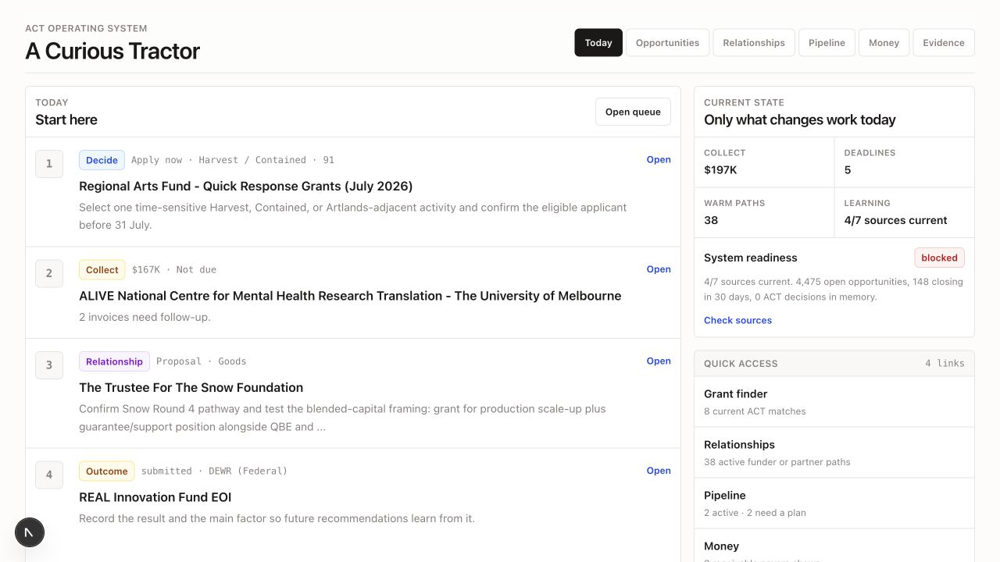
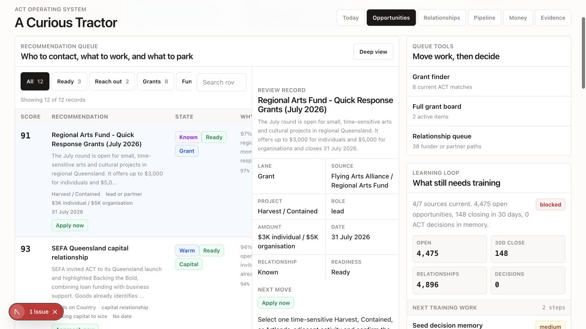
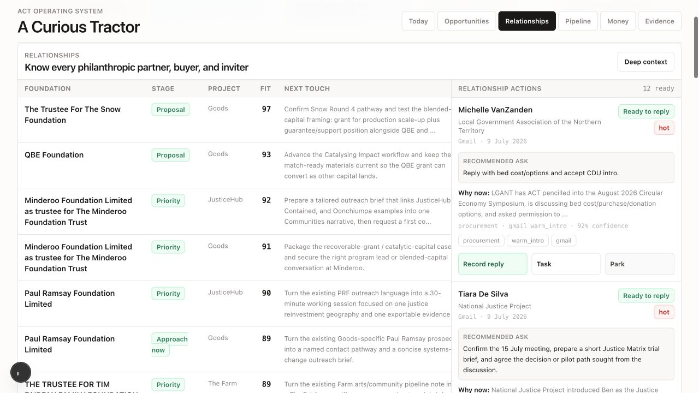
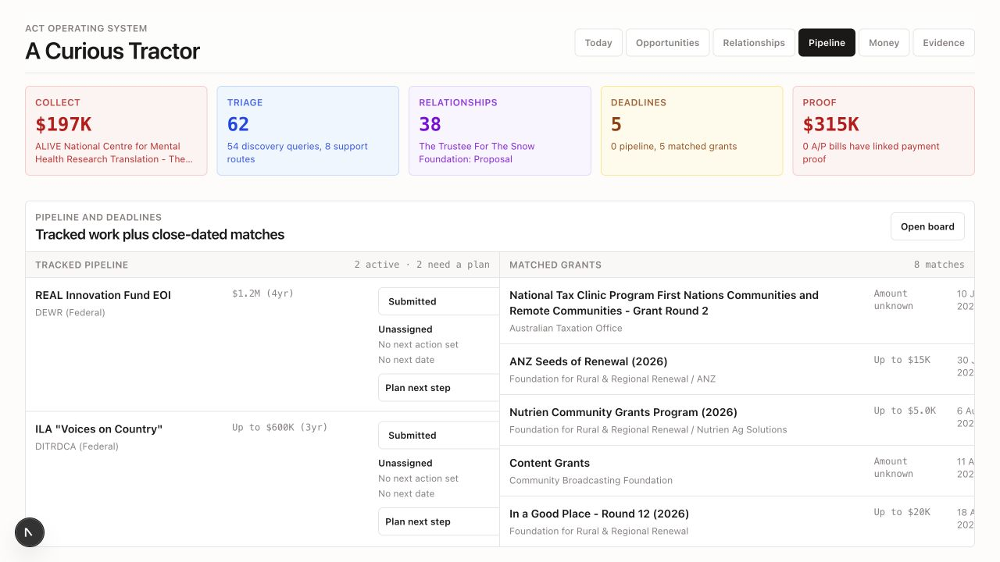
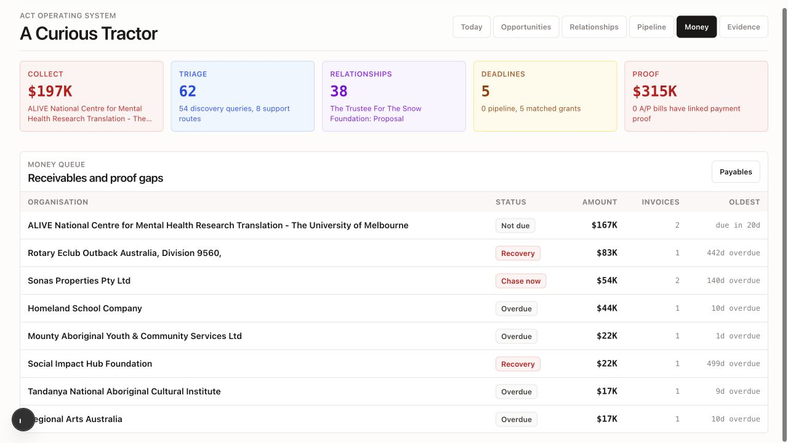
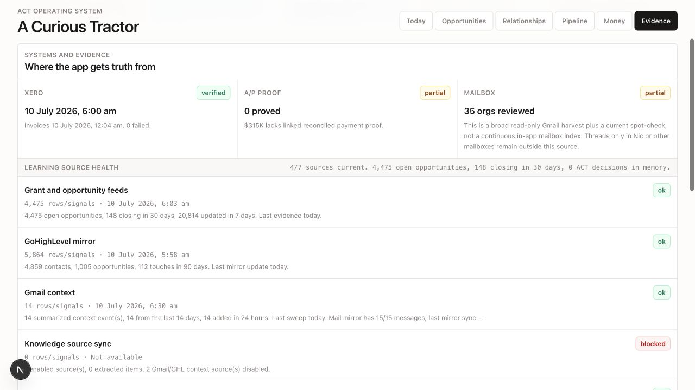

# ACT Operating Desk product review

Date: 10 July 2026

## Verdict

The operating desk is becoming functionally credible, but it still feels dull because six different jobs use the same visual grammar: white panels, rows, badges, metrics, and links. It reports data more often than it creates momentum.

The strongest direction is not a more decorative dashboard. It is a **Field Desk**: a quiet operating home that helps ACT notice signals, explore relationships, commit to work, and learn from outcomes.

## Captured Flow

### 1. Today

Health: **Good foundation.** The ranked list is the clearest screen in the system. It still sends the user away to act, gives system health too much prominence, and does not show owner or time horizon beside each item.

### 2. Opportunities

Health: **Overloaded.** A queue, record detail, queue tools, learning health, filters, badges, confidence and recommendations all compete in one viewport. The three-column arrangement squeezes the actual recommendation and hides the primary decision below the fold.

### 3. Relationships

Health: **Disconnected.** The foundation table and contact action stream are different representations of the same relationship system, but they do not behave as one. Repeated organisations, truncated next touches and anonymous rows make the page feel administrative instead of human.

### 4. Pipeline

Health: **Improving but mixed.** The accepted pipeline is now small and actionable, but it shares equal space with discovery results. The repeated metric strip consumes attention without helping the current task.

### 5. Money

Health: **Scannable, with a trust problem.** The table is useful. However, the global `Collect $197K` cue points to a payer marked `Not due`, while genuinely overdue and recovery items sit below it. That contradiction undermines confidence in all recommendations.

### 6. Evidence

Health: **Useful administration in the wrong place.** Data-source health belongs behind a status indicator or system drawer, not alongside daily work. Counts such as `4,475 open opportunities` create scale without helping ACT decide.

## Why It Feels Dull

1. **Everything has equal visual weight.** A payment risk, warm introduction, system sync and grant deadline all look like rows with badges.
2. **The system describes more than it enables.** Many elements end with `Open`, `Deep view`, or another navigation step instead of completing the action in context.
3. **People are rendered like data.** Relationships lack faces, connection paths, interaction history, strongest connector, reciprocity and upcoming moments.
4. **Projects are metadata, not working contexts.** Goods, JusticeHub, Harvest, Empathy Ledger and CivicGraph appear as labels instead of distinct fields of work.
5. **System health leaks into daily work.** Source counts and blocked syncs compete with decisions only Ben can make.
6. **Discovery and commitment still touch too often.** New signals, matched grants and accepted work should be separate states over the same records, not parallel lists.

## Replacement Model: The Field Desk

Use one shared set of records with four operating modes inspired by ACT's LCAA method:

| Mode | Job | Main interaction |
| --- | --- | --- |
| Listen | New Gmail, grant, procurement, festival and relationship signals | Accept, connect, snooze, decline |
| Curiosity | Explore a person, organisation, place, pattern or opportunity | Ask, compare, map, save a question |
| Action | Work ACT has committed to | Assign owner, set next move/date, update outcome |
| Art | Invitations, residencies, gatherings, commissions and storytelling opportunities | Invite, attend, host, collaborate |

These should be modes over one knowledge graph, not four new databases.

## Recommended Home

### 1. Needs Me

Maximum five items. Each row has one reason, one owner, one due horizon and an inline primary action. Do not show system-maintenance work here unless it blocks a real decision.

### 2. Momentum Rail

A single 14-day horizontal timeline for grant deadlines, meetings, follow-ups, reporting, festivals, visits and expected decisions. This replaces separate deadline counts scattered across screens.

### 3. Relationship Radar

Six relationship cards grouped by state:

- Growing: active exchange or clear next meeting
- Cooling: no interaction inside the expected rhythm
- Opening: warm introduction or invitation
- Reciprocal: ACT owes an update, proof, invitation or response

Each card shows person, organisation, strongest ACT connection, last meaningful touch, next moment, project and recommended ask.

### 4. Project Fields

One compact row each for Goods, JusticeHub, Harvest, Empathy Ledger and CivicGraph:

- money sought / secured
- live asks
- warm relationships
- next external moment
- main blocker

Selecting a field filters the entire desk without navigating to another product.

### 5. Learning Pulse

Show only learning that changes behaviour: `relationship-led opportunities converted better`, `timing caused three passes`, or `Harvest arts signals are increasing`. Move raw connector health into a system drawer.

## Better Elements

### Signal Card

One sentence for what changed, one sentence for why it matters, source confidence, project and four decisions: **Commit, Connect, Investigate, Park**.

### Opportunity Scorecard

Replace mixed badges with five stable dimensions: strategic fit, relationship, eligibility, readiness and timing. Every score opens its evidence.

### Relationship Record

Use one page or side sheet for overview, activity, emails, meetings, tasks, connected projects, asks made, value exchanged and next touch. Attio's record model is a useful reference because it combines activity, email, tasks and related records while keeping email visibility controlled by default.

### Universal Record Panel

Clicking any grant, person, organisation, invoice or event opens the same right-side panel. The left side stays in place. Actions and history live in the panel; the user does not bounce between pages.

### Command Bar

One global `Find or do` control for people, organisations, projects, grants, invoices and actions. It should support natural requests such as `show warm justice relationships with no next touch` or `add this to Goods and assign Ben`.

### Source Drawer

One small status indicator in the header. Opening it shows Gmail, GHL, Xero, Supabase and Notion freshness. Evidence remains accessible without occupying a primary navigation tab.

## Information Architecture

Recommended primary navigation:

1. **Home** — needs me, momentum, relationship radar, project fields
2. **Inbox** — unreviewed signals only
3. **Relationships** — people and organisations, with saved views
4. **Commitments** — accepted opportunities, delivery, reporting and outcomes
5. **Money** — receivables, payables, secured and prospective capital

Move Evidence into the source drawer. Put deep data tools, ecosystem graphs and the legacy grant board under a secondary Tools menu.

## Patterns Worth Borrowing

- [Linear Triage](https://linear.app/docs/triage?tabs=36dbc0f97e0d) treats incoming items as outside the normal workflow until accepted. ACT should do the same for discovery signals.
- [Linear My Issues](https://linear.app/docs/my-issues) groups assigned work by urgency, blockers and active work rather than presenting one undifferentiated list.
- [Airtable Record Review](https://support.airtable.com/docs/interface-layout-record-review) uses a review list plus focused record detail for fast triage. ACT's opportunity screen should use two panes, not three.
- [Airtable Dashboards](https://support.airtable.com/docs/interface-layout-dashboard) support drill-down from summaries into the underlying records. Every ACT metric should open the exact filtered work behind it.
- [Attio records](https://attio.com/help/reference/managing-your-data/records/create-and-view-records) unify activity, emails, files, notes, relationships and tasks around one person or organisation.
- [Attio communication intelligence](https://attio.com/help/reference/managing-your-data/enriched-data) makes last interaction, next interaction, connection strength and strongest connection usable as relationship attributes.
- [Attio lists and views](https://attio.com/help/reference/managing-your-data/lists/create-lists) show how one record set can support table and kanban views without duplicating the underlying data.

## Visual Direction

- Keep the operational density and restrained 8px-or-less corners.
- Use a warm off-white surface, near-black text, ACT green for committed work, ocean blue for investigation and clay/red only for real risk.
- Remove the five repeated metric tiles from subpages.
- Use project colour swatches consistently, not arbitrary status pastels.
- Add people images or organisation marks where available, especially in relationship views.
- Use space, type weight and one accent line for hierarchy instead of more borders and badges.
- Keep visual metaphor subtle: `Field`, `Seed`, `Growing`, and `Harvest` can name states, but the interface should remain an operating tool rather than themed decoration.

## Build Order

### First: simplify the existing product

1. Fix the Money priority contradiction.
2. Remove the repeated metric strip from Opportunities, Relationships, Pipeline and Money.
3. Move Evidence into a source-health drawer.
4. Rebuild Opportunities as a two-pane Inbox + Record panel.
5. Make every Today item actionable inline.

### Second: make relationships the centre

1. Merge foundation rows and contact actions into one relationship object/view.
2. Add last interaction, next interaction, strongest connector and reciprocal obligation.
3. Add a unified relationship record with activity timeline and connected opportunities.

### Third: make ACT's ecosystem visible

1. Add the project field switcher.
2. Add the 14-day momentum rail.
3. Add the global command bar.
4. Add a relationship-and-opportunity map as an optional exploration view, never the default work surface.

## Recommended Next Build

Build the **Opportunity Inbox + Universal Record Panel** first. It removes the most chaotic screen, establishes the interaction pattern reusable for relationships and pipeline, and gives the recurring discovery automation a clear destination.

The target first viewport should contain:

- one compact filter row: New, Ready, Connect, Investigate, Parked
- one ranked list with 8-10 signals
- one selected record panel with source evidence, five score dimensions and four decisions
- no right utility sidebar
- no raw learning/source-health metrics
- no navigation required to accept, assign, park or request proof
