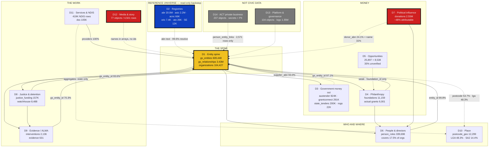
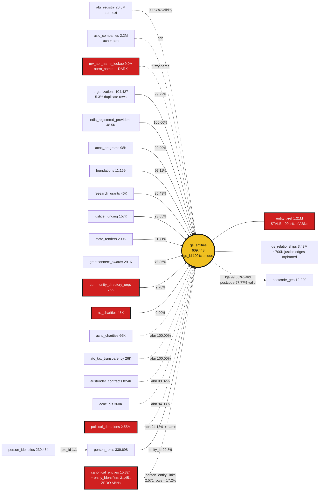
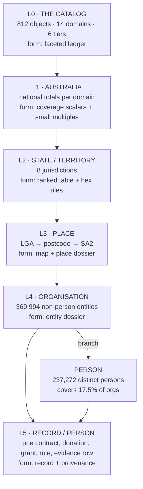

> **⚠ READ `VERIFICATION.md` BEFORE ACTING ON THIS DOCUMENT.**
> An adversarial pass checked 41 claims here: 34 CONFIRMED (most to the exact digit), 7 corrected.
> The corrections are not cosmetic. In particular:
> - **19 objects on the DELETE/DROP list are read or written by live application code.** The
>   analysis equated "empty" with "unused"; they are write-first tables. Do not drop anything
>   from this document without first grepping both `src` trees AND `pg_proc.prosrc`.
> - The justice drill-through gap is **100%, not 82%** — `gs_relationships.source_record_id` is a
>   dead key namespace, not a partial-orphan problem.
> - QLD watchhouse figures need rebaselining: the first monthly bucket is n=2 snapshots.
>   On a May baseline it is 2.7x (not 3.0x) and non-Indigenous +476% (not +868%).
> - "290 dark objects" means *unreferenced by application code*, not unused — the scan never read
>   410 database function bodies or 227 triggers (measured 23% false-positive rate on a sample).
> - This document covers 812 tables/matviews. The schema actually holds **1,024 relations** —
>   212 views and 409 functions were never inventoried. See `COMPLETENESS.md`.

---

# THE CANONICAL DATA MAP
### CivicGraph (grantscope) + JusticeHub — Supabase project `tednluwflfhxyucgwigh`

**Compiled 2026-08-14.** Reconciles three independent shard inventories (812 objects), the join-spine
measurement pass (~30 psql probes), and two independent codebase usage traces (GrantScope, JusticeHub)
into one authoritative description of every piece of data in the system and how it connects.

**Scope:** 812 public-schema objects (714 tables + 98 materialized views) — 724 populated, 88 empty,
**52,349,579 rows**, 14,310 columns, 636 declared foreign keys, 26.3 GB. Plus 212 regular views, which
carry no row count and are indexed here only where they matter. Two Next.js apps share this one database.
A third project (`yvnuayzslukamizrlhwb`, Empathy Ledger) is reached across the wire by JusticeHub only.

> **This document supersedes** `CLAUDE.md`'s "Key Tables Reference", `COMPENDIUM.md`, `data/schema-cache.md`,
> and `thoughts/shared/handoffs/frontend-data-audit/db-inventory.md`. All four are materially stale — three
> of them give three different wrong row counts for `gs_entities` (159K / 100K / 587K; actual **609,448**).

---

## 0. How to read this, and how much to trust it

Every claim carries one of three grades. They are used consistently throughout.

| Grade | Meaning |
|---|---|
| **VERIFIED** | Read from live rows or computed by a query against the database on 2026-08-14, or read from a source file line by line. Row counts, match rates, null counts, code references. |
| **INFERRED** | Derived from column names, the FK graph, name prefixes, or code-usage context, without sampling the rows. Most "purpose" statements for objects under ~10,000 rows are inferred. |
| **UNVERIFIED** | Stated by one source and not independently checked, or a probe that timed out and was not retried. |

Three structural caveats that apply to the whole map:

1. **Grain is inference everywhere.** No agent read `pg_index` or checked unique constraints (except
   `gs_entities.abn`, `person_identities.role_id` and `se_search_index.se_id`, which were tested). Treat
   "what makes a row unique" as a hypothesis for every other object.
2. **Domain and tier assignments are judgement calls.** They were reconciled from three shards that used
   the same 17-label enum; where the shards disagreed, §2 states the resolution and why. The `note` column
   in the tier tables is **blank when no agent recorded a specific finding** — blank means "not examined",
   not "nothing to see".
3. **Usage labels are static analysis, not runtime.** `GS` / `JH` / `GS+JH` / `dark` come from ripgrep over
   both repos. A table referenced in code may never be hit at runtime; a table built by string
   concatenation would be invisible. `dark` is proven for these two repos only — the database is shared
   with act-global-infrastructure, Empathy Ledger, Harvest and Contained, which were not scanned.

---

## 1. The ten facts that govern everything downstream

**1. There is one hub, and it is not the foreign-key graph.** The 636 declared FKs are app scaffolding:
the top FK target is `users` (91 constraints, **17 rows**), then `organizations` (65), then `org_profiles`
(51 constraints, **3 rows**). Meanwhile the nine largest objects in the database — `abr_registry` 20.0M,
`mv_abr_name_lookup` 9.0M, `political_donations` 2.5M, `asic_companies` 2.2M, `asic_name_lookup` 2.1M,
`privacy_audit_log` 1.3M, `entity_xref` 1.2M, `austender_contracts` 824K — have **zero declared foreign
keys in either direction**. Auto-generating navigation from `pg_constraint` would produce a UI centred on
three near-empty app tables. [VERIFIED]

**2. The real spine is `gs_entities` (609,448), reached by four implicit mechanisms**, in descending
reliability: `gs_entity_id` uuid stamps → `abn` text equality → `upper(trim(name))` equality →
`postcode`/`lga_code` text equality. There is a second hub, `organizations` (104,427), which is
JusticeHub's, bridged at a measured **99.72%**. That bridge is the single most important join in the
database. [VERIFIED]

**3. Nearly a third of the objects are not civic data at all.** 237 of 812 objects (29%) are A Curious
Tractor's own private business systems — Xero, receipts, GHL CRM, Notion mirrors, project finance, staff
salaries, personal email and iMessage. They hold 0.5% of the rows and carry the highest sensitivity in the
database, including **plaintext OAuth tokens** (`xero_tokens`, `gmail_auth_tokens`). Any "see every piece
of data" surface must separate this from the civic corpus on line one, not as a filter.

**4. Two apps co-own the core, and 19 objects are dual-written.** JusticeHub is not a consumer of this
database; it is a co-owner. `gs_entities`, `justice_funding`, `organizations`, `postcode_geo`,
`alma_interventions`, `foundation_grantees`, `oric_corporations`, `vic_grants_awarded` and 11 others are
written by both codebases with no documented lane. The sharpest case: a JusticeHub cron does a
**read-modify-write on `gs_entities.metadata` (JSONB) and `.source_datasets` (array)** with no lock, while
GrantScope's backfills touch the same columns. [VERIFIED by reading
`JusticeHub/src/app/api/cron/alma/enrich-websites/route.ts:324`]

**5. 40% of the live data is read by neither app.** 290 populated objects (245 with no reference at all,
45 created by a migration and queried by nobody) — 14.9M rows — are dark to both codebases. That includes
a 9.0M-row name index refreshed nightly, a 351,455-row shared-director charity network refreshed nightly,
and a 42,599-row provenance-tracked foundation classification layer. The dark half is almost exactly as
large as the live half. [VERIFIED]

**6. The analytics layer is half-unmaintained, and the wrong version is the maintained one.** 98 matviews
exist; `mv_refresh_log` has ever seen **44 distinct objects**; 15 more `mv_yj_report_*` are refreshed by a
script that does not log. That leaves **~30 matviews with no known refresh path**, including
`mv_entity_total_funding` (94K), `mv_foundation_regranting` (85K) and `mv_trustee_grantee_chain` (79K).
Worse: `mv_person_identity_influence_v2` — the corrected, per-director-attributed person influence view —
is **not** scheduled, while the superseded v1 **is** refreshed nightly. [VERIFIED]

**7. Two matviews refresh garbage nightly and nothing alerts.** `mv_funding_by_disadvantage` returns
**1 row** where 10 SEIFA deciles are expected; `mv_indigenous_funding_by_disadvantage` returns **0 rows**
and is read by a live page (`reports/funding-equity`). Both are on the nightly schedule. A matview that
refreshes successfully and returns nothing is invisible to every monitor in the system. [VERIFIED]

**8. The vision's headline content is its emptiest data.** "Youth detention numbers, child protection,
organisations doing the work, and media" — `aihw_youth_justice_stats` holds **13 rows** (every one scraped
from a report headline, `source_table='PDF_HEADLINE'`), `alma_funding_data` (detention vs prevention spend)
holds **2 rows**, `bocsar_youth_offending` and `abs_indigenous_population_by_lga` are **empty**, child
protection is 2,981 state-level rows with no sub-state geography, and the entire media/story domain is
**77 objects holding 4,501 rows**. [VERIFIED]

**9. Half the influence story cannot be attributed.** `political_donations` holds 2,549,483 rows (8× the
documented figure) and `donor_abn` is present on only 24.8%, empty on every sampled row of the rest.
Total attributable: ~48% (24.1% by ABN + 31.1% of the ABN-less remainder by name match). The AEC's 1 July
2026 reforms — $5,000 threshold, calendar-year periods, 24-hour election-period reporting — will
step-change the volume flowing into this weakest leg. [VERIFIED; reform detail from the AEC's own Oct-2025
explainer]

**10. The page you want was already built and deleted.** `/clarity` — "full platform data model, coverage
heatmaps, schema health watcher" — was built 2026-03-25 (commit `833ca96`) and deleted 2026-04-24 (commit
`bd20a8c`, "scope cut to portfolio mode"). Its API still ships and is orphaned:
`apps/web/src/app/api/data/schema-graph/route.ts` (280 lines) emits `{nodes, edges}` with FK plus inferred
ABN/entity_id/postcode edges. It silently drops 742 of 812 objects because of a hardcoded 70-entry domain
map with `if (!domain) continue;`. [VERIFIED]

---

## 2. THE DOMAIN MODEL

Fourteen domains, derived from what the data actually is rather than from any pre-existing enum. The three
shard inventories each classified their objects against a shared 17-label taxonomy; this model reconciles
those labels into 14 and states every material change.

### 2.0 How the shards' labels were reconciled

| Reconciliation decision | Why |
|---|---|
| **`platform_ops_auth` (215 objects) split into D13 Platform and D14 ACT private business.** | All three shards independently flagged this label as an unusable catch-all. Shard n–z: "108 of 306 objects in this shard — a third — are platform/business plumbing, not civic data." Shard g–m: "forced into a taxonomy that has no 'internal business ops' bucket." The split is the single most useful thing this model does: Xero, GHL, Notion, receipts, salaries, personal email and the ACT CRM island are now visibly *not* civic data. |
| **`corporate_registry` split: the spine (D1) vs the registers it is built from (D2).** | `gs_entities`, `entity_xref`, `gs_entity_aliases`, `asic_name_lookup`, `mv_abr_name_lookup`, `assertions` and the ORIC dedup staging are resolution machinery, not registers. Shard g–m labelled `gs_entities` lifecycle `crosswalk` for exactly this reason. |
| **The CRM identity island (`canonical_entities`, `entity_identifiers`, `person_identity_map`, `linkedin_contacts`) moved from `people_directors_governance` to D14.** | Verified: `entity_identifiers` contains **zero ABNs** and is FK'd to `canonical_entities`, not `gs_entities`. It is ACT's contact book, not the governance layer. Only `person_entity_links` (2,571 rows) bridges it to the graph, and that stays in D1. |
| **`justice_funding` assigned to D8, not D3 (government money).** | It is the youth-justice lens on money and is dual-written by both apps. But note the shard finding: it is *not* purely justice funding — it contains `source='austender-direct'` rows for things like "Pump Repairs". |
| **`grantconnect_awards`, `research_grants`, `vic_grants_awarded` moved from `grants_funding` to D3.** | These are **awarded** money (government out), not opportunities. Keeping them with `grant_opportunities` was the single biggest source of the "five models of a fundable thing" confusion. |
| **`child_protection` (2 objects) folded into D8.** | Two objects cannot carry a domain, and the honest framing is that child protection is a thin sub-corpus of the justice/protection story, not a peer of it. |
| **`media_narrative` + `storytelling_consent` merged into D12.** | They share the same consent machinery and the same problem (77 objects, 4,501 rows). Splitting them hides how small the whole pillar is. |
| **`ai_agents_pipeline` split**: crawler/ingest tables went to the domain they feed (ALMA ingest → D9, Justice Matrix scraping → D8, civic RAG chunks → D7); genuine platform agents stayed in D13. | Shards put ingest staging with the pipeline, which scatters each corpus across two domains. |

### 2.1 Domain summary

*(exact object/row/size counts are repeated at the head of §3, immediately before the tier tables)*

| dom | domain | objects | rows | share | the one-line truth |
|---|---|---:|---:|---:|---|
| D1 | Entity spine & identity resolution | 18 | 17,231,206 | 32.9% | Everything joins here. Clean at the centre, 1.2M rows of unused crosswalk at the edge. |
| D2 | Corporate & charity registries | 30 | 23,428,612 | 44.8% | The reference universe. 20M ABNs, and `gs_entities` materialises 1.76% of it. |
| D3 | Government money out | 37 | 1,587,901 | 3.0% | The strongest evidence base in the database. Federal is excellent; states are one table each at best. |
| D4 | Philanthropy & giving | 36 | 379,464 | 0.7% | The most complete *structure* and the thinnest *evidence*: 6,001 actual grants across 11,159 foundations. |
| D5 | Grant opportunities & funding-seeking | 37 | 62,848 | 0.1% | Five competing models of "a fundable thing", 35% of one of them unverified. |
| D6 | People, directors & governance | 24 | 2,605,927 | 5.0% | Real, capped at 17.5% of organisations, and topped by name collisions with 745 boards. |
| D7 | Political influence & civic accountability | 28 | 2,861,474 | 5.5% | 2.5M donations, half of them unattributable. Lobbying access recorded and never linked to money. |
| D8 | Justice, detention & child protection | 54 | 252,938 | 0.5% | One world-class dataset (QLD watchhouses) surrounded by 13-row placeholders. |
| D9 | Evidence, outcomes & ALMA | 54 | 61,719 | 0.1% | The qualitative spine of the whole mission, well-linked, with a broken provenance chain (9 citations). |
| D10 | Place & geography | 46 | 1,647,005 | 3.1% | Rebuilt honestly in August; 1.5M of its rows are that rebuild's backups. |
| D11 | Social services, NDIS & delivery | 30 | 528,597 | 1.0% | A complete NDIS market dataset nobody documented, stranded at state level by one NULL column. |
| D12 | Media, story & consent | 77 | 4,501 | 0.0% | **77 objects, 4,501 rows.** The most over-modelled and under-fed domain in the database. |
| D13 | Platform, agents & data governance | 104 | 1,441,132 | 2.8% | Contains the catalog machinery Ben is asking for, already working, covering 25 of 812 tables. |
| D14 | ACT private business systems | 237 | 256,255 | 0.5% | 29% of all objects. Not civic data. Highest sensitivity in the database. |

---

### D1 · Entity spine & identity resolution — 18 objects, 17.2M rows

**Covers:** the canonical Australian organisation and person-block register, the edge table between them,
every identifier crosswalk, alias store, name-lookup index, and the claims ledger that records disagreement.

**Key objects:** `gs_entities` 609,448 · `gs_relationships` 3,429,184 · `mv_abr_name_lookup` 9,038,737 ·
`asic_name_lookup` 2,149,868 · `entity_xref` 1,211,744 · `mv_gs_entity_stats` 400,276 ·
`mv_entity_power_index` 188,139 · `organizations` 104,427 · `assertions` 59,300 · `gs_entity_aliases` 16,646 ·
`donor_entity_matches` 10,264 · `name_aliases` 8,046 · `person_entity_links` 2,571 · `stg_oric_dupe_pairs` 847.

**Source systems:** derived — built by `scripts/build-entity-graph.mjs` and the linkage sweeps from ABR,
ASIC, ACNC, ORIC, AusTender, GrantConnect, AEC and the state portals.

**Refresh:** `mv_gs_entity_stats` and `mv_entity_power_index` are refresh-scheduled (last logged 2026-08-13).
`mv_abr_name_lookup` and `asic_name_lookup` are rebuilt by `scripts/refresh-views-v2.mjs`. `entity_xref` has a
bespoke refresher (`scripts/refresh-entity-xref.mjs`) and is **stale**: 317,590 ABN rows against 351,455 actual.

**Completeness:** `gs_id` 100% unique. `abn` 57.7% overall, **~96% of the 369,994 non-person rows**
(239,454 rows are `GS-PERSON` blocks with no ABN by design). ABN is enforced unique with **zero duplicates**.
99.57% of `gs_entities` ABNs resolve in `abr_registry`. Rollup denominators diverge sharply:
`mv_gs_entity_stats` covers 65.7% of entities, `mv_entity_power_index` 30.9%, `mv_entity_total_funding` 15.4% —
so a card showing a "power score" is blank for half of all organisations.

**What will bite you:** `entity_id` means two different things (`entity_xref.entity_id` → `gs_entities.id`;
`entity_identifiers.entity_id` → `canonical_entities.id`, a different universe, same uuid type).
`gs_relationships` cannot be reconciled to `justice_funding` — 857,798 edges against 157,116 source rows,
857,731 of them distinct, so ~700K point at records that no longer exist. Any dollar total taken from the
edge table for that dataset is unreconcilable. [VERIFIED arithmetic; cause INFERRED as a rebuild with fresh UUIDs]

---

### D2 · Corporate & charity registries — 30 objects, 23.4M rows

**Covers:** the external registers of who exists — ABR, ASIC, ASX, ACNC (register + annual financials +
self-reported programs), ORIC, ATO tax transparency, the NZ charity register, plus the scraped
community-directory and social-enterprise registries and their derived rankings.

**Key objects:** `abr_registry` 20,006,350 · `asic_companies` 2,167,533 · `acnc_ais` 360,488 ·
`mv_charity_network` 351,455 · `acnc_programs` 98,381 · `community_directory_orgs` 76,151 ·
`acnc_charities` 66,023 · `mv_acnc_latest` 63,555 · `nz_charities` 45,192 · `mv_charity_rankings` 42,503 ·
`ato_tax_transparency` 26,241 · `social_enterprises` 12,180 · `oric_corporations` 7,369 · `asx_companies` 2,036.

**Source systems:** ABR bulk extract; ASIC's free weekly data.gov.au company file (**contains no
officeholders** — that is why the director layer has zero ASIC rows); ACNC register + AIS + CC BY 3.0 AU
"People" pages, scraped by three separate scripts; ORIC register; ATO corporate tax transparency;
mycommunitydirectory + sacommunity scrapes.

**Refresh:** `mv_acnc_latest`, `mv_charity_rankings`, `mv_charity_network`, `mv_acnc_ais_yearly`,
`mv_org_justice_signals` are refresh-scheduled. The base registers are periodic bulk ingests with no
declared cadence in the database.

**Completeness:** `acnc_charities` and `ato_tax_transparency` join at **100%** by ABN — the cleanest paths
in the database. `acnc_ais` covers **2017–2023 only** (~50–53K rows/year), with exactly one 2025 row and
**no FY2024 at all** — a gap that is invisible unless you group by year. `community_directory_orgs` is 90%
unjoined (the 61,712-row mycommunitydirectory slice has zero ABNs and zero entity links). `nz_charities`
has a declared FK to `gs_entities` populated on **zero** rows.

**What will bite you:** `mv_charity_network` is 88% zeros (only 41,502 of 351,455 rows have a non-zero
connection count), which makes `mv_charity_rankings.score_network` effectively a constant for 42,503
charities. `_backup_entity_contacts_20260606` (16,664 rows) is dead weight whose sampled contact fields are
all NULL.

---

### D3 · Government money out — 37 objects, 1.59M rows

**Covers:** every dollar the Australian state pays out or contracts for — federal procurement, awarded
Commonwealth grants, state tender portals, research council grants, Victorian grant awards, the
Productivity Commission spend tables, Indigenous-procurement compliance, and the derived crossover analysis.

**Key objects:** `austender_contracts` 823,620 · `grantconnect_awards` 291,264 · `state_tenders` 199,719 ·
`mv_entity_total_funding` 94,088 · `procurement_alerts` 53,223 · `research_grants` 46,378 ·
`money_flows` 42,468 · `rogs_justice_spending` 22,364 · `vic_grants_awarded` 5,202 ·
`mv_indigenous_procurement_score` 2,647 · `se_buyer_prospects` 438 · `mmr_unspsc_categories` 19.

**Source systems:** AusTender OCDS releases; GrantConnect; VIC Buying / NSW eTender / QLD portals (scraped
by **JusticeHub**, read by GrantScope — an undocumented reverse dependency); ARC + NHMRC; DFFH; PC RoGS;
ANAO MMR reports.

**Refresh:** `mv_indigenous_procurement_score`, `mv_grant_contract_overlap`, `mv_indigenous_proven_suppliers`
are refresh-scheduled. `mv_entity_total_funding` has a bespoke script and is **not** in the nightly list.

**Completeness:** contracts link at **93.0%** by supplier ABN (100% of ABN-bearing rows). GrantConnect is
72.4% stamped but its recipient ABNs are **99.97% present in `abr_registry`** — so ~67,000 awards point at
real entities that were never created in `gs_entities`, fixable in one bulk insert. `state_tenders` is
81.7% stamped but sparsely *awarded*: supplier name, ABN and contract value were all empty on sampled rows.
Only **one state** (VIC) has its own grant-awards table.

**What will bite you:** ~658K dual-key duplicate rows in `austender_contracts` (recorded in memory) mean
`SUM(contract_value)` overstates without dedup. `rogs_justice_spending` stores states as **columns**, not
rows, and must be unpivoted. `money_flows` mixes $510M budget aggregates with granular lines in one table
with no level marker. `procurement_alerts` is not an alert table at all — it is 53,223 donor↔contractor
crossover findings that have never been delivered to anyone.

---

### D4 · Philanthropy & giving — 36 objects, 379K rows

**Covers:** Australian philanthropic foundations — who they are, what they say they fund, who they
actually gave money to, who sits on their boards, the two-hop regranting chains, and the derived
power/readiness/conflict scorecards.

**Key objects:** `mv_foundation_regranting` 85,401 · `mv_trustee_grantee_chain` 79,535 ·
`mv_foundation_trends` 53,985 · `foundation_category_assignments` 42,599 · `foundation_geo_focus` 16,942 ·
`mv_foundation_grantees` 15,003 · `foundations` 11,159 · `funder_intelligence` 11,159 ·
`foundation_power_profiles` 10,114 · `foundation_grantees` 6,001 · `foundation_programs` 4,218 ·
`funder_board_paths` 2,651 · `foundation_people` 33.

**Source systems:** ACNC register + AIS; foundation annual reports (LLM-extracted); foundation websites via
`source_frontier`; hand-curated allow/block lists.

**Refresh:** `mv_foundation_grantees`, `mv_foundation_trends`, `mv_foundation_scores` are scheduled.
`mv_foundation_regranting`, `mv_trustee_grantee_chain`, `mv_foundation_need_alignment`,
`mv_foundation_readiness` and the four `mv_foundation_landscape_*` objects have **no refresh path** — and
`mv_foundation_scores` depends on three of them, so staleness propagates into a scheduled object.

**Completeness:** 97.1% of foundations carry `gs_entity_id` — the best-linked source family in the
database. But **actual giving evidence is 6,001 grants across 11,159 foundations**, heavily skewed to
funders who publish grant lists. `funder_intelligence` is exactly 1:1 with `foundations` and its long tail
is undifferentiated filler (uniform `giving_grade='inferred'`, `rank_score=8.80`).
`foundation_category_assignments` shows a constant 0.820 confidence in sample.

**What will bite you:** `mv_trustee_grantee_chain` looks like 79,535 conflict-of-interest findings; it is a
cross-product off **195 distinct trustees and 25 foundations**, with 87 true overlaps. Widening it is a JOIN
problem against existing ACNC responsible-person rows, not an acquisition problem — and it is the single
highest-value unbuilt join in the philanthropy domain. `foundation_geo_focus.geo_code` mixes ISO codes
(`AU-NSW`) with remoteness labels (`metro`) in one column.

---

### D5 · Grant opportunities & funding-seeking — 37 objects, 62,848 rows

**Covers:** the *forward-looking* money — discovered opportunities, matching and recommendation, saved
grants, applications, answer banks, decisions and pipeline workflow.

**Key objects:** `grant_opportunities` 25,897 · `act_grant_recommendations` 22,252 (matview) ·
`alma_funding_opportunities` 8,538 · `mv_grant_contract_overlap` 4,865 · `saved_grants` 2,620 ·
`user_grant_tracking` 234 · `grant_applications` 33 · `funding_awards` 5.

**Source systems:** 44 registered feeds (`funding_ingest_sources`), 32 discovery plugins
(`grant_source_plugins`), the `source_frontier` crawler, and web-search providers.

**Refresh:** `grant_discovery_runs` (144) and `grant_frontier_source_snapshots` (3,099) record the ingest;
`act_grant_recommendations` is a matview over the 12 configured projects × verified opportunities.

**Completeness:** low and contaminated. `grant_opportunities` has **mixed semantics** — verified rows
include already-*awarded* Lotterywest grants and ARC research projects presented as open opportunities,
with `status='unknown'`. 2,987 of `alma_funding_opportunities` (35%) are `opportunity_type='unverified'`
and 54 are literal placeholders.

**What will bite you:** **five competing models of "a fundable thing"** —
`alma_funding_opportunities` (8,538), `grant_opportunities` (25,897), `foundation_programs` (4,218),
`alma_government_programs` (207), `funding_programs` (4) — and `act_grant_recommendation_decisions`
declares foreign keys to *two of them simultaneously*. `funding_awards` (the modelled "did they get the
money" table) has 5 rows while `grantconnect_awards` holds 291,264 unmodelled ones.

---

### D6 · People, directors & governance — 24 objects, 2.61M rows

**Covers:** who governs what. Registry-sourced officer appointments, the identity-resolution verdicts over
them, and nine overlapping matviews computing influence, interlocks and board power.

**Key objects:** `person_roles` 339,698 · `mv_person_entity_network` 336,444 ·
`mv_person_entity_crosswalk` 331,239 · `mv_person_identity_network` 328,939 ·
`mv_person_identity_influence` 241,269 · `mv_person_identity_influence_v2` 241,260 ·
`mv_person_network` 237,990 · `mv_person_influence` 237,340 · `person_identities` 230,434 ·
`mv_board_interlocks` 39,757 · `mv_board_power` 38,199 · `funder_board_paths` 2,651 · `people` 84.

**Source systems:** **ACNC register "People" pages, scraped — 334,152 of 339,698 rows.** Plus 4,522
foundation-board rows and 582 parliamentary. **Zero rows from ASIC**: ASIC's free file has no
officeholders, and `scripts/ingest-asic-directors.mjs --officeholders` exists with its column mapping
stubbed "pending actual ASIC officeholder extract schema". The biggest governance upgrade available is
blocked on a commercial licence conversation, not on code.

**Refresh:** five of the nine person matviews are scheduled; **`mv_person_entity_network` is in the refresh
script but has never once appeared in `mv_refresh_log`**, and two scheduled matviews are built on top of it.

**Completeness:** 99.8% of roles carry both `entity_id` and `person_entity_id`, but they cover only
**64,139 distinct companies = 17.5% of non-person entities**. That is the hard ceiling on any "director
links" feature and it must be shown in the UI or absence of directors reads as absence of governance.
`person_identities` covers 67.8% of roles; 109,264 roles have no identity verdict at all.

**What will bite you:** name collisions. `max(board_count)` in `mv_board_interlocks` is **745**; the top
row of `mv_person_identity_influence` is "Mark Smith" with **689 boards**, `is_nominee_block=true`. Any
public director feature must gate on `is_nominee_block`/`confidence` or it publishes a
defamatory-adjacent claim about a common name. Three generations of matview coexist (name-normalised →
`identity_key` → attributed `_v2`) and **the newest and most correct generation is the least maintained**.

---

### D7 · Political influence & civic accountability — 28 objects, 2.86M rows

**Covers:** money into politics and access to power — disclosed donations, donation↔contract timing,
revolving-door scoring, ministerial diaries and statements, Hansard, bills, RTI logs, charter commitments,
and the LLM-proposes/human-confirms classification layer over all of it.

**Key objects:** `political_donations` 2,549,483 · `mv_donation_contract_timing` 232,474 ·
`mv_fy_donation_contracts` 50,685 · `civic_intelligence_chunks` 7,022 · `mv_revolving_door` 6,976 ·
`campaign_alignment_entities` 4,141 · `mv_donor_contract_crossref` 2,175 · `civic_ministerial_diaries` 1,728 ·
`civic_ministerial_statements` 649 · `civic_hansard` 647 · `parliament_bills` 249 ·
`civic_charter_commitments` 75 · `civic_consultancy_spending` 18.

**Source systems:** AEC annual returns; state and federal ministerial diary publications; Hansard scrapes
(scraper duplicated in both repos); RTI disclosure logs; NSW lobbying register.

**Refresh:** `mv_donation_contract_timing`, `mv_donor_contract_crossref`, `mv_gs_donor_contractors`,
`mv_revolving_door` are scheduled. `mv_fy_donation_contracts` (50,685) and `mv_temporal_summary` are not,
and are referenced in no script or app.

**Completeness:** the weakest attribution in the database. Only 24.8% of donations carry `donor_abn`;
total attributable ~48%. `donor_entity_matches` (10,264) is the only bridge and it is name-matched only,
using `'0'` as a null sentinel — seen on a $41.8M donor. Access data is recorded but unlinked:
`civic_ministerial_diaries.organisation_abn` exists and is never resolved to `gs_entities`.

**What will bite you:** `mv_donation_contract_timing` is a **cartesian expansion** — a $2,000 Raytheon
donation paired against a $1.79bn Defence contract yields `roi_multiple` 895,650, and the same contract is
reused across donations. It is a legitimate narrative lens and an invalid statistic. Use
`mv_donor_contract_crossref` (2,175) for any total. `receipt_type` includes "other receipt", so summing
`amount` overstates donations even before attribution.

---

### D8 · Justice, detention & child protection — 54 objects, 253K rows

**Covers:** the mission-critical domain — youth justice funding, watchhouse custody, LGA crime, AIHW
detention and child-protection statistics, detention facilities, coronial findings, oversight
recommendations, justice-reinvestment sites, the strategic-litigation corpus, and the cached youth-justice
report layer.

**Key objects:** `justice_funding` 157,116 · `crime_stats_lga` 58,125 · `outcomes_metrics` 9,193 ·
`qld_watchhouse_snapshot_rows` 8,488 · `mv_youth_justice_entities` 5,469 · `mv_justice_proven_suppliers` 4,865 ·
`aihw_child_protection` 2,981 · `mv_yj_report_*` (15 objects, ~5,300 rows) · `justice_matrix_cases` 367 ·
`jr_*` (14 objects, 7 of them empty) · `oversight_recommendations` 139 · `youth_detention_facilities` 21 ·
`coroners_findings` 39 · **`aihw_youth_justice_stats` 13** · `alma_funding_data` 2 (D9).

**Source systems:** AusTender + GrantConnect + state portals (bridged into `justice_funding`); QPS
watchhouse PDFs (with `raw_pdf_sha256` provenance — exemplary); BOCSAR and state crime agencies; AIHW PDF
headlines; RoGS; coronial and oversight reports; AustLII.

**Refresh:** the 15 `mv_yj_report_*` matviews are refreshed by
`scripts/refresh-youth-justice-report-cache.mjs`, which does **not** log to `mv_refresh_log` — absence from
the log is not evidence of staleness for this family. `mv_justice_proven_suppliers` and
`mv_triple_proof_suppliers` are scheduled; `mv_youth_justice_entities` is not and has no app references.

**Completeness:** `mv_yj_report_coverage` already states this honestly in one row: of 157,102
`justice_funding` rows, **only 5,600 are youth justice**; 320 of 977 ROGS rows landed; 581 ALMA
interventions tagged against 989 serving youth justice. `crime_stats_lga` is **not national** — NSW 51,480 /
QLD 4,082 / VIC 1,873 / SA 617 / NT 60 / ACT 13, with **WA and TAS entirely absent**. AIHW detention and
child protection are **state-level only**, which makes an LGA choropleth of detention rates dishonest by
construction.

**What will bite you:** `justice_funding` is not all justice funding (verified `source='austender-direct'`
rows for "Pump Repairs"). It also shrank from 218,022 rows in April to 157,116 now, with no artefact
recording why and no guard that noticed. The `jr_*` community-evidence workflow was built from both ends
and never joined: 7 of 14 tables empty, `jr_site_authorities` (the publication-consent gate) has **1 row**,
while the three well-populated research tables (866 rows) are read by no code at all.

**The crown jewel:** `qld_watchhouse_snapshot_rows` — children and adults in 63 Queensland police
watchhouses by age group, gender, First Nations status and length of custody, near-daily since 2026-04-28,
with a SHA-256 of every source PDF. AIHW is quarterly and state-level. Nothing public in Australia has this
shape, and it is not the front page of anything.

---

### D9 · Evidence, outcomes & ALMA — 54 objects, 61,719 rows

**Covers:** the Australian Living Map of Alternatives and everything that makes a claim provable — named
interventions, research evidence, outcome definitions, the junctions between them, source documents,
consent, the Governed Proof bundles, and the "does the money have evidence behind it" rollups.

**Key objects:** `mv_funding_outcomes_summary` 39,432 · `alma_intervention_outcomes` 3,109 ·
`alma_outcomes` 2,869 · `alma_interventions` 2,136 · `alma_intervention_evidence` 2,065 ·
`mv_triple_proof_suppliers` 1,269 · `jr_site_research_items` 690 · `alma_evidence` 631 ·
`mv_evidence_backed_funding` 415 · `alma_source_documents` 117 · `governed_proof_bundles` 16 ·
**`alma_entity_sources` 9** · **`alma_consent_ledger` 3**.

**Source systems:** research literature and evaluation reports (LLM-extracted), government program
announcements, community submissions, JusticeHub desk research.

**Refresh:** `mv_triple_proof_suppliers` scheduled. `mv_funding_outcomes_summary`,
`mv_evidence_backed_funding`, `mv_intervention_funding_chain` have **no refresh path**.

**Completeness:** `alma_interventions` is the best-connected table in the database — it declares FKs to
`gs_entities`, `organizations`, `services` and `registered_services` simultaneously, and `justice_funding`
FKs back into it. 70.3% stamped. But the **provenance chain is broken**: 117 source documents, 2,136
interventions, and **9 rows** in the citation junction. And the consent ledger — the governance spine of a
project whose name is "Living Map of Alternatives" — holds **3 rows**, while `consent_level` is stored
inline on interventions and evidence instead.

**What will bite you:** 2,065 evidence links over 631 evidence rows means heavy reuse of the same evidence
across interventions — verify before claiming "evidence-backed". The `governed_proof` service module is
**forked across both repos** (515 vs 323 lines, divergent from line 1), with both copies writing the same
four tables.

---

### D10 · Place & geography — 46 objects, 1.65M rows

**Covers:** where things are. Postcode↔locality↔SA2↔LGA geography, SEIFA disadvantage, ABS correspondence
ratios, the LGA/postcode/SA2 funding rollups, funding deserts, remote-community reference data — and the
1.5M rows of dated backups left by the August 2026 attribution rebuild.

**Key objects (live):** `postcode_geo` 12,299 · `abs_locality_lga` 16,637 · `abs_sal_lga_ratio` 16,372 ·
`seifa_2021` 10,572 · `postcode_sa2_concordance` 7,261 · `mv_funding_by_postcode` 7,224 ·
`abs_poa_lga_ratio` 3,968 · `mv_sa2_map_data` 2,473 · `sa2_reference` 2,473 · `mv_funding_deserts` 1,997 ·
`mv_funding_by_lga` 1,729 · `goods_communities` 1,542 · `agil_locations` 1,546 ·
`mv_lga_place_profile` 1,145 · `geo_resolution_gaps` 600 · `nt_communities` 75 · `sa3_regions` 14.
**Backups:** 5 × `gs_entities_*_backup_*` (1,461,670 rows) + 6 × `postcode_geo_*_backup_*` (62,524 rows).

**Source systems:** ABS ASGS **Edition 3 (2021)** correspondences, AIATSIS/AGIL gazetteer, ORIC registered
addresses, ACNC addresses, hand adjudication.

**Refresh:** `mv_funding_by_lga`, `mv_funding_by_postcode`, `mv_funding_deserts`, `mv_lga_place_profile`,
`mv_lga_indigenous_proxy_score` are scheduled. `mv_sa2_map_data` is not.

**Completeness — measured:** `gs_entities.lga_code` 294,214 populated (48.3%) at **99.85% valid**;
`postcode` 327,277 (53.7%) at **97.77% valid**; `sa2_code` only 87,810 (**14.4%**). Live `postcode_geo` has
11,638 filled LGA codes — **fewer than four of its own backups** — deliberately, because the rebuild nulled
confidently-wrong values. `lga_source` records the placement method per row (`poa_ratio_dominant`,
`straddler_ratio_dominant`, `own_name_town+abs_asgs`, `oric_register_address+abs_asgs`, …).
**Never read a NULL LGA as missing data without checking `lga_source`.**

**What will bite you:** six LGA-keyed rollups return **six different row counts** against ~540 real LGAs —
`mv_funding_deserts` 1,997 / `mv_funding_by_lga` 1,729 / `mv_lga_place_profile` 1,145 /
`lga_cross_system_stats` 361 / `mv_yj_report_heatmap` 361 / `mv_lga_indigenous_proxy_score` 208. Counts
above 540 mean duplicate `(lga_name, state)` keys; counts below mean coverage gaps. **Nothing at LGA level
is trustworthy until these are reconciled.** And **ASGS Edition 4 shipped 2026-07-22** — every concordance
here is Edition 3, so dropping an Ed4 basemap in will silently mismatch codes.

---

### D11 · Social services, NDIS & delivery — 30 objects, 529K rows

**Covers:** the service system — the NDIS market (participants, providers, utilisation, concentration,
compliance actions, First Nations participation), DSS income-support demographics, the service registries,
and youth opportunity listings.

**Key objects:** `ndis_utilisation` 143,987 · `ndis_active_providers` 134,572 ·
`dss_payment_demographics` 105,529 · `ndis_participants` 67,353 · `ndis_registered_providers` 48,510 ·
`ndis_market_concentration` 14,915 · `ndis_participants_lga` 8,329 · `ndis_compliance_actions` 2,322 ·
`ndis_first_nations` 1,486 · `mv_disability_landscape` 598 · `services` 508 · `youth_opportunities` 263 ·
`registered_services` 19.

**Source systems:** NDIA quarterly public data; DSS payment demographics; website scrapes.

**Refresh:** `mv_disability_landscape` is scheduled. The NDIS ingests are quarterly bulk loads
(`scripts/import-ndis-*.mjs`).

**Completeness:** **the NDIS cluster is entirely undocumented in CLAUDE.md and in every prior inventory** —
~419K rows of disability-market data including provider-level compliance actions and market concentration.
`ndis_registered_providers` is 100% `gs_entity_id` stamped. But the aggregate tables are stranded:
`ndis_participants_lga` looks like the NDIS→place bridge (it has both `service_district` and `lga_code`) and
`lga_code` is **100% NULL**. Nothing in the database maps an NDIS service district to an LGA or postcode.
362,313 rows are reachable only at state level.

**What will bite you:** the aggregate NDIS tables mix `"ALL"` rollup rows with detail rows, so naive `SUM()`
double-counts. `ndis_registered_providers` is a **snapshot-per-scrape-date**, not one row per provider
(verified: the same ABN on both 2026-03-11 and 2026-03-12) — every provider count must dedupe.
`dss_payment_demographics` joins at postcode 97.6% and LGA 97.2% but SA2 only **59.2%**, and its sampled
demographic split columns were NULL.

---

### D12 · Media, story & consent — 77 objects, 4,501 rows

**Covers:** everything narrative — youth-justice media coverage, sentiment, editorial articles and blog
posts, storytellers and transcripts, quotes, photos and albums, partner microsite content, public profiles,
and the Empathy Ledger mirror tables.

**Key objects:** `alma_media_articles` 872 · `alma_daily_sentiment` 564 (matview) · `storytellers` 227 ·
`media_items` 219 · `public_profiles` 218 · `transcripts` 208 · `synced_stories` 190 · `media_assets` 168 ·
`exa_media_mentions` 162 · `social_posts` 104 · `alma_sentiment_program_correlation` 91 · `el_storytellers` 55 ·
`el_transcripts` 52 · `articles` 49 · `blog_posts` 37 · `quotes` 37 · `stories` 9 · `art_innovation` 7.

**Source systems:** media scrapes into `alma_media_articles`; Exa.ai person-mention search; first-person
interviews (Empathy Ledger, project `yvnuayzslukamizrlhwb`); JusticeHub editorial.

**Refresh:** `alma_daily_sentiment` and `alma_sentiment_program_correlation` are matviews over 872
articles. `synced_stories`/`el_*` are mirrored by JusticeHub scripts on no declared schedule.

**Completeness:** **this is the least-fed domain in the database and the most over-modelled.** 77 objects,
4,501 rows. The "media" leg of the stated vision is effectively `alma_media_articles` (872) plus
`exa_media_mentions` (162); every other content table is under 300 rows. `alma_media_articles` links to
organisations only through **arrays of names**, so there is no clean join to entities.
`art_innovation` has 7 rows and **seven outside tables FK into it**.

**What will bite you:** consent is the entire risk surface here. `transcripts` carries **five independent
consent booleans** that must each be honoured separately; `storytellers` carries 14 consent/permission
columns plus DOB and cultural background; `photo_storyteller_tags` stores **facial-recognition coordinates
against identified people**. And GrantScope reads `el_transcripts` — consented Empathy Ledger material —
through a three-hop pipe it neither owns nor mentions anywhere in its code, so the consent lineage is
invisible from the reading side.

---

### D13 · Platform, agents & data governance — 104 objects, 1.44M rows

**Covers:** the machinery — auth and tenancy, the agent fleet and its registries, the crawl frontier, LLM
cost telemetry, request/webhook/pageview logs, the alert and notification plumbing, and **the data-catalog
layer that is already doing a small version of what this map does**.

**Key objects:** `privacy_audit_log` 1,278,440 · `source_frontier` 56,081 · `page_views` 38,115 ·
`webhook_delivery_log` 25,792 · `integration_events` 14,594 · `agent_runs` 6,111 · `llm_usage` 4,452 ·
`mv_refresh_log` 2,260 · `data_catalog_snapshots` 1,419 · `data_catalogue` 261 · `data_gap_questions` 126 ·
`data_sources_inventory` 63 · `data_catalog` 25 · `users` 17 · `profiles` 14 · `org_profiles` 3.

**Completeness:** the governance layer works and is tiny. `data_catalog` (25 rows: domain, owner, PII
level, SLA, licence, public-export flag) plus `data_catalog_snapshots` (1,419 rows of row-count/freshness
history, latest 2026-08-13) plus the `snapshot_data_catalog()` RPC is a **working freshness engine that
watches 3% of the database**. `data_gap_questions` already lists 126 known gaps. `source_frontier` holds
56,081 URLs with owning agent, cadence, ETag, last HTTP status and failure count — a data-source health
dashboard already sitting in a table.

**What will bite you:** four agent registries have drifted (`agents` 13 / `agent_registry` 29 /
`agent_schedules` 95 / 45 in `scripts/lib/agent-registry.mjs`), and three task queues coexist.
`privacy_audit_log` retains full request `query` and `body` JSON indefinitely with no evidence that
`privacy_settings.retention_days` is enforced. `data_catalog` and `data_catalogue` are one letter apart
with opposite meanings (ours vs other people's datasets) — rename one before building anything on either.

---

### D14 · ACT private business systems — 237 objects, 256K rows

**Covers:** A Curious Tractor's own operations. Xero (11 tables), receipts and bookkeeping (4 overlapping
tables), SaaS subscriptions (5), GHL CRM mirror, Notion mirrors (10), project registry and finance (~20),
sprints, the Goods commercial arm, personal email/iMessage/Telegram, agent memory, the CRM identity island,
and staff cost data.

**Key objects:** `communications_history` 31,961 · `knowledge_chunks` 19,413 · `entity_identifiers` 31,451 ·
`opportunities_unified` 17,790 · `person_identity_map` 14,919 · `canonical_entities` 15,324 ·
`linkedin_contacts` 13,810 · `goods_supply_routes` 23,873 · `ghl_sync_log` 10,665 · `finance_receipt_documents` 7,172 ·
`ghl_contacts` 5,169 · `xero_bank_transactions` 5,661 · `memory_episodes` 4,587 · `xero_invoices` 2,332 ·
`relationship_pipeline` 1,000 · `xero_tokens` 2 · `team_members` 4.

**Why it is in this map at all:** because it shares a database with the civic corpus, it is 29% of the
objects anyone browsing the schema will see, and several of its rows are **already denormalised into
philanthropy tables** — `funder_context_snapshot` (1,038 rows) mixes public foundation data with ACT's
private Xero invoiced/paid totals in the same row.

**What will bite you:** this is where the security exposure lives. `xero_tokens` and `gmail_auth_tokens`
store **plaintext OAuth access and refresh tokens**. `users.password_hash` and `ce_users.password_hash`
sit outside Supabase Auth. `xero_bank_accounts.bank_account_number`, `team_members.annual_salary` and
`project_salary_allocations.monthly_cost` are named-individual financial data.
`communications_history` and `knowledge_chunks` hold verbatim personal email and iMessage.
None of it should ever appear on a civic surface, and the separation is currently convention only.

---

## 3. TIERING — all 724 populated objects, plus verdicts on the 88 empty ones

### 3.0 Tier definitions and how each object was assigned

| Tier | Definition | Count | Rows |
|---|---|---:|---:|
| **T0** | **Spine.** If this object is wrong, more than one domain breaks. Everything joins through it. | 5 | 4,495,056 |
| **T1** | **Core source datasets.** Facts ingested from the outside world. The evidence base. | 177 | 27,878,967 |
| **T2** | **Derived / analytical.** Matviews, rollups, scores, classifier output. Rebuildable from T0–T1. | 141 | 3,022,680 |
| **T3** | **Crosswalk / entity resolution.** Objects whose job is to map an identifier or a geography onto another. | 43 | 13,193,372 |
| **T4** | **Operational / platform.** Workflow, tenancy, telemetry, CRM, private business. | 301 | 1,428,473 |
| **T5** | **Staging / backup / superseded / junk.** Each carries an explicit DELETE or KEEP verdict. | 57 | 2,331,031 |
| — | **Empty.** Each carries an explicit BUILD or DROP verdict. | 88 | 0 |

**Assignment method [INFERRED, stated so you can argue with it]:** the base signal is the `lifecycle` label
each shard agent assigned per object (`core_source` → T1, `derived` → T2, `crosswalk` → T3,
`app_operational` → T4, `staging`/`backup`/`superseded` → T5). Every materialized view defaults to T2 unless
its function is resolution. Then ~80 objects were overridden by hand where the evidence contradicted the
label — notably: the five T0 objects; the resolution indexes (`asic_name_lookup`, `mv_abr_name_lookup`,
`person_identities`, the ABS ratio tables) promoted to T3; the superseded person matviews and the broken
board matviews demoted to T5; `goods_supply_routes` demoted to T5 as fabricated data.

**Reading the tables:** the `note` column is populated only where a research agent recorded a specific,
sourced finding — **167 of 724 objects**. A blank note means *not examined*, not *nothing to see*. `used by`
is static analysis over both repos: `GS` = GrantScope, `JH` = JusticeHub, `ddl-only` = created by a migration
and queried by nobody, **`dark`** = no reference anywhere in either codebase.

**Dark-data summary [VERIFIED]:** 290 populated objects (245 dark + 45 ddl-only) holding **14,894,611 rows**
are referenced by neither app. By tier: T1 35 · T2 53 · T3 10 · T4 157 · T5 35.

### Domain totals

| dom | domain | objects | populated | empty | rows | % of all rows | size |
|---|---|---:|---:|---:|---:|---:|---:|
| D1 | Entity spine & identity resolution | 18 | 18 | 0 | 17,231,206 | 32.9% | 11.45 GB |
| D2 | Corporate & charity registries | 30 | 28 | 2 | 23,428,612 | 44.8% | 9.18 GB |
| D3 | Government money out | 37 | 33 | 4 | 1,587,901 | 3.0% | 1.75 GB |
| D4 | Philanthropy & giving | 36 | 31 | 5 | 379,464 | 0.7% | 0.59 GB |
| D5 | Grant opportunities & funding-seeking | 37 | 34 | 3 | 62,848 | 0.1% | 0.91 GB |
| D6 | People, directors & governance | 24 | 24 | 0 | 2,605,927 | 5.0% | 1.34 GB |
| D7 | Political influence & civic accountability | 28 | 28 | 0 | 2,861,474 | 5.5% | 1.36 GB |
| D8 | Justice, detention & child protection | 54 | 49 | 5 | 252,938 | 0.5% | 0.46 GB |
| D9 | Evidence, outcomes & ALMA | 54 | 47 | 7 | 61,719 | 0.1% | 0.08 GB |
| D10 | Place & geography | 46 | 40 | 6 | 1,647,005 | 3.1% | 0.14 GB |
| D11 | Social services, NDIS & delivery | 30 | 25 | 5 | 528,597 | 1.0% | 0.27 GB |
| D12 | Media, story & consent | 77 | 69 | 8 | 4,501 | 0.0% | 0.02 GB |
| D13 | Platform, agents & data governance | 104 | 82 | 22 | 1,441,132 | 2.8% | 0.36 GB |
| D14 | ACT private business systems | 237 | 216 | 21 | 256,255 | 0.5% | 0.36 GB |
| | **TOTAL** | **812** | **724** | **88** | **52,349,579** | 100% | **26.3 GB** |

### T0 — SPINE (5 objects, 4,495,056 rows)

| object | kind | rows | dom | used by | note (blank = no specific finding recorded by any agent) |
|---|---|---:|---|---|---|
| `gs_relationships` | table | 3,429,184 | D1 | GS+JH | 3.43M edges, 18 datasets. THREE MEASURED DEFECTS: justice_funding has 857,798 edges against a 157,116-row source (~700K orphaned, ~82%); austender year spans 140-2999; grant_opportunities edges are 97.6% self-loops. Always filter source<>target and bound year. |
| `gs_entities` | table | 609,448 | D1 | GS+JH **DUAL-WRITE** | THE hub. gs_id 100% unique; abn unique, 57.7% overall but ~96% of the 369,994 non-person rows. abn NULL 42%, state NULL 45%, lga_code NULL 52% (nulls are deliberate refusals - check lga_source). Written by BOTH apps; JusticeHub cron does a read-modify-write on metadata/source_datasets JSONB with no lock. |
| `person_roles` | table | 339,698 | D6 | GS+JH | Spine of the whole director layer. 99.8% carry entity_id AND person_entity_id. Covers only 64,139 distinct companies = 17.5% of non-person entities - that is the hard ceiling on 'director links'. 334,152 rows scraped from ACNC; ZERO from ASIC. |
| `organizations` | table | 104,427 | D1 | GS+JH **DUAL-WRITE** | JusticeHub's hub. 99.72% carry gs_entity_id but only 98,612 distinct -> 5,527 duplicate org rows (5.3%); filter merged_into IS NULL. 510 JH source files vs 15 GS. |
| `postcode_geo` | table | 12,299 | D10 | GS+JH **DUAL-WRITE** | Place spine. 11,638 of 12,299 rows have lga_code - FEWER than four of its own dated backups, deliberately (unplaced beats confidently wrong). Not a complete SA2 register: 41% of DSS SA2 rows have nowhere to land. |

### T1 — CORE SOURCE DATASETS (177 objects, 27,878,967 rows)

**D2 · Corporate & charity registries** — 12 objects, 22,869,159 rows

| object | kind | rows | dom | used by | note (blank = no specific finding recorded by any agent) |
|---|---|---:|---|---|---|
| `abr_registry` | table | 20,006,350 | D2 | GS+JH | The universe backstop: 99.57% of gs_entities ABNs resolve here (n=9,868). gs_entities materialises only 1.76% of it. Names carry un-decoded HTML entities (&amp; -> 'amp'). Read by scripts only. |
| `asic_companies` | table | 2,167,533 | D2 | GS | Company register. abn is nullable, so ABN-only joins undercount. No officeholder columns - ASIC's free file has no directors, which is why person_roles has zero ASIC rows. |
| `acnc_ais` | table | 360,488 | D2 | GS+JH | Richest financial time series in the DB (full P&L + balance sheet per charity per year). Coverage 2017-2023 at ~50-53K/yr, exactly ONE 2025 row and NO 2024 at all. 94.1% ABN match. |
| `acnc_programs` | table | 98,381 | D2 | GS | 99.99% gs_entity_id stamped - the best-linked source table in the database. Named programs a charity self-reported. |
| `community_directory_orgs` | table | 76,151 | D2 | GS | The single largest unexploited resolution opportunity: the mycommunitydirectory slice (61,712 rows) has ZERO gs_entity_id links and ZERO ABNs; the sacommunity slice (14,439) has 7,450 linked. 90% of the 'who is actually doing the work' dataset is unjoined. |
| `acnc_charities` | table | 66,023 | D2 | GS+JH | 100% ABN match to gs_entities - the cleanest join in the database. Purpose/beneficiary booleans duplicate the purposes/beneficiaries arrays; pick one. |
| `nz_charities` | table | 45,192 | D2 | GS | 45,192 NZ charities with a DECLARED FK to gs_entities that is populated on ZERO rows. charity_type/sector are bare numeric codes as text with no decode table. Out of scope for an Australian vision. |
| `ato_tax_transparency` | table | 26,241 | D2 | GS | 100% ABN match. report_year is TEXT in '2023-24' form - normalise before any fiscal-year join. |
| `social_enterprises` | table | 12,180 | D2 | GS | Free open registry - the buyer-wedge core. No gs_entity_id; links only via abn text at 85.3%. verification_tier (identified/verified/certified) is the trust signal. |
| `oric_corporations` | table | 7,369 | D2 | GS+JH **DUAL-WRITE** | Indigenous corporations register. Only 44.6% carry an ABN; 4,081 graph entities exist as AU-ORIC-<icn> with no ABN at all. ORIC refuses bulk export, so this is hard-won data. |
| `asx_companies` | table | 2,036 | D2 | GS |  |
| `community_orgs` | table | 1,215 | D2 | GS |  |

**D3 · Government money out** — 13 objects, 1,431,122 rows

| object | kind | rows | dom | used by | note (blank = no specific finding recorded by any agent) |
|---|---|---:|---|---|---|
| `austender_contracts` | table | 823,620 | D3 | GS+JH | 93.0% of rows join to gs_entities by supplier_abn (100% of ABN-bearing rows). buyer_name is free text with no buyer table, but 83.2% of distinct buyer names resolve by exact upper(trim()) name match. Memory records ~658K dual-key duplicate rows - do not sum contract_value without dedup. |
| `grantconnect_awards` | table | 291,264 | D3 | GS+JH | 291,264 awarded Commonwealth grants that CLAUDE.md omits and memory wrongly called empty. 72.4% gs_entity_id stamped, but recipient ABNs are 99.97% present in abr_registry - so ~67,000 awards point at real entities that were never created in gs_entities. Fixable in one bulk insert. Sum value_aud and variation_value_aud carefully. |
| `state_tenders` | table | 199,719 | D3 | GS+JH | Largest procurement dataset outside AusTender. OWNED BY JUSTICEHUB (scrapers live there), READ by GrantScope report pages - an undocumented reverse dependency. Many rows are notices not awards: supplier_name/abn/contract_value were all empty on sampled rows. Filter contract_value IS NOT NULL. |
| `research_grants` | table | 46,378 | D3 | GS | 46,378 ARC/NHMRC awards, 95.5% stamped. WARNING: the title column holds the full multi-paragraph abstract, not a title - any UI rendering it will blow up. |
| `money_flows` | table | 42,468 | D3 | GS | 42,468 rows mixing $510M budget aggregates with granular lines in one table with NO level marker - summing it double-counts badly. Endpoints are free-text names with no entity ids, so it cannot join to gs_entities. |
| `rogs_justice_spending` | table | 22,364 | D3 | GS+JH **DUAL-WRITE** | The authoritative Productivity Commission justice-spend series, stored WIDE (one numeric column per state: nsw..nt, aust). Must be unpivoted before joining anything place-keyed. measure alone is not a key. |
| `vic_grants_awarded` | table | 5,202 | D3 | GS+JH **DUAL-WRITE** | The ONLY state with its own grant-awards table. No NSW/QLD/WA/SA/TAS equivalent - a clear coverage gap against 'map all Australian giving'. |
| `government_programs` | table | 27 | D3 | GS |  |
| `mmr_unspsc_categories` | table | 19 | D3 | ddl-only |  |
| `civic_consultancy_spending` | table | 18 | D3 | GS+JH | 18 rows. Consultancy spend is a marquee accountability story and this is essentially empty. |
| `anao_mmr_exemptions` | table | 18 | D3 | GS |  |
| `anao_mmr_compliance` | table | 17 | D3 | GS |  |
| `auditor_general_audits` | table | 8 | D3 | JH |  |

**D4 · Philanthropy & giving** — 4 objects, 21,809 rows

| object | kind | rows | dom | used by | note (blank = no specific finding recorded by any agent) |
|---|---|---:|---|---|---|
| `foundations` | table | 11,159 | D4 | GS+JH | The philanthropy hub: 97.1% gs_entity_id stamped, 9 child tables. 416MB for 11,159 rows (~38KB/row - embeddings + JSON), so never SELECT *. total_giving_annual contains placeholders; memory warns fit_score>=85 funders are noise. |
| `foundation_grantees` | table | 6,001 | D4 | GS+JH **DUAL-WRITE** | WHO EACH FOUNDATION ACTUALLY GAVE MONEY TO - extracted from annual reports with evidence text. 6,001 grants across 11,159 foundations: heavily skewed to funders that publish grant lists. Never present as complete. confidence is TEXT here, numeric elsewhere. |
| `foundation_programs` | table | 4,218 | D4 | GS |  |
| `foundation_program_years` | table | 431 | D4 | GS |  |

**D5 · Grant opportunities & funding-seeking** — 9 objects, 34,642 rows

| object | kind | rows | dom | used by | note (blank = no specific finding recorded by any agent) |
|---|---|---:|---|---|---|
| `grant_opportunities` | table | 25,897 | D5 | GS+JH | 25,897 rows with MIXED SEMANTICS - verified rows include already-AWARDED Lotterywest grants and ARC research projects presented as open opportunities, with status='unknown'. Treat any '25K open grants' claim with suspicion. |
| `alma_funding_opportunities` | table | 8,538 | D5 | GS+JH **DUAL-WRITE** | 8,538 rows of which 2,987 (35%) are opportunity_type='unverified' and 54 are literal placeholders. Never present raw counts as 'grants available'. |
| `grant_application_requirements` | table | 98 | D5 | **dark** |  |
| `grant_answer_bank` | table | 37 | D5 | GS |  |
| `grant_applications` | table | 33 | D5 | **dark** |  |
| `grant_assets` | table | 26 | D5 | **dark** |  |
| `funding_awards` | table | 5 | D5 | JH |  |
| `funding_programs` | table | 4 | D5 | JH |  |
| `grant_funder_documents` | table | 4 | D5 | **dark** |  |

**D6 · People, directors & governance** — 5 objects, 298 rows

| object | kind | rows | dom | used by | note (blank = no specific finding recorded by any agent) |
|---|---|---:|---|---|---|
| `person_role_holdings` | table | 126 | D6 | GS+JH | 126 hand-curated public roles, no lineage to person_roles (339,698). |
| `people` | table | 84 | D6 | GS+JH | 84 rows, sampled primary_role='mp_senator'. Names are badly parsed from Hansard-style text ('Power', 'Ms GRACE'). Not linked to person_roles or person_identity_map - a third, unconnected person universe. |
| `foundation_people` | table | 33 | D6 | GS | Only 33 rows. Cannot plausibly be the source of funder_board_paths (2,651). |
| `role_taxonomy` | table | 33 | D6 | ddl-only |  |
| `fellows` | table | 22 | D6 | **dark** |  |

**D7 · Political influence & civic accountability** — 9 objects, 2,552,921 rows

| object | kind | rows | dom | used by | note (blank = no specific finding recorded by any agent) |
|---|---|---:|---|---|---|
| `political_donations` | table | 2,549,483 | D7 | GS+JH | 2.55M rows - 8x CLAUDE.md's stale 312K. donor_abn is present on only 24.8% and EMPTY on every sampled row of the rest, so donor->entity resolution is name-only: ~48% attributable in total (24.1% by ABN + 31.1% of the ABN-less remainder by name). receipt_type includes 'other receipt' - summing amount overstates donations. AEC reform from 1 Jul 2026 (threshold $5,000, calendar-year, 24-hour election reporting) will step-change volume. |
| `civic_ministerial_diaries` | table | 1,728 | D7 | GS+JH | 1,728 published diary entries - direct lobbying-access evidence. organisation_abn is present but never resolved to gs_entities. Cheapest high-leverage link in the database: access -> money. |
| `civic_ministerial_statements` | table | 649 | D7 | GS+JH |  |
| `civic_hansard` | table | 647 | D7 | GS+JH **DUAL-WRITE** | 647 speeches with extracted amounts/orgs/programs. Scraper duplicated in BOTH repos (scripts/scrape-qld-hansard.mjs exists twice) and both apps run cron writers. |
| `parliament_bills` | table | 249 | D7 | GS | 249 bills, QLD-heavy on sample - partial, not a legislative corpus. |
| `civic_charter_commitments` | table | 75 | D7 | GS+JH | 75 ministerial charter commitments with status and evidence - promise vs delivery. Links are uuid ARRAYS, not junctions, so no FK integrity. |
| `policy_events` | table | 63 | D7 | GS |  |
| `civic_rti_disclosures` | table | 17 | D7 | GS+JH |  |
| `scag_communiques` | table | 10 | D7 | JH |  |

**D8 · Justice, detention & child protection** — 25 objects, 237,375 rows

| object | kind | rows | dom | used by | note (blank = no specific finding recorded by any agent) |
|---|---|---:|---|---|---|
| `justice_funding` | table | 157,116 | D8 | GS+JH **DUAL-WRITE** | NOT purely justice funding - verified rows with source='austender-direct' and measure_kind='contract_value' (e.g. 'Pump Repairs'). Filter on topics/source. 93.6% stamped; 6.4% unlinked; 4.7% no ABN. is_aggregate flags double-counting rows. Went DOWN from 218,022 (Apr) to 157,116 with no artefact recording why. |
| `crime_stats_lga` | table | 58,125 | D8 | GS+JH | Named as if national; verified NSW 51,480 / QLD 4,082 / VIC 1,873 / SA 617 / NT 60 / ACT 13 - WA and TAS ABSENT. Keys on lga_name TEXT (91.65% match, 305/331 LGAs), not lga_code. year_period is a free-text rolling window ('October 2015 - September 2016'), not a fiscal year. |
| `outcomes_metrics` | table | 9,193 | D8 | GS+JH | 9,193 published outcome statistics with source + source_url per row - the cleanest cross-jurisdiction numbers table in the database. |
| `qld_watchhouse_snapshot_rows` | table | 8,488 | D8 | GS+JH | THE most differentiated dataset in the database: children and adults in QLD police watchhouses by facility, age group, gender, First Nations status and custody duration. AIHW is quarterly and state-level; this is facility-level and near-daily. 63 watchhouses, 2026-04-28 to 2026-08-13. It is not the front page of anything. |
| `aihw_child_protection` | table | 2,981 | D8 | GS+JH | 2,981 rows, state x FY x metric, Indigenous splits. STATE-LEVEL ONLY - no sub-state geography exists, so an LGA choropleth of child protection is not honest. |
| `justice_matrix_cases` | table | 367 | D8 | JH |  |
| `alma_government_programs` | table | 207 | D8 | JH | 207 announced government youth-justice programs - the government-side counterpart to interventions. Only 192 links to interventions exist. |
| `qld_watchhouse_snapshots` | table | 201 | D8 | GS | 201 PDF fetches with raw_pdf_sha256 and raw_text - fully reproducible provenance. Exemplary ingestion design. |
| `cross_system_stats` | table | 148 | D8 | JH |  |
| `oversight_recommendations` | table | 139 | D8 | GS+JH **DUAL-WRITE** | 139 numbered recommendations with implementation status - accountability-ledger gold, thin coverage. |
| `international_programs` | table | 67 | D8 | JH |  |
| `justice_matrix_campaigns` | table | 67 | D8 | JH |  |
| `jr_sites` | table | 46 | D8 | JH | 46 JusticeHub JR sites (UX + governance). Overlaps justice_reinvestment_sites (13, money + ABN link) with NO link between them. |
| `jr_site_links` | table | 44 | D8 | JH |  |
| `coroners_findings` | table | 39 | D8 | ddl-only | 39 rows covering deaths in custody. Treat as a known-incomplete sample, never as a count. Extremely sensitive. |
| `tracker_evidence_events` | table | 39 | D8 | GS |  |
| `youth_detention_facilities` | table | 21 | D8 | GS+JH | 21 facilities - plausibly the COMPLETE national list, which is rare here. current_population is a single snapshot, not a series. |
| `justice_matrix_issues` | table | 18 | D8 | JH |  |
| `historical_inquiries` | table | 17 | D8 | JH | 17 royal commissions / inquiries with findings and implementation status. |
| `justice_reinvestment_sites` | table | 13 | D8 | GS | 13 sites carrying funders, funding total and gs_entity_id. The money-side twin of jr_sites (46). |
| `aihw_youth_justice_stats` | table | 13 | D8 | JH | 13 ROWS. source_table='PDF_HEADLINE' on every row - scraped from a report headline. This is the 'youth detention numbers' pillar of the vision. |
| `children_commissioner_reports` | table | 11 | D8 | JH |  |
| `justicehub_nodes` | table | 9 | D8 | JH |  |
| `australian_frameworks` | table | 4 | D8 | JH |  |
| `alma_funding_data` | table | 2 | D8 | JH | 2 ROWS. Detention-vs-prevention spend per jurisdiction - exactly the comparison the vision wants. |

**D9 · Evidence, outcomes & ALMA** — 14 objects, 6,996 rows

| object | kind | rows | dom | used by | note (blank = no specific finding recorded by any agent) |
|---|---|---:|---|---|---|
| `alma_outcomes` | table | 2,869 | D9 | GS+JH | 2,869 rows - CLAUDE.md says 506. Linked via junction only. |
| `alma_interventions` | table | 2,136 | D9 | GS+JH **DUAL-WRITE** | The best-connected table in the database: declares FKs to gs_entities, organizations, services AND registered_services simultaneously; justice_funding FKs back into it. 70.3% stamped. Four different org links per row is itself a resolution hazard. Dual-written (JH owns it, GS writes gs_entity_id from 5 scripts). |
| `jr_site_research_items` | table | 690 | D9 | **dark** | 690 researched facts about justice-reinvestment sites, with source and asserter - populated, and read by ZERO lines of code in either repo. |
| `alma_evidence` | table | 631 | D9 | GS+JH | 631 research-evidence rows linked to interventions ONLY via the junction. Carries revocation_token and consent_authority. |
| `jr_site_metrics` | table | 133 | D9 | JH |  |
| `jr_site_impact_figures` | table | 132 | D9 | **dark** |  |
| `governed_proof_bundle_records` | table | 120 | D9 | GS+JH **DUAL-WRITE** |  |
| `alma_source_documents` | table | 117 | D9 | JH |  |
| `charity_impact_reports` | table | 62 | D9 | GS |  |
| `jr_site_research` | table | 44 | D9 | **dark** |  |
| `research_items` | table | 27 | D9 | JH |  |
| `governed_proof_bundles` | table | 16 | D9 | GS+JH **DUAL-WRITE** | 16 bundles. The productised 'Governed Proof' surface. Its service module is FORKED across both repos (515 vs 323 lines, divergent from line 1) with both copies writing these tables. |
| `alma_community_contexts` | table | 10 | D9 | JH |  |
| `jr_evaluations` | table | 9 | D9 | JH |  |

**D10 · Place & geography** — 7 objects, 26,324 rows

| object | kind | rows | dom | used by | note (blank = no specific finding recorded by any agent) |
|---|---|---:|---|---|---|
| `seifa_2021` | table | 10,572 | D10 | GS+JH | MULTIPLE index types per postcode (IRSD, IER, ...) - filtering on postcode alone returns several rows. |
| `acara_schools` | table | 9,755 | D10 | GS |  |
| `sa2_reference` | table | 2,473 | D10 | GS | Clean ABS SA2 spine (2,473). |
| `agil_locations` | table | 1,546 | D10 | GS | 1,546 AIATSIS gazetteer Indigenous locality names with alternates - directly useful for remote-community name matching. |
| `goods_communities` | table | 1,542 | D10 | GS | 1,542 remote/regional communities with demand, asset, freight and local-entity rollups. 60+ columns mixing curated fact with computed rollup. |
| `lga_cross_system_stats` | table | 361 | D10 | GS+JH **DUAL-WRITE** | 361 LGAs with school ICSEA + welfare + youth offenders + detention beds + NDIS + crime + tracked funding in one row. High analytical value; covers 361 of ~540 LGAs and mixes data vintages. |
| `nt_communities` | table | 75 | D10 | GS | 75 remote NT communities with land council and service region - underpins the remote-intermediary attribution problem (funding to a hub credited to the hub, not the community). |

**D11 · Social services, NDIS & delivery** — 15 objects, 527,843 rows

| object | kind | rows | dom | used by | note (blank = no specific finding recorded by any agent) |
|---|---|---:|---|---|---|
| `ndis_utilisation` | table | 143,987 | D11 | GS | Largest NDIS table. Mixes 'ALL' rollup rows with detail rows - naive SUM double-counts. |
| `ndis_active_providers` | table | 134,572 | D11 | GS |  |
| `dss_payment_demographics` | table | 105,529 | D11 | GS | 105,529 rows. Joins at postcode 97.6% and LGA 97.2% but SA2 only 59.2%. Sampled rows had geography_name, state AND indigenous_count all NULL - verify the demographic splits exist before building on them. geography_code is text ('200') and holds the literal 'Unknown'. |
| `ndis_participants` | table | 67,353 | D11 | GS | Same 'ALL' rollup trap. |
| `ndis_registered_providers` | table | 48,510 | D11 | GS | 100% gs_entity_id stamped - but it is a SNAPSHOT-PER-SCRAPE-DATE, not one row per provider (verified: the same ABN on 2026-03-11 and 2026-03-12). Any provider count must dedupe. |
| `ndis_market_concentration` | table | 14,915 | D11 | GS | Top-10 provider share of NDIS payments per district/support class. Genuinely rare market-power data, currently unlinked to any entity. |
| `ndis_participants_lga` | table | 8,329 | D11 | GS | Looks like the NDIS->place bridge (it has both service_district and lga_code) but lga_code is 100% NULL. One empty column strands 362K rows of NDIS data at state level. |
| `ndis_compliance_actions` | table | 2,322 | D11 | GS | 2,322 banning orders / compliance actions against named providers - the only per-organisation accountability content in the NDIS cluster. |
| `ndis_first_nations` | table | 1,486 | D11 | GS |  |
| `services` | table | 508 | D11 | JH | 508 youth/community services, 80+ columns; category and data_source were empty on sampled rows. Overlaps registered_services (19) and scraped_services (6). |
| `youth_opportunities` | table | 263 | D11 | JH |  |
| `discrimination_reports` | table | 47 | D11 | JH |  |
| `registered_services` | table | 19 | D11 | JH | 19 rows. Its FK constraints are still named community_programs_* - the table was renamed and ~31 JusticeHub call sites still query the OLD name, which does not exist in any schema. |
| `mentor_profiles` | table | 2 | D11 | JH |  |
| `mentorships` | table | 1 | D11 | JH |  |

**D12 · Media, story & consent** — 17 objects, 2,320 rows

| object | kind | rows | dom | used by | note (blank = no specific finding recorded by any agent) |
|---|---|---:|---|---|---|
| `alma_media_articles` | table | 872 | D12 | GS+JH | 872 articles. The entire 'media' pillar of the vision is essentially this table. Mentions are arrays of NAMES, not ids, so there is no clean join to entities. Has quarantined_at - some articles are withheld. |
| `storytellers` | table | 227 | D12 | GS+JH | 227 people with DOB, cultural background, transcript, phone, email and 14 consent/permission columns. The most sensitive table in the database. Attribute columns are LLM-extracted, not self-reported. |
| `media_items` | table | 219 | D12 | JH |  |
| `public_profiles` | table | 218 | D12 | JH | 218 publicly rendered person profiles - is_public must gate every read. |
| `transcripts` | table | 208 | D12 | JH | 208 raw first-person transcripts with FIVE independent consent booleans (ai_analysis, quote_extraction, theme_analysis, story_creation) that must each be honoured separately. |
| `media_assets` | table | 168 | D12 | JH |  |
| `exa_media_mentions` | table | 162 | D12 | **dark** |  |
| `social_posts` | table | 104 | D12 | **dark** |  |
| `articles` | table | 49 | D12 | JH |  |
| `blog_posts` | table | 37 | D12 | JH |  |
| `alma_stories` | table | 14 | D12 | JH |  |
| `events` | table | 13 | D12 | JH | 13 public events. 'Events' means three unrelated things in this database: events (public), community_events (192 web-analytics rows with IP addresses), integration_events (14,594 webhooks). |
| `stories` | table | 9 | D12 | JH |  |
| `tour_stops` | table | 9 | D12 | GS+JH |  |
| `art_innovation` | table | 7 | D12 | JH | 7 rows, but SEVEN outside tables FK into it. A near-empty content table is load-bearing for a whole JusticeHub surface. |
| `media_collections` | table | 3 | D12 | **dark** |  |
| `jr_site_authorities` | table | 1 | D12 | JH | 1 ROW. This is the publication-authority consent gate for JR sites; publishing site-level content without it is a governance risk. |

**D13 · Platform, agents & data governance** — 3 objects, 56,359 rows

| object | kind | rows | dom | used by | note (blank = no specific finding recorded by any agent) |
|---|---|---:|---|---|---|
| `source_frontier` | table | 56,081 | D13 | GS | 56,081 crawl-frontier URLs with owning agent, cadence, ETag, last_http_status and failure_count. 97.6% carry gs_entity_id. This is a data-source health dashboard already sitting in a table - the single most under-exploited object in the database. |
| `data_catalogue` | table | 261 | D13 | JH | 261 EXTERNAL open-data datasets (jurisdiction, licence, formats, indigenous_breakdown, youth_focused). Name collides with data_catalog (internal) one letter apart, opposite meanings. Rename one. |
| `tag_inference_rules` | table | 17 | D13 | **dark** |  |

**D14 · ACT private business systems** — 44 objects, 111,799 rows

| object | kind | rows | dom | used by | note (blank = no specific finding recorded by any agent) |
|---|---|---:|---|---|---|
| `communications_history` | table | 31,961 | D14 | GS | 31,961 real emails and iMessages with content_preview, contact_email and contact_name (gmail in 14,804 / out 3,585; imessage out 6,778 / in 6,756). The most sensitive high-volume table in the database. |
| `knowledge_chunks` | table | 19,413 | D14 | GS | 19,413 embedded chunks containing VERBATIM personal iMessage content (verified by sampling). Must never back a public surface. |
| `linkedin_contacts` | table | 13,810 | D14 | GS | 13,810 LinkedIn connections; only 43 (0.3%) link to person_identity_map. A large orphan PII island with real unrealised join value against person_roles - and real privacy exposure. |
| `finance_receipt_documents` | table | 7,172 | D14 | **dark** |  |
| `xero_bank_transactions` | table | 5,661 | D14 | GS |  |
| `ghl_contacts` | table | 5,169 | D14 | GS+JH |  |
| `xero_transactions` | table | 5,100 | D14 | GS |  |
| `memory_episodes` | table | 4,587 | D14 | **dark** |  |
| `calendar_events` | table | 3,585 | D14 | **dark** |  |
| `receipt_emails` | table | 2,582 | D14 | **dark** |  |
| `xero_invoices` | table | 2,332 | D14 | GS |  |
| `bank_statement_lines` | table | 1,618 | D14 | **dark** |  |
| `xero_payments` | table | 1,536 | D14 | GS |  |
| `xero_contacts` | table | 1,416 | D14 | **dark** |  |
| `ghl_opportunities` | table | 1,116 | D14 | GS |  |
| `imessage_attachments` | table | 1,090 | D14 | **dark** |  |
| `project_knowledge` | table | 995 | D14 | **dark** |  |
| `vendor_project_rules` | table | 507 | D14 | **dark** |  |
| `wiki_pages` | table | 413 | D14 | GS |  |
| `goods_asset_lifecycle` | table | 404 | D14 | GS |  |
| `goods_content_library` | table | 369 | D14 | **dark** |  |
| `goods_relationships` | table | 306 | D14 | GS |  |
| `touchpoints` | table | 170 | D14 | **dark** |  |
| `projects` | table | 81 | D14 | JH |  |
| `idea_board` | table | 73 | D14 | **dark** |  |
| `ghl_tags` | table | 72 | D14 | **dark** |  |
| `subscriptions` | table | 68 | D14 | **dark** |  |
| `goals_2026` | table | 47 | D14 | **dark** |  |
| `gmail_messages` | table | 25 | D14 | GS |  |
| `ghl_pipelines` | table | 19 | D14 | GS |  |
| `goods_tranches` | table | 17 | D14 | GS |  |
| `exa_linkedin_profiles` | table | 17 | D14 | **dark** |  |
| `knowledge_sources` | table | 12 | D14 | GS |  |
| `goods_funding_matters` | table | 9 | D14 | GS |  |
| `goods_funding_routes` | table | 8 | D14 | GS |  |
| `gmail_contacts` | table | 7 | D14 | **dark** |  |
| `campaign_nominations` | table | 7 | D14 | JH |  |
| `goods_governance_readiness` | table | 5 | D14 | GS |  |
| `xero_bank_accounts` | table | 5 | D14 | GS | Stores bank_account_number. |
| `goods_capital_blocks` | table | 5 | D14 | GS |  |
| `goods_products` | table | 4 | D14 | GS |  |
| `harvest_events` | table | 3 | D14 | **dark** |  |
| `harvest_businesses` | table | 2 | D14 | **dark** |  |
| `knowledge_versions` | table | 1 | D14 | **dark** |  |

### T2 — DERIVED / ANALYTICAL (141 objects, 3,022,680 rows)

**D1 · Entity spine & identity resolution** — 2 objects, 588,415 rows

| object | kind | rows | dom | used by | note (blank = no specific finding recorded by any agent) |
|---|---|---:|---|---|---|
| `mv_gs_entity_stats` | matview | 400,276 | D1 | GS |  |
| `mv_entity_power_index` | matview | 188,139 | D1 | GS |  |

**D2 · Corporate & charity registries** — 11 objects, 530,599 rows

| object | kind | rows | dom | used by | note (blank = no specific finding recorded by any agent) |
|---|---|---:|---|---|---|
| `mv_charity_network` | matview | 351,455 | D2 | ddl-only |  |
| `mv_org_justice_signals` | matview | 66,023 | D2 | **dark** |  |
| `mv_acnc_latest` | matview | 63,555 | D2 | ddl-only |  |
| `mv_charity_rankings` | matview | 42,503 | D2 | GS |  |
| `mv_justice_charity_financial_health` | matview | 5,898 | D2 | GS |  |
| `organization_funding_summaries` | table | 1,059 | D2 | JH |  |
| `v_ato_largest_entities` | matview | 30 | D2 | GS |  |
| `v_austender_top_charities` | matview | 25 | D2 | GS |  |
| `v_austender_top_oric` | matview | 25 | D2 | GS |  |
| `v_austender_supplier_tax` | matview | 18 | D2 | GS |  |
| `mv_acnc_ais_yearly` | matview | 8 | D2 | **dark** |  |

**D3 · Government money out** — 11 objects, 156,712 rows

| object | kind | rows | dom | used by | note (blank = no specific finding recorded by any agent) |
|---|---|---:|---|---|---|
| `mv_entity_total_funding` | matview | 94,088 | D3 | **dark** |  |
| `procurement_alerts` | table | 53,223 | D3 | GS | NOT a user alert table. 53,223 bulk-generated donor<->contractor crossover findings ('X won $2.93B from Defence. Has donated...') attached to 2 shortlists, with an EMPTY notification outbox - nothing has ever been delivered. Arguably the most publishable content in the database, parked in workflow furniture. |
| `goods_procurement_entities` | table | 4,562 | D3 | GS |  |
| `mv_indigenous_procurement_score` | matview | 2,647 | D3 | GS |  |
| `goods_procurement_signals` | table | 1,251 | D3 | GS |  |
| `se_buyer_prospects` | table | 438 | D3 | GS | 438 government buyers that already contract with registry social enterprises. Keyed on buyer NAME only - no entity id - so it cannot join to the graph. |
| `mv_indigenous_proven_suppliers` | matview | 306 | D3 | GS |  |
| `mv_yj_report_contracts` | matview | 99 | D3 | GS |  |
| `v_austender_procurement_by_type` | matview | 94 | D3 | GS |  |
| `v_austender_entity_summary` | matview | 3 | D3 | GS |  |
| `v_austender_stats` | matview | 1 | D3 | GS |  |

**D4 · Philanthropy & giving** — 19 objects, 356,373 rows

| object | kind | rows | dom | used by | note (blank = no specific finding recorded by any agent) |
|---|---|---:|---|---|---|
| `mv_foundation_regranting` | matview | 85,401 | D4 | GS | Two-hop money chains (foundation -> regranter -> ultimate grantee), e.g. Snow Foundation -> NACCHO -> IUIH. 86.9% carry a downstream amount. Analytically the most interesting philanthropy object. NO refresh path. |
| `mv_trustee_grantee_chain` | matview | 79,535 | D4 | GS | The conflict-of-interest detector: trustee sits on a foundation board AND on a grantee board. 79,535 rows but only 195 distinct trustees / 25 foundations / 87 true overlaps - a wide cross-product off a tiny trustee base. Widening it is a JOIN problem, not an acquisition problem. No refresh path, yet mv_foundation_scores depends on it. |
| `mv_foundation_trends` | matview | 53,985 | D4 | GS | 53,985 foundation-years - the philanthropy time-series spine. |
| `foundation_category_assignments` | table | 42,599 | D4 | **dark** | 42,599 classifier assignments with confidence, evidence_text, evidence_url, classifier_version - a full provenance-tracked enrichment layer that NO code reads. Sampled confidence is a constant 0.820, so do not rank on it without checking. |
| `foundation_geo_focus` | table | 16,942 | D4 | **dark** | 16,942 rows, same provenance shape, also unread. geo_code MIXES coding schemes in one column (ISO 'AU-NSW' alongside remoteness 'metro') disambiguated only by geo_type - any naive geo join breaks. |
| `mv_foundation_grantees` | matview | 15,003 | D4 | GS | The philanthropy backbone (15,003 observed grants). link_method records how each link was inferred - always surface it. |
| `funder_intelligence` | table | 11,159 | D4 | ddl-only | Exactly 1:1 with foundations (11,159 = 11,159 distinct). Sampled rows are uniformly giving_grade='inferred', grantee_count=0, reach_grade='missing', rank_score=8.80 - the long tail is undifferentiated filler. Ranking on rank_score without filtering evidence_tier returns noise. |
| `mv_foundation_readiness` | matview | 10,464 | D4 | GS |  |
| `mv_trustee_grantee_overlaps` | matview | 10,206 | D4 | GS |  |
| `mv_foundation_landscape_top_foundations` | matview | 10,129 | D4 | **dark** |  |
| `foundation_power_profiles` | table | 10,114 | D4 | GS | Classifies capital-holder class and capital source with openness/gatekeeping/capital-power scores for 10,114 of 11,159 foundations. Exactly the 'how power moves' layer the vision asks for. reportable_in_power_map is an editorial suppression flag - understand its rules before publishing. |
| `mv_foundation_need_alignment` | matview | 7,749 | D4 | GS |  |
| `mv_foundation_scores` | matview | 1,753 | D4 | GS | Refresh-scheduled, but 3 of its 5 base objects are NOT - scores can be computed from stale inputs. |
| `funder_context_snapshot` | table | 1,038 | D4 | GS | Mixes public philanthropy data with ACT's PRIVATE Xero invoiced/paid totals in the same row. Must never reach a public surface. |
| `mv_yj_report_foundations` | matview | 196 | D4 | GS |  |
| `foundation_relationship_signals` | table | 55 | D4 | GS |  |
| `mv_foundation_landscape_geo` | matview | 23 | D4 | **dark** |  |
| `mv_foundation_landscape_category` | matview | 16 | D4 | **dark** |  |
| `mv_foundation_landscape_access` | matview | 6 | D4 | **dark** |  |

**D5 · Grant opportunities & funding-seeking** — 8 objects, 27,467 rows

| object | kind | rows | dom | used by | note (blank = no specific finding recorded by any agent) |
|---|---|---:|---|---|---|
| `act_grant_recommendations` | matview | 22,252 | D5 | GS |  |
| `mv_grant_contract_overlap` | matview | 4,865 | D5 | GS |  |
| `mv_award_winner_by_theme` | matview | 275 | D5 | ddl-only |  |
| `v_grant_focus_areas` | matview | 30 | D5 | GS |  |
| `v_grant_provider_summary` | matview | 30 | D5 | GS |  |
| `mv_award_history_by_theme` | matview | 11 | D5 | ddl-only |  |
| `funding_match_recommendations` | table | 3 | D5 | JH |  |
| `v_grant_stats` | matview | 1 | D5 | GS |  |

**D6 · People, directors & governance** — 6 objects, 949,333 rows

| object | kind | rows | dom | used by | note (blank = no specific finding recorded by any agent) |
|---|---|---:|---|---|---|
| `mv_person_entity_network` | matview | 336,444 | D6 | GS | 336,444 rows. Listed in refresh-views-v2.mjs but has NEVER appeared in mv_refresh_log, yet two scheduled matviews are built on top of it. |
| `mv_person_identity_network` | matview | 328,939 | D6 | GS |  |
| `mv_person_identity_influence_v2` | matview | 241,260 | D6 | GS | The CORRECTED per-director-attributed version (A4 de-collide, 2026-06-21). NOT refresh-scheduled, in no refresh script, 1 app reference - while the superseded v1 IS refreshed nightly. The fix exists and is going stale. |
| `mv_board_interlocks` | matview | 39,757 | D6 | GS | 39,757 people on 2+ boards with the dollars they connect: 8,781 with procurement, 11,226 with justice funding, 1,194 with donations. max(board_count)=745, which is name collision, not a person - any public director feature MUST gate on is_nominee_block/confidence or it publishes a defamatory-adjacent claim. |
| `funder_board_paths` | table | 2,651 | D6 | ddl-only | 2,651 warm-introduction paths through funder boards, carrying collision_risk and cluster_size. This is the 'director links' the vision asks about - but foundation_people has only 33 rows, so something else feeds it (probably person_roles / mv_board_interlocks). Confirm the source before trusting it. |
| `mv_person_cross_system` | matview | 282 | D6 | GS |  |

**D7 · Political influence & civic accountability** — 13 objects, 307,460 rows

| object | kind | rows | dom | used by | note (blank = no specific finding recorded by any agent) |
|---|---|---:|---|---|---|
| `mv_donation_contract_timing` | matview | 232,474 | D7 | GS | A CARTESIAN donation x contract expansion. Verified: a $2,000 Raytheon donation paired against a $1.79bn Defence contract yields roi_multiple 895,650, and the same contract is reused across donations. Powerful as a narrative lens, invalid as a statistic. Use mv_donor_contract_crossref for totals. |
| `mv_fy_donation_contracts` | matview | 50,685 | D7 | **dark** |  |
| `civic_intelligence_chunks` | table | 7,022 | D7 | JH |  |
| `mv_revolving_door` | matview | 6,976 | D7 | GS | Entities with 2+ influence vectors (lobbies/donates/contracts/receives). 6,976 rows, not the 4.7K CLAUDE.md claims. |
| `campaign_alignment_entities` | table | 4,141 | D7 | JH | 4,141 named people/orgs scored for campaign alignment, fusing donations + funding + board paths, and holding AI-DRAFTED OUTREACH MESSAGES. Reputational risk if leaked. |
| `mv_donor_contract_crossref` | matview | 2,175 | D7 | GS | The de-duplicated, safe-to-sum counterpart to mv_donation_contract_timing. |
| `mv_gs_donor_contractors` | matview | 2,097 | D7 | GS |  |
| `mv_individual_donors` | matview | 1,041 | D7 | ddl-only |  |
| `mv_donor_person_crosslink` | matview | 294 | D7 | GS |  |
| `civic_alerts` | table | 293 | D7 | GS+JH |  |
| `mv_temporal_summary` | matview | 158 | D7 | GS |  |
| `civic_intelligence_claims` | table | 88 | D7 | JH | The provenance layer for published figures (methodology, tier, verification). 88 claims. civic_claim_evidence (250) supports an explicit refutes flag. |
| `civic_metric_snapshots` | table | 16 | D7 | **dark** |  |

**D8 · Justice, detention & child protection** — 10 objects, 14,699 rows

| object | kind | rows | dom | used by | note (blank = no specific finding recorded by any agent) |
|---|---|---:|---|---|---|
| `mv_youth_justice_entities` | matview | 5,469 | D8 | **dark** |  |
| `mv_justice_proven_suppliers` | matview | 4,865 | D8 | GS |  |
| `mv_yj_report_state_program_partners` | matview | 2,352 | D8 | GS |  |
| `mv_yj_report_recipients` | matview | 1,548 | D8 | GS |  |
| `tracker_site_snapshots` | table | 342 | D8 | GS | 342 rows of tracked-vs-mirrored-vs-gap counts per site - a ready-made 'where are our gaps' dataset. |
| `mv_yj_report_state_top_orgs` | matview | 59 | D8 | GS |  |
| `mv_yj_report_state_programs` | matview | 52 | D8 | GS |  |
| `mv_closing_the_gap_state_summary` | matview | 9 | D8 | ddl-only |  |
| `mv_yj_report_acco_gap` | matview | 2 | D8 | GS |  |
| `mv_yj_report_coverage` | matview | 1 | D8 | GS | A one-row honest coverage manifest: 157,102 justice_funding rows of which only 5,600 are youth justice; 320 of 977 ROGS rows landed; 581 ALMA tagged vs 989 serving YJ. This is already the 'show me the gaps' object Ben is asking for. |

**D9 · Evidence, outcomes & ALMA** — 9 objects, 42,720 rows

| object | kind | rows | dom | used by | note (blank = no specific finding recorded by any agent) |
|---|---|---:|---|---|---|
| `mv_funding_outcomes_summary` | matview | 39,432 | D9 | GS | Per-entity money-received vs outcomes vs evidence -> proof completeness. 39,432 rows, NO refresh path. |
| `mv_triple_proof_suppliers` | matview | 1,269 | D9 | GS | 1,269 suppliers proven on justice funding + contracts + ALMA evidence. The narrowest and most defensible of three near-identical 'proven supplier' matviews. |
| `alma_dashboard_interventions` | matview | 617 | D9 | **dark** |  |
| `mv_yj_report_alma_interventions` | matview | 581 | D9 | GS |  |
| `mv_evidence_backed_funding` | matview | 415 | D9 | GS | Only 415 rows - the evidence<->money join is thin. No refresh path. |
| `mv_intervention_funding_chain` | matview | 341 | D9 | ddl-only |  |
| `alma_dashboard_queue` | matview | 42 | D9 | **dark** |  |
| `mv_yj_report_unfunded_programs` | matview | 13 | D9 | GS | 13 rows: evidence-rated interventions with NO funding attached. Conceptually the sharpest item in the whole report family. |
| `mv_yj_report_alma_type_counts` | matview | 10 | D9 | GS |  |

**D10 · Place & geography** — 9 objects, 15,147 rows

| object | kind | rows | dom | used by | note (blank = no specific finding recorded by any agent) |
|---|---|---:|---|---|---|
| `mv_funding_by_postcode` | matview | 7,224 | D10 | GS+JH |  |
| `mv_sa2_map_data` | matview | 2,473 | D10 | GS | The only SA2-level rollup (2,473 rows, good coverage). No refresh path, 1 app reference. |
| `mv_funding_deserts` | matview | 1,997 | D10 | GS+JH | 1,997 rows against ~540 LGAs - same duplication smell. Feeds foundation need-alignment and the disability landscape. |
| `mv_funding_by_lga` | matview | 1,729 | D10 | GS+JH | 1,729 rows against ~540 real LGAs (CLAUDE.md claims 492) - duplicate (lga_name, state) keys. Nothing at LGA level is trustworthy until the six LGA rollups are reconciled. |
| `mv_lga_place_profile` | matview | 1,145 | D10 | GS | 1,145 rows. local_retention_pct (grants delivered locally vs held elsewhere) is the standout metric in the place layer. |
| `mv_yj_report_heatmap` | matview | 361 | D10 | GS |  |
| `mv_lga_indigenous_proxy_score` | matview | 208 | D10 | GS | Share of 'Indigenous-tagged' funding in an LGA that actually reaches community-controlled orgs vs proxy organisations. Politically sharp, analytically strong, only 208 LGAs. |
| `mv_yj_report_remoteness` | matview | 5 | D10 | GS |  |
| `place_funding_snapshot` | table | 5 | D10 | ddl-only |  |

**D11 · Social services, NDIS & delivery** — 3 objects, 632 rows

| object | kind | rows | dom | used by | note (blank = no specific finding recorded by any agent) |
|---|---|---:|---|---|---|
| `mv_disability_landscape` | matview | 598 | D11 | GS |  |
| `mv_yj_report_dss_payments` | matview | 24 | D11 | GS |  |
| `mv_yj_report_ndis_overlay` | matview | 10 | D11 | GS |  |

**D12 · Media, story & consent** — 6 objects, 968 rows

| object | kind | rows | dom | used by | note (blank = no specific finding recorded by any agent) |
|---|---|---:|---|---|---|
| `alma_daily_sentiment` | matview | 564 | D12 | JH |  |
| `transcript_analysis` | table | 271 | D12 | **dark** |  |
| `alma_sentiment_program_correlation` | matview | 91 | D12 | JH | Media sentiment before vs after a government program announcement. Analytically the most interesting matview in its shard - built on 872 articles, so directional only. |
| `signal_content` | table | 27 | D12 | JH |  |
| `story_analysis` | table | 9 | D12 | GS |  |
| `program_summaries` | table | 6 | D12 | **dark** |  |

**D13 · Platform, agents & data governance** — 5 objects, 1,444 rows

| object | kind | rows | dom | used by | note (blank = no specific finding recorded by any agent) |
|---|---|---:|---|---|---|
| `data_catalog_snapshots` | table | 1,419 | D13 | ddl-only | 1,419 rows of per-table row-count/freshness history, latest 2026-08-13. The freshness engine already exists and works - it just only watches 25 tables. |
| `signal_events` | table | 9 | D13 | JH |  |
| `mv_data_quality` | matview | 6 | D13 | GS |  |
| `learned_thresholds` | table | 6 | D13 | **dark** |  |
| `mv_crossref_quality` | matview | 4 | D13 | GS |  |

**D14 · ACT private business systems** — 29 objects, 30,711 rows

| object | kind | rows | dom | used by | note (blank = no specific finding recorded by any agent) |
|---|---|---:|---|---|---|
| `opportunities_unified` | table | 17,790 | D14 | **dark** | 90% a re-projection of grant_opportunities (16,106 of 17,790). Sampled value_mid=0 and project_codes={}. |
| `relationship_health` | table | 2,791 | D14 | GS |  |
| `project_intelligence_snapshots` | table | 2,254 | D14 | **dark** |  |
| `project_health_history` | table | 1,982 | D14 | **dark** |  |
| `knowledge_edges` | table | 1,252 | D14 | **dark** |  |
| `supporter_comms_summary` | table | 1,101 | D14 | **dark** |  |
| `sprint_suggestions` | table | 573 | D14 | **dark** |  |
| `contact_intelligence` | table | 509 | D14 | GS |  |
| `sprint_snapshots` | table | 370 | D14 | **dark** |  |
| `wiki_search_index` | table | 363 | D14 | **dark** |  |
| `project_summaries` | table | 270 | D14 | **dark** |  |
| `project_monthly_financials` | table | 210 | D14 | GS |  |
| `project_health_analysis` | table | 204 | D14 | **dark** |  |
| `supporters_intelligence` | table | 179 | D14 | **dark** |  |
| `project_contact_alignment` | table | 175 | D14 | **dark** |  |
| `project_contact_matches` | table | 143 | D14 | **dark** |  |
| `mv_project_quarter_position` | matview | 125 | D14 | **dark** |  |
| `project_intelligence` | table | 67 | D14 | **dark** |  |
| `project_pipelines` | table | 63 | D14 | **dark** |  |
| `contact_cadence_metrics` | table | 52 | D14 | **dark** |  |
| `contact_support_recommendations` | table | 52 | D14 | **dark** |  |
| `contact_intelligence_scores` | table | 47 | D14 | **dark** |  |
| `project_health` | table | 46 | D14 | **dark** |  |
| `financial_summary` | table | 45 | D14 | **dark** |  |
| `project_support_graph` | table | 22 | D14 | **dark** |  |
| `financial_snapshots` | table | 17 | D14 | **dark** |  |
| `sector_map_cache` | table | 7 | D14 | JH |  |
| `project_pairings` | table | 1 | D14 | **dark** |  |
| `financial_overview_cache` | table | 1 | D14 | **dark** |  |

### T3 — CROSSWALK / ENTITY RESOLUTION (43 objects, 13,193,372 rows)

| object | kind | rows | dom | used by | note (blank = no specific finding recorded by any agent) |
|---|---|---:|---|---|---|
| `mv_abr_name_lookup` | matview | 9,038,737 | D1 | ddl-only | 9.0M-row name index over the ABR, 1.37GB, refreshed nightly, read by NOTHING in the web app. Second-largest object in the database. |
| `asic_name_lookup` | table | 2,149,868 | D1 | **dark** | Rebuildable normalised-name index over asic_companies, materialised as a TABLE (325MB). Never treat as a source; never back it up. No ABN index - ABN probes time out. |
| `entity_xref` | table | 1,211,744 | D1 | GS | The real graph crosswalk - and CLAUDE.md documents the wrong table. Covers 91.9% of gs_entities but holds 317,590 ABN rows vs 351,455 actual (90.4% - STALE). Referenced in exactly 1 file per repo. Either refresh and route lookups through it, or drop 1.2M rows. |
| `mv_person_entity_crosswalk` | matview | 331,239 | D6 | GS | Name-keyed (person_name_normalised + company_abn), not identity-keyed. Feeds mv_trustee_grantee_chain. |
| `person_identities` | table | 230,434 | D6 | GS | 1:1 with person_roles.id (230,434 distinct role_id verified) - could be columns on person_roles. 109,264 roles (32%) have NO identity verdict. 19,403 (8.4%) flagged is_nominee_block - the cap must stay. |
| `assertions` | table | 59,300 | D1 | JH | The universal claims ledger: subject_table+subject_id+predicate+asserter, with supersession AND explicit disagreement (disagrees_with). 38,547 display-name assertions, 20,115 justice_funding entity links. The mechanism any 'contested facts' surface would need. subject_id is TEXT holding uuids - every join is a cast. Sampled rows are audience='private'. |
| `entity_identifiers` | table | 31,451 | D14 | GS | Contains ZERO ABNs. identifier_types are linkedin_id 13,807 / linkedin_url 13,520 / ghl_id 2,012 / email 1,720 / xero_id 349. CLAUDE.md describes this as the graph identifier table; it is not - entity_xref is. |
| `gs_entity_aliases` | table | 16,646 | D1 | GS | 16,646 alternate/former names, ASIC-sourced. Essential for name-match recall. |
| `abs_locality_lga` | table | 16,637 | D10 | GS |  |
| `abs_sal_lga_ratio` | table | 16,372 | D10 | ddl-only | ABS suburb/locality->LGA share. Same Edition-3 vintage caveat. |
| `canonical_entities` | table | 15,324 | D14 | GS | The CRM-side entity hub (15,324), completely disjoint from gs_entities. Sampled rows type obvious organisations as entity_type='person'. |
| `person_identity_map` | table | 14,919 | D14 | GS+JH **DUAL-WRITE** | 14,919 CRM people assembled from Gmail/LinkedIn/Notion/GHL with indigenous_affiliation and government_influence scoring. Sampled full_name values are first-names only - data quality is poor. Heavy PII. |
| `se_search_index` | table | 12,180 | D2 | GS | Strict 1:1 derivation of social_enterprises (verified 12,180/12,180) but stored as a plain TABLE, so nothing enforces the refresh. Should be a matview. |
| `donor_entity_matches` | table | 10,264 | D1 | GS | The ONLY bridge from 2.55M political_donations rows to the graph, and it is name-matched only. matched_abn uses '0' as a null sentinel (seen on a $41.8M donor) - filter it explicitly. |
| `name_aliases` | table | 8,046 | D1 | GS | 8,046 hand-curated + mechanical alias strings with match_method provenance. |
| `postcode_sa2_concordance` | table | 7,261 | D10 | ddl-only | The honest many-to-many postcode<->SA2 mapping that postcode_geo flattens to one row. |
| `finance_receipt_bank_line_links` | table | 4,292 | D14 | **dark** |  |
| `abs_poa_lga_ratio` | table | 3,968 | D10 | ddl-only | ABS postcode->LGA population-share correspondence - the basis of the >=90% dominance placement rule. Built against ASGS Edition 3 (2021); ASGS Edition 4 shipped 2026-07-22, so do not drop an Ed4 basemap in without rebuilding these. |
| `alma_intervention_outcomes` | table | 3,109 | D9 | GS+JH |  |
| `civicscope_act_entity_bridge` | table | 3,074 | D14 | ddl-only | 3,074 rows mapping ACT's internal records onto the graph with match method, confidence and review state. |
| `person_entity_links` | table | 2,571 | D1 | GS | The ONLY substantial bridge from the CRM person universe to the entity graph: 2,571 rows against 14,919 CRM people (17.2%). |
| `alma_intervention_evidence` | table | 2,065 | D9 | GS+JH | 2,065 links over 631 evidence rows - heavy reuse of the same evidence. Verify before claiming 'evidence-backed'. |
| `communication_project_links` | table | 855 | D14 | **dark** |  |
| `contact_entity_links` | table | 643 | D1 | GS |  |
| `civic_org_classifications` | table | 626 | D7 | JH |  |
| `contact_project_links` | table | 487 | D14 | GS |  |
| `civic_funding_yj_classifications` | table | 308 | D8 | JH | LLM-proposes/human-confirms youth-justice relevance per funding row, with evidence snippet and override reason. Exemplary pattern - and it covers 308 of 157,116 justice_funding rows (0.2%). |
| `civic_claim_evidence` | table | 250 | D7 | JH |  |
| `alma_program_interventions` | table | 192 | D9 | JH |  |
| `civic_meeting_tags` | table | 160 | D7 | JH |  |
| `crm_contact_organization_affiliations` | table | 75 | D1 | JH |  |
| `el_storytellers` | table | 55 | D12 | JH |  |
| `el_transcripts` | table | 52 | D12 | GS+JH | Mirrored from the Empathy Ledger project (yvnuayzslukamizrlhwb) by a JusticeHub script, then read by GrantScope's place-brief-service. GrantScope consumes consented narrative material through a pipe it neither owns nor mentions anywhere in its code. |
| `invoice_project_overrides` | table | 46 | D14 | **dark** |  |
| `article_locations` | table | 42 | D12 | JH |  |
| `facility_partnerships` | table | 27 | D8 | JH |  |
| `blog_posts_profiles` | table | 23 | D12 | JH |  |
| `alma_entity_sources` | table | 9 | D9 | JH | 9 ROWS. The citation junction for ALMA: 117 source documents, 2,136 interventions, and 9 citations. The provenance chain is broken. |
| `article_related_programs` | table | 8 | D12 | JH |  |
| `collection_media` | table | 5 | D12 | **dark** |  |
| `jm_external_ids` | table | 4 | D8 | JH |  |
| `justice_matrix_case_campaigns` | table | 3 | D8 | JH |  |
| `art_innovation_profiles` | table | 1 | D12 | JH |  |

### T4 — OPERATIONAL / PLATFORM (301 objects, 1,428,473 rows)

T4 is the workflow, tenancy, telemetry and private-business layer. It is 42% of all populated objects and 2.7% of all rows. Objects with a recorded finding are tabled first; the rest are listed compactly by domain.

| object | kind | rows | dom | used by | note (blank = no specific finding recorded by any agent) |
|---|---|---:|---|---|---|
| `privacy_audit_log` | table | 1,278,440 | D13 | **dark** | 1.28M HTTP request rows retaining full query and body JSON indefinitely. Its only occurrence in the GrantScope repo is a string in a watch-list array. privacy_settings.retention_days exists (1 row) with no evidence of enforcement. |
| `page_views` | table | 38,115 | D13 | JH | 38,115 rows polluted with http://localhost:3004 referrers - not trustworthy without filtering. |
| `webhook_delivery_log` | table | 25,792 | D13 | **dark** | 25,792 webhook deliveries with event_type='unknown' on sampled rows - payloads stored but never parsed. Raw bodies may contain contact PII. |
| `integration_events` | table | 14,594 | D13 | **dark** | 14,594 rows, 18% of them 'unknown'->skipped. |
| `site_health_checks` | table | 9,608 | D14 | **dark** | 9,608 uptime probes of the ACT web estate - pure ops noise, 8th-largest object in its shard. |
| `agent_runs` | table | 6,111 | D13 | GS | 6,111 pipeline runs - the freshness backbone. agent_audit_log has 99 rows against it, so auditing is not actually wired up. |
| `mv_refresh_log` | table | 2,260 | D13 | GS | A TABLE despite the mv_ prefix. Has ever seen only 44 distinct objects of 98 matviews - the single best evidence that most matviews are unmonitored. |
| `relationship_pipeline` | table | 1,000 | D14 | **dark** | Exactly 1,000 rows - a suspicious round number, likely an import cap. |
| `geo_resolution_gaps` | table | 600 | D10 | GS | 600 unresolved postcodes with what source is needed to fix each and how many entities it blocks. A burn-down queue for the place layer. |
| `data_gap_questions` | table | 126 | D13 | JH | 126 known data gaps already written down. Read this before proposing any new ingest. |
| `org_pipeline` | table | 125 | D14 | GS | owner_name / next_action / next_action_at are 100% EMPTY across all 125 rows. Do not design screens on them. |
| `agent_registry` | table | 29 | D13 | **dark** | 29 agents in the DB vs 95 schedules vs 45 in scripts/lib/agent-registry.mjs vs 13 in `agents`. Four registries, all drifted. |
| `data_catalog` | table | 25 | D13 | GS | 25 rows: per-table domain, owner, PII level, SLA, licence, public_export flag. This is the seed of exactly what Ben is asking for, covering 3% of 812 objects. Extending it is the highest-leverage move available. |
| `org_participants` | table | 21 | D11 | ddl-only | De-identified program participants with consent status - sensitive by design. |
| `users` | table | 17 | D13 | JH | 17 rows, and the #1 foreign-key target in the database with 91 constraints. Stores password_hash alongside Supabase Auth. Procurement FKs point at BOTH users.id and profiles.id. |
| `project_salary_allocations` | table | 14 | D14 | **dark** | Monthly cost per named individual. |
| `outcome_submissions` | table | 5 | D9 | GS | gs_entity_id is TEXT here and uuid everywhere else - it will silently fail to join. |
| `team_members` | table | 4 | D14 | **dark** | Annual salary and hourly rate for named individuals. |
| `alma_consent_ledger` | table | 3 | D12 | JH | 3 ROWS. The consent spine of the Australian Living Map of Alternatives, while consent_level is stored inline on interventions and evidence instead. Governance decision needed. |
| `org_profiles` | table | 3 | D13 | GS | 3 tenant rows, 51 inbound FKs. The entire SaaS product is modelled around three tenants. |
| `photo_storyteller_tags` | table | 2 | D12 | **dark** | Facial-recognition coordinates against identified people. |
| `xero_tokens` | table | 2 | D14 | **dark** | PLAINTEXT OAuth refresh_token and access_token. Highest-priority security review item; must be excluded from every dump, export and anon RLS path. |
| `public_spending_transactions` | table | 1 | D3 | JH | A table named for the project's entire mission (jurisdiction, period, community_visible) containing 1 row. The real spend lives in austender_contracts / justice_funding / state_tenders. |
| `gmail_auth_tokens` | table | 1 | D14 | **dark** | Plaintext Google OAuth access + refresh token. |

**All remaining T4 objects, by domain** (`name` (rows) [used by]):

- **D1** (1): `gs_graph_completeness_log` (169)

- **D2** (2): `organization_capability_profiles` (7), `charity_claims` (2)

- **D3** (8): `procurement_shortlist_events` (37), `procurement_workflow_runs` (11), `procurement_shortlist_items` (5), `procurement_pack_exports` (5), `procurement_shortlist_comments` (3), `procurement_tasks` (2), `procurement_shortlists` (2), `procurement_shortlist_watches` (1)

- **D4** (8): `org_project_foundations` (1,187), `funder_allowlist` (40), `foundation_categories` (16) *dark*, `org_project_foundation_research` (16), `funder_blocklist` (12), `org_project_foundation_interactions` (6), `funder_profiles` (3), `funder_briefs` (2) *dark*

- **D5** (17): `user_grant_tracking` (234), `grant_feedback` (144), `opportunity_context_events` (137), `org_grant_budget_lines` (46), `funding_ingest_sources` (44), `org_program_source_links` (38), `funding_relationship_engagements` (34), `org_deadlines` (27), `org_grants` (8), `opportunity_decisions` (7), `opportunity_promotions` (7), `funding_sources` (3), `funding_discovery_review_workspace` (2), `funding_application_draft_workspace` (2), `org_applicant_entities` (2), `funding_weekly_cycles` (2), `alma_funding_applications` (2)

- **D6** (3): `org_contacts` (102), `org_leadership` (12), `coe_key_people` (6)

- **D7** (3): `campaign_outreach` (53), `campaign_alignment_runs` (3), `civic_digests` (1)

- **D8** (9): `jm_external_cache` (48), `justice_matrix_sources` (48), `justice_matrix_queries` (48), `jm_rate_limits` (38), `justice_matrix_gaps` (13), `jm_subscribers` (3), `jm_result_events` (2), `jm_watches` (2), `jm_answers` (1)

- **D9** (15): `alma_ingestion_jobs` (404), `alma_maturation_log` (227), `community_outcome_validations` (200), `alma_tags` (39), `governed_proof_tasks` (37), `partner_impact_metrics` (14), `funding_outcome_commitments` (8), `governed_proof_runs` (7), `community_outcome_definitions` (6), `alma_extraction_patterns` (5), `clearinghouse_documents` (5) *dark*, `funding_outcome_updates` (3), `alma_impact_metrics` (3) *dark*, `alma_research_tool_logs` (2), `alma_research_sessions` (2)

- **D10** (2): `act_communities` (3), `place_corrections` (1)

- **D11** (5): `org_programs` (44), `org_sessions` (23), `partner_goals` (10), `org_milestones` (10), `org_referrals` (8)

- **D12** (34): `organizations_profiles` (125), `story_attribution_events` (85) *dark*, `media_processing_jobs` (82) *dark*, `content_placements` (48) *dark*, `partner_photos` (43), `profile_appearances` (41), `review_media_links` (38) *dark*, `quotes` (37) *dark*, `analysis_jobs` (34) *dark*, `ai_discoveries` (33) *dark*, `review_projects` (31) *dark*, `partner_stories` (29), `content_link_suggestions` (29), `community_submissions` (26) *dark*, `review_curated_entries` (24) *dark*, `portraits` (21) *dark*, `partner_storytellers` (14), `partner_external_links` (11), `review_videos` (9) *dark*, `contained_capture_log` (7), `photos` (7) *dark*, `partner_videos` (6), `photo_album_photos` (6) *dark*, `platform_media_items` (6) *dark*, `partner_contacts` (5), `storyteller_videos` (3), `storyteller_media` (3) *dark*, `story_reactions` (3) *dark*, `photo_albums` (2) *dark*, `photo_album_shares` (2) *dark*, `services_profiles` (2), `story_comments` (2), `review_year_settings` (1) *dark*, `processing_jobs` (1)

- **D13** (58): `llm_usage` (4,452) *dark*, `grant_frontier_source_snapshots` (3,099), `discoveries` (2,467), `intelligence_insights` (2,428) *dark*, `agent_tasks` (922), `grant_notification_outbox` (771), `funding_agent_workflows` (741), `alert_events` (662), `agent_proposals` (478) *dark*, `agent_task_queue` (355), `agentic_projects` (195) *dark*, `community_events` (192), `grant_discovery_runs` (144), `agent_audit_log` (99) *dark*, `agent_schedules` (95), `profile_sync_log` (92), `data_sources_inventory` (63), `enrichment_reviews` (57) *dark*, `grant_source_plugins` (32), `event_registrations` (30), `api_usage` (25), `sync_status` (25) *dark*, `org_action_items` (24), `org_compliance_docs` (17), `agent_actions` (16) *dark*, `agentic_tasks` (16) *dark*, `org_projects` (14), `profiles` (14), `agents` (13), `tagging_sweep_runs` (12) *dark*, `api_pricing` (11) *dark*, `organization_members` (11), `ti_usage_log` (10), `platform_media_processing_jobs` (6) *dark*, `agentic_work_log` (5) *dark*, `data_sources` (5), `sync_events` (5) *dark*, `user_profiles` (5) *dark*, `agent_runtime_state` (4), `org_members` (4), `pipeline_changes` (4) *dark*, `audit_events` (4), `alert_preferences` (3), `partnership_inquiries` (3), `sync_state` (3) *dark*, `pending_form_submissions` (2) *dark*, `intelligence_briefings` (2) *dark*, `organization_claims` (2), `agentic_chat` (2) *dark*, `report_leads` (2), `privacy_settings` (1) *dark*, `recommendation_outcomes` (1) *dark*, `platform_organizations` (1) *dark*, `intelligence_refusals` (1) *dark*, `intelligence_geo_alerts` (1) *dark*, `event_reactions` (1) *dark*, `product_events` (1), `integration_outbox` (1) *dark*

- **D14** (112): `ghl_sync_log` (10,665), `receipt_matches` (2,972) *dark*, `saved_grants` (2,620), `contact_intelligence_insights` (2,197) *dark*, `receipt_pipeline_status` (2,195) *dark*, `health_alerts` (1,394) *dark*, `notion_actions` (957) *dark*, `contact_enrichments` (812) *dark*, `newsletter_candidates` (800) *dark*, `receipt_status` (592) *dark*, `xero_sync_log` (469), `finance_ai_routing_suggestions` (390) *dark*, `act_payable_decisions` (359), `pulse_events` (284) *dark*, `act_opportunity_benchmark_cases` (275), `revenue_stream_projections` (180) *dark*, `subscription_discovery_events` (168) *dark*, `pm2_cron_status` (159) *dark*, `saved_foundations` (157), `act_grant_recommendation_decisions` (89), `notion_calendar` (85) *dark*, `notion_projects` (80) *dark*, `notion_organizations` (74), `location_project_rules` (73) *dark*, `notion_projects_cache` (70) *dark*, `discovered_subscriptions` (66) *dark*, `goal_updates` (61) *dark*, `collections_actions` (52) *dark*, `subscription_patterns` (48) *dark*, `project_funding_drawdowns` (48) *dark*, `pending_subscriptions` (46) *dark*, `bgfit_budget_items` (46), `notion_opportunities` (43), `image_overrides` (43) *dark*, `finance_receipt_ingestion_runs` (42) *dark*, `bookkeeping_rules` (41) *dark*, `notion_meetings` (37) *dark*, `notion_grants` (37) *dark*, `sprint_items` (36) *dark*, `ignored_email_patterns` (30) *dark*, `notion_decisions` (28) *dark*, `reminders` (27) *dark*, `bgfit_deadlines` (27), `founder_intake_messages` (23), `project_media_links` (23) *dark*, `bgfit_transactions` (22), `pulse_reports` (22), `entity_merge_log` (21) *dark*, `repo_project_links` (19) *dark*, `act_ask_none_owed` (19), `project_storytellers` (16), `newsletter_subscriptions` (16), `bgfit_suppliers` (15), `fundraising_pipeline` (14) *dark*, `sessions` (14) *dark*, `communication_user_actions` (13) *dark*, `project_budgets` (13) *dark*, `contact_votes` (13) *dark*, `strategic_objectives` (13) *dark*, `subscription_history` (13) *dark*, `act_grant_recommendation_projects` (12), `member_actions` (12), `project_focus_areas` (12) *dark*, `exa_company_intelligence` (12) *dark*, `project_funding_allocations` (12) *dark*, `project_funding_profiles` (11), `enrollment_codes` (10), `compliance_tracking` (9) *dark*, `resource_allocations` (9) *dark*, `project_strategic_profile` (8) *dark*, `project_profiles` (7), `cms_pages` (7) *dark*, `ecosystem_sites` (7) *dark*, `ecosystem_projects` (7) *dark*, `campaign_nomination_upvotes` (7), `pulse_report_links` (6), `revenue_streams` (6) *dark*, `campaign_content` (6), `daily_reflections` (6) *dark*, `founder_intakes` (6), `knowledge_source_sync` (5), `act_research_experiments` (5), `witta_contributions` (4) *dark*, `business_alerts` (4) *dark*, `bgfit_grants` (4), `project_commentary` (4) *dark*, `email_response_templates` (4) *dark*, `revenue_scenarios` (3) *dark*, `campaign_tracked_posts` (3), `app_config` (2) *dark*, `receipt_match_history` (2) *dark*, `pulse_responses` (2) *dark*, `cashflow_scenarios` (2) *dark*, `studio_projects` (2) *dark*, `site_config` (2), `telegram_conversations` (2) *dark*, `user_identities` (2) *dark*, `act_entities` (1) *dark*, `bookkeeping_sync_state` (1) *dark*, `migration_email_templates` (1) *dark*, `user_gamification_stats` (1) *dark*, `page_gallery` (1), `project_research` (1) *dark*, `xero_bas_tracking` (1) *dark*, `exa_api_usage` (1) *dark*, `newsletter_drafts` (1) *dark*, `ralph_tasks` (1) *dark*, `ralph_prds` (1) *dark*, `xero_sync_status` (1) *dark*, `act_research_initiatives` (1), `contact_submissions` (1), `gmail_sync_status` (1)

### T5 — STAGING / BACKUP / SUPERSEDED / JUNK (57 objects, 2,331,031 rows)

**T5a · Backup snapshots** — 14 objects, 1,541,951 rows

| object | rows | used by | VERDICT | reason |
|---|---:|---|---|---|
| `gs_entities_lga_backup_20260808` | 609,416 | **dark** | **DELETE** | 609,416-row snapshot from the 2026-08-08 LGA rebuild. Zero code references in either repo. Rebuild is settled. |
| `gs_entities_lga_backup_20260809b` | 358,347 | **dark** | **DELETE** | Same rebuild, pass b. Zero references. |
| `gs_entities_lga_backup_20260809c` | 355,797 | **dark** | **DELETE** | Same rebuild, pass c. Zero references. |
| `gs_entities_lga_backup_20260809` | 98,660 | **dark** | **DELETE** | Same rebuild, pass a. Zero references. |
| `gs_entities_reason_backup_20260809b` | 39,450 | **dark** | **DELETE** | lga_source reason-code snapshot. Zero references. |
| `_backup_entity_contacts_20260606` | 16,664 | **dark** | **DELETE** | 16,664 rows whose sampled website/email/phone/contact_source are ALL NULL - the backup may be worthless. Confirm the restore path once, then drop. |
| `postcode_geo_lga_backup_20260809b` | 12,299 | **dark** | **DELETE** | 11,957 filled - provably identical coverage to _20260809c. |
| `postcode_geo_state_backup_20260809e` | 12,299 | ddl-only | **DELETE** | Named state_backup but same shape as the lga backups. 11,635 filled. |
| `postcode_geo_lga_backup_20260808` | 12,299 | **dark** | **KEEP one, DELETE rest** | Earliest full snapshot (11,885 lga_code filled). Keep this one as the restore point. |
| `postcode_geo_lga_backup_20260809d` | 12,299 | **dark** | **DELETE** | 11,959 filled. Superseded by live table plus the _20260808 restore point. |
| `postcode_geo_lga_backup_20260809c` | 12,299 | **dark** | **DELETE** | 11,957 filled - identical coverage to _20260809b. One of the two is redundant by proof. |
| `postcode_geo_lga_backup_20260809e` | 1,029 | **dark** | **DELETE** | 1,029-row PARTIAL snapshot with 0 lga_code filled. Easy to mistake for a full backup - actively dangerous to keep. |
| `gs_entities_dedup_backup_20260809` | 822 | ddl-only | **KEEP until ORIC dedup lands** | 822 pre-dedup rows; the ORIC/ABN merge is still open (stg_oric_dupe_pairs, 847 pairs). Delete with the merge. |
| `gs_entities_state_backup_20260809` | 271 | **dark** | **DELETE** | 271-row state snapshot. Zero references. |

**T5b · Fabricated / junk** — 1 objects, 23,873 rows

| object | rows | used by | VERDICT | reason |
|---|---:|---|---|---|
| `goods_supply_routes` | 23,873 | GS | **DELETE and regenerate** | 23,873 rows = 11 origins x 1,542 communities with identical freight_cost_per_kg=3 and delivered_cost_per_bed=827. Fabricated economics presented as data. |

**T5c · Superseded** — 9 objects, 755,050 rows

| object | rows | used by | VERDICT | reason |
|---|---:|---|---|---|
| `mv_person_identity_influence` | 241,269 | GS | **DROP after cutover** | Superseded by _v2 (per-director attribution, A4 de-collide 2026-06-21). Currently the v1 is refresh-scheduled and _v2 is not - fix the schedule first, then drop. |
| `mv_person_network` | 237,990 | GS | **DROP after cutover** | Name-normalised generation, superseded by the identity_key generation. |
| `mv_person_influence` | 237,340 | GS | **DROP after cutover** | Name-normalised generation. CLAUDE.md documents this one and not v2. |
| `mv_board_power` | 38,199 | GS | **DROP after cutover** | Name-normalised board rollup, overlaps mv_board_interlocks and mv_person_influence. No refresh path. |
| `knowledge_links` | 213 | **dark** | **MERGE then DELETE** | 213 rows duplicating knowledge_edges (1,252) against a different target table. |
| `invoice_project_map` | 18 | **dark** | **MERGE then DELETE** | 18 rows (uuid FK) duplicating invoice_project_overrides (46, text Xero id). |
| `media_item` | 15 | JH | **MERGE then DELETE** | 15 seeded demo rows; media_items (219) is the richer twin. Singular/plural collision is a live trap - both carry consent levels. |
| `pmpp_knowledge` | 3 | **dark** | **DELETE** | 3 rows with the identical principle/method/practice model as wiki_pages (413). |
| `wiki_articles` | 3 | **dark** | **DELETE** | 3 rows; wiki_pages (413) won. |

**T5d · Broken** — 4 objects, 8 rows

| object | rows | used by | VERDICT | reason |
|---|---:|---|---|---|
| `mv_board_contractor_links` | 4 | ddl-only | **FIX OR DELETE** | 4 rows claiming to expose board->contract links across 339,698 person_roles. Read its SQL definition before acting; the name promises a flagship cross-section. |
| `mv_board_donor_links` | 2 | ddl-only | **FIX OR DELETE** | 2 rows claiming board->donation links. Same diagnosis needed. |
| `mv_funding_by_disadvantage` | 1 | GS | **FIX** | 1 row where 10 SEIFA deciles are expected, and it refreshes nightly. Almost certainly a seifa_2021 postcode join failure. Its sibling mv_indigenous_funding_by_disadvantage returns 0 rows and is read by a live report page. |
| `mv_multi_board_persons` | 1 | ddl-only | **DELETE** | 1 row where mv_board_interlocks has 39,757. Broken or superseded; nothing reads it. |

**T5e · Dead scaffolding** — 4 objects, 4 rows

| object | rows | used by | VERDICT | reason |
|---|---:|---|---|---|
| `metrics` | 1 | GS | **DELETE** | 1 row, user_id='anonymous', every counter 0, untouched since 2025-08-29, squatting on a maximally generic name. |
| `authors` | 1 | JH | **DELETE** | 1 row while articles has 49 and blog_posts 37 - bylines resolve through public_profiles instead. |
| `messages` | 1 | GS | **DELETE** | 1 row; purpose genuinely unclear beyond a FK to portraits. Squats a generic name. |
| `pipeline_runs` | 1 | **dark** | **DELETE** | 1 row; superseded by agent_runs (6,111). |

**T5f · Foreign-app squatters** — 5 objects, 39 rows

| object | rows | used by | VERDICT | reason |
|---|---:|---|---|---|
| `editable_content` | 19 | **dark** | **QUARANTINE - needs a human** | Same foreign app (editedBy -> app_users.id, integer). |
| `ce_metrics` | 15 | **dark** | **QUARANTINE - needs a human** | user_id is text while every other user reference is uuid. |
| `event_feedback` | 2 | **dark** | **QUARANTINE - needs a human** | event_id is INTEGER while events.id is uuid - it cannot join to anything here. |
| `ce_users` | 2 | **dark** | **QUARANTINE - needs a human** | password_hash column outside Supabase Auth. Security review candidate. |
| `app_users` | 1 | **dark** | **QUARANTINE - needs a human** | camelCase columns, integer PK, password_hash outside Supabase Auth. Belongs to an imported app, not CivicGraph or JusticeHub. |

**T5g · Low-quality reference** — 3 objects, 55 rows

| object | rows | used by | VERDICT | reason |
|---|---:|---|---|---|
| `locations` | 21 | GS+JH | **REPLACE** | 21 free-text place names, mostly bare cities with empty state/city and a typo ('Bundaburg'). Not joined to postcode_geo. Replace with the real geography spine. |
| `alma_locations` | 20 | ddl-only | **REPLACE** | 20 curated locations superseded in practice by postcode_geo / agil_locations. |
| `sa3_regions` | 14 | **dark** | **REBUILD** | 14 rows against ~350 real ABS SA3s. Reads as a reference table; it is a partial seed. |

**T5h · LIVE staging (keep)** — 17 objects, 10,051 rows

| object | rows | used by | VERDICT | reason |
|---|---:|---|---|---|
| `alma_discovered_links` | 2,544 | JH | **KEEP - LIVE** | 2,544-URL crawler frontier feeding the ALMA ingest. |
| `alma_org_enrichment_candidates` | 1,825 | JH | **KEEP - LIVE** | 1,825 proposed org enrichments awaiting human review. Near-clone of the empty enrichment_candidates (which points at gs_entities instead). |
| `alma_research_findings` | 979 | JH | **KEEP** | 979 findings from just 2 research sessions - one session produced almost everything. |
| `stg_oric_dupe_pairs` | 847 | **dark** | **KEEP - ACTIVE WORK** | 847 unresolved duplicate entity pairs. Indigenous-corporation counts are inflated until these merge. |
| `dedup_tranche1_20260809` | 822 | ddl-only | **KEEP until merge lands** | 822 ORIC<->ABN candidate pairs awaiting adjudication. |
| `dext_forwarded_emails` | 632 | **dark** | **KEEP (ACT finance)** | 632 receipt emails forwarded to Dext. |
| `entity_potential_matches` | 620 | **dark** | **KEEP** | 620 unresolved CRM duplicate-pair candidates. |
| `dext_receipts` | 383 | GS | **KEEP (ACT finance)** | 383 Dext receipts with Xero match confidence. |
| `email_financial_documents` | 332 | **dark** | **KEEP (ACT finance)** | 332 invoices/receipts extracted from email. |
| `justice_matrix_discovered` | 319 | JH | **KEEP - LIVE** | 319 scraped candidates awaiting promotion, with a duplicate gate. |
| `alma_raw_content` | 313 | JH | **KEEP - LIVE** | 313 scraped documents awaiting extraction. |
| `synced_stories` | 190 | JH | **KEEP - LIVE** | 190 Empathy Ledger stories mirrored in, carrying cultural_sensitivity_level. Consent-governed. |
| `data_agent_findings` | 161 | JH | **KEEP** | 161 web-search candidates proposed against data_gap_questions - a clean gap->search->review loop. |
| `act_opportunity_observatory` | 47 | GS | **KEEP** | 47 raw provider search results awaiting gating, with per-result cost. |
| `exa_enrichment_queue` | 17 | **dark** | **KEEP** | 17 person-enrichment requests. |
| `knowledge_extraction_queue` | 14 | GS | **KEEP** | 14 candidates awaiting review before becoming wiki pages. |
| `scraped_services` | 6 | JH | **KEEP** | 6 rows - the services scraper barely ran. Live staging for services. |

### THE 88 EMPTY OBJECTS — build it, or drop it

| object | dom | VERDICT | reason |
|---|---|---|---|
| `abs_indigenous_population_by_lga` | D10 | **BUILD - HIGHEST PRIORITY** | Indigenous population denominator per LGA/SA2. Without it, NO per-capita over-representation map is honest. Referenced by JusticeHub code and by school-need-signal.ts. Effort: small (ABS). |
| `alma_conversations` | D9 | **BUILD or REWIRE** | Empty, and agent_task_queue.conversation_id declares an FK to it - a dangling target. |
| `bocsar_source_files` | D8 | **BUILD** | Provenance for the BOCSAR downloads. crime_stats_lga already holds 58,125 rows tagged source='bocsar-2025' loaded WITHOUT recording provenance. |
| `bocsar_youth_offending` | D8 | **BUILD** | The only table designed to hold youth offending by Indigenous status, sex, age and offence. The 'youth detention numbers' pillar depends on it. |
| `community_reflections` | D12 | **BUILD or REWIRE** | Highest-traffic dead reference in JusticeHub (20 reads / 13 writes). Either populate or fix the calling code. |
| `data_corrections` | D13 | **BUILD** | Public right-of-reply / correction channel on published records, wired to /api/data/corrections. For a platform publishing claims about named organisations, an unused correction channel is a governance flag. |
| `exhibition_service_submissions` | D11 | **BUILD** | The public on-ramp to the SE registry (the free layer of the buyer wedge). Never used. |
| `goods_cost_allocation_decisions` | D14 | **BUILD** | Human decision on which project an invoice line belongs to. |
| `goods_deployment_batches` | D14 | **BUILD** | goods_asset_lifecycle.deployment_batch_id already points here - dangling by design. |
| `goods_route_allocations` | D14 | **BUILD** | The join table of the Goods capital model - both halves of that model are empty, so the capital story cannot be computed. |
| `governed_proof_gold_set_cases` | D9 | **BUILD** | Same. |
| `governed_proof_gold_sets` | D9 | **BUILD** | No eval harness data for the productised proof pipeline. |
| `jr_evidence_drafts` | D9 | **BUILD** | The authoring half of the community evidence workflow; 6 reads / 3 writes live. |
| `jr_outcome_evidence_links` | D9 | **BUILD** | Consent-scoped outcome<->evidence links; live references. |
| `jr_outcomes` | D9 | **BUILD** | The heart of the community-authored outcomes model; 10 reads / 3 writes in live JusticeHub code. |
| `jr_publication_snapshots` | D12 | **BUILD** | Immutable published versions of a site payload. |
| `jr_review_decisions` | D12 | **BUILD** | Approve/withdraw decisions with authority scope - the governance gate. |
| `mv_indigenous_funding_by_disadvantage` | D2 | **FIX - BROKEN** | 0 rows, refresh-scheduled, and READ BY A LIVE PAGE (reports/funding-equity). Same seifa_2021 join failure as mv_funding_by_disadvantage (1 row). |
| `network_memberships` | D11 | **BUILD** | Backs the live /network route family alongside peer_validations. |
| `organization_sync_log` | D13 | **BUILD** | Empty while organizations.empathy_ledger_org_id is populated - cross-project syncs are happening with no audit trail. |
| `peer_validations` | D9 | **BUILD** | One organisation vouching for another - the peer-evidence tier of the registry. Backs the live /network route family. |
| `procurement_notification_channels` | D3 | **BUILD** | Webhook/Slack channels for the above. Holds a signing_secret column. |
| `procurement_notification_outbox` | D3 | **BUILD** | 53,223 procurement_alerts have never been delivered to anyone because this is empty. |
| `registered_services_profiles` | D12 | **BUILD or REWIRE** | 3 reads / 5 writes live; every sibling *_profiles table exists and is populated. |
| `story_related_programs` | D12 | **BUILD or REWIRE** | The story<->service bridge, never populated. |
| `story_related_sites` | D12 | **BUILD or REWIRE** | 15 reads / 2 writes live; the story<->JR-site bridge with consent level. |
| `validation_reviews` | D13 | **BUILD** | A fully designed human-QA gate (url_works, deadline_correct, amount_correct, provider_correct), referenced by live GrantScope ops routes, never used once. This is the data-quality discipline the project says it wants. |
| `voice_notes` | D14 | **BUILD or DROP - decide** | project_knowledge.voice_note_id already references it. Designed with a mentions_elders / cultural-review gate. |
| `wiki_page_versions` | D14 | **BUILD** | wiki_pages.version increments while this stays empty - edit history is actively being LOST, not merely uncollected. |
| `youth_survey_results` | D8 | **BUILD** | Would be the young-people's-voice counterweight to administrative data. Referenced by JusticeHub. |
| `api_keys` | D13 | **KEEP - write-first** | Empty, but api_usage has 25 rows FK'd to it - orphaned usage rows or a key wipe. 40KB allocated. |
| `ask_grantscope_corrections` | D13 | **KEEP - write-first** | Human corrections feeding the benchmark set. 80KB allocated - previously populated then wiped. |
| `device_sessions` | D13 | **DO NOT REPOPULATE without checking** | 80KB allocated and now empty; it held location lat/lng and phone. Reads as a deliberate privacy purge. |
| `digest_log` | D13 | **KEEP - write-first** | Desk digest send log. |
| `dream_journal` | D14 | **DO NOT REPOPULATE without checking** | 72KB allocated and now empty; personal journal content. Same pattern. |
| `entity_watches` | D13 | **KEEP - write-first** | 'Watch this organisation' subscriptions. Headline product feature with zero users. 40KB allocated - previously populated. |
| `foundation_notes` | D4 | **KEEP - write-first** | Private user notes on a foundation. |
| `jm_answer_feedback` | D8 | **KEEP - write-first** | Verdicts on Justice Matrix answers; jm_answers has 1 row, so there is nothing to rate yet. |
| `jm_eval_cases` | D8 | **KEEP - write-first** | Eval cases derived from feedback. |
| `organization_outreach_log` | D13 | **KEEP - write-first** | The claim-invitation campaign never ran. |
| `pilot_participants` | D13 | **KEEP - write-first** | Pilot cohort tracking; live ops routes read it. |
| `report_feedback` | D13 | **KEEP - write-first** | Empty because nobody has submitted. Live GrantScope read target. |
| `report_submissions` | D13 | **KEEP - write-first** | Same: write-first, live read target. |
| `whats_new_subscribers` | D13 | **KEEP - write-first** | Changelog subscribers. |
| `abs_raw_responses` | D10 | **DROP** | Raw cache for the abandoned ABS SDMX API lane (same lane as abs_indigenous_population_by_lga - build that one a different way). |
| `acnc_ais_line_items` | D2 | **DROP** | Empty long-format alternate of acnc_ais (360,488), which holds the same data wide. |
| `act_ask_artefacts` | D14 | **DROP or BUILD - decide** | Part of the known Goods next-action data gap. |
| `act_ask_warmers` | D14 | **DROP** | Parent act_people is empty. |
| `act_community_links` | D10 | **DROP** | Polymorphic link table with no FK and no rows. |
| `act_obligations` | D14 | **DROP or BUILD - decide** | 'What ACT owes whom, by when' - already flagged in memory as the Goods next-action gap. Do not design screens against it. |
| `act_people` | D14 | **DROP or BUILD - decide** | Empty ACT relationship register with two empty children (act_person_roles, act_ask_warmers). The whole sub-tree is dead while GHL holds the real relationship state. Live GrantScope pages read it. |
| `act_person_roles` | D14 | **DROP** | Empty duplicate of person_roles (339,698) at 1/300,000 the scale. |
| `alert_notifications` | D13 | **DROP** | Duplicate of the live grant_notification_outbox. |
| `archival_memory` | D13 | **DROP** | 128KB allocated, now empty. Agent long-term memory superseded by memory_episodes (4,587). |
| `bgfit_financial_periods` | D14 | **DROP** | Single-client BAS/GST period tracking; the rest of the bgfit_* app is barely used. |
| `compliance_ack` | D14 | **DROP** | Parent act_obligations is empty. |
| `dext_supplier_setup_status` | D14 | **DROP** | Never used. |
| `enrichment_candidates` | D13 | **DROP** | Superseded by alma_org_enrichment_candidates (1,825). 184KB allocated - it was populated, then abandoned. |
| `founder_intake_signals` | D14 | **DROP or BUILD - decide** | Aggregated 'what are people trying to start' demand signal. Would be a genuinely novel dataset if fed; only 6 intakes exist. |
| `funder_nudge_log` | D4 | **DROP** | 40KB allocated - built, used, wiped. |
| `funder_portfolio_entities` | D4 | **DROP** | Parent empty. |
| `funder_portfolios` | D4 | **DROP** | Funder-facing saved-portfolio feature with zero users. |
| `funding_ghl_callback_events` | D5 | **DROP** | Inbound GHL webhook events for funding; never used. |
| `funding_ghl_handoffs` | D5 | **DROP or BUILD - decide** | The CivicGraph->GHL handoff was built, heavily FK'd, and never fired (40KB allocated). Matches the memory note that GHL pipelines had to be created by hand. |
| `ghl_task_bridge` | D14 | **DROP** | Never populated; GHL tasks are managed in GHL. |
| `idea_ack` | D14 | **DROP** | Ack for idea reminders. |
| `idea_snoozes` | D14 | **DROP** | Snooze for ideas. |
| `integration_webhook_events` | D13 | **DROP** | Duplicate intent with integration_events (14,594). |
| `kiosk_control_signals` | D13 | **DROP** | Remote control for a physical kiosk display. |
| `member_wall_entries` | D14 | **DROP** | Harvest-style int PK, never used. |
| `mv_api_usage_daily` | D13 | **DROP** | Base api_usage has 25 rows and api_keys is empty. |
| `ndis_plan_budgets` | D11 | **DROP** | ndis_participants already carries avg_annual_budget. |
| `ndis_providers` | D11 | **DROP** | Superseded before it was filled - ndis_active_providers (134,572) does this. Still named in reports/ndis/page.tsx. |
| `ndis_sda` | D11 | **DROP** | Never populated; no ingest exists. |
| `nz_gets_contracts` | D3 | **DROP** | NZ scope creep against an explicitly Australian vision; nz_charities (45,192) already has 0% linkage. |
| `procurement_pending_team_invites` | D13 | **DROP** | Same. |
| `procurement_team_settings` | D13 | **DROP** | Per-user procurement roles for a 3-tenant product. |
| `procurement_webhook_receipts` | D3 | **DROP** | Inbound webhook receipts for a workflow supporting 2 shortlists. |
| `project_backers` | D4 | **DROP** | FK targets art_innovation, which has 7 rows. |
| `qbe_evaluations` | D5 | **DROP** | org_pipeline already carries 6 qbe_* columns - the workflow was inlined instead. |
| `record_grants` | D13 | **DROP** | Time-limited record-access tokens; the name collides confusingly with grant funding tables. |
| `stg_pc_ratio_decided` | D10 | **DROP** | Drained staging from the completed POA-ratio LGA placement pass. |
| `stg_ratio_winners` | D10 | **DROP** | Drained staging from the completed ratio pass. |
| `stg_straddler_refill` | D10 | **DROP** | Drained staging from the completed straddler refill. |
| `telegram_mutes` | D14 | **DROP** | Muted notification sources. |
| `tour_reactions` | D12 | **DROP** | Dead tour-capture lane; 9 JusticeHub references. |
| `tour_stories` | D12 | **DROP** | Same dead lane. |
| `vendor_contact_log` | D14 | **DROP** | FK targets discovered_subscriptions rather than the populated subscriptions table. |

Verdict tally: **30 build/fix · 14 keep (write-first or do-not-repopulate) · 44 drop**.

## 4. THE CONNECTION MAP

### 4.1 Domain-level — how the fourteen domains actually connect

Solid arrows are uuid foreign keys or uuid stamps. Dashed arrows are text-equality joins (ABN, name,
postcode) with no referential integrity. Red = no verified path to the spine.

### 4.2 Object-level — the spine and its spokes, with measured coverage

### 4.3 Verified join paths — measured match rates

Every number below was measured on 2026-08-14. "full" = whole-table count; `SYSTEM(n)` = Postgres
`TABLESAMPLE SYSTEM` with the stated sample size.

**A. uuid-stamp paths (`X.gs_entity_id → gs_entities.id`)** — the reliable tier.

| Source | Rows | Stamped | Rate | Method |
|---|---:|---:|---:|---|
| `ndis_registered_providers` | 48,510 | 48,510 | **100.00%** | full |
| `acnc_programs` | 98,381 | 98,372 | **99.99%** | full |
| `organizations` | 104,427 | 104,139 | **99.72%** | full |
| `source_frontier` | 56,081 | 54,707 | **97.55%** | full |
| `foundations` | 11,159 | 10,836 | **97.11%** | full |
| `research_grants` | 46,378 | 44,287 | **95.49%** | full |
| `justice_funding` | 157,116 | 147,130 | **93.65%** | full |
| `state_tenders` | 199,719 | 163,187 | **81.71%** | full |
| `grantconnect_awards` | 291,264 | 210,761 | **72.36%** | full |
| `alma_interventions` | 2,136 | 1,501 | **70.27%** | full |
| `ndis_compliance_actions` | 2,322 | 1,617 | **69.64%** | full |
| `vic_grants_awarded` | 5,202 | 3,406 | **65.47%** | full |
| `community_directory_orgs` | 76,151 | 7,450 | **9.78%** ⚠ | full |
| `nz_charities` | 45,192 | 0 | **0.00%** ⚠⚠ | full |

**B. ABN-equality paths (`X.abn = gs_entities.abn`)** — the workhorse tier.

| Source | Rows | Has ABN | Match % of ABN-bearing | **Overall linkable** | Method |
|---|---:|---:|---:|---:|---|
| `acnc_charities` | 66,023 | 100% | 100.00% | **100.00%** | full |
| `ato_tax_transparency` | 26,241 | 100% | 100.00% | **100.00%** | full |
| `person_roles.company_abn` | 339,698 | 99.9% | 99.98% | **99.9%** | SYSTEM(5), n=16,811 |
| `ndis_registered_providers` | 48,510 | 100% | 99.96% | **99.96%** | full |
| `state_tenders.supplier_abn` | 199,719 | 97.8% | 99.69% | **97.5%** | SYSTEM(5), n=9,812 |
| `foundation_grantees.grantee_abn` | 6,001 | 97.7% | 100.00% | **97.72%** | full |
| `acnc_ais.abn` | 360,488 | 100% | 94.08% | **94.08%** | SYSTEM(5), n=17,548 |
| `austender_contracts.supplier_abn` | 823,620 | 93.0% | 100.00% | **93.02%** | SYSTEM(2), n=16,816 |
| `social_enterprises.abn` | 12,180 | 85.3% | 100.00% | **85.28%** | full |
| `grantconnect_awards.recipient_abn` | 291,264 | 95.8% | 76.42% ⚠ | **73.2%** | SYSTEM(5), n=14,219 |
| `oric_corporations.abn` | 7,369 | 44.6% | 100.00% | **44.62%** | full |
| `political_donations.donor_abn` | 2,549,483 | 24.8% | 97.50% | **24.13%** ⚠⚠ | SYSTEM(1), n=25,998 |
| `community_directory_orgs.abn` | 76,151 | 10.1% | 69.47% | **7.04%** ⚠⚠ | full |
| `asx_companies.abn` | 2,036 | **0%** | n/a | **0.00%** ⚠⚠ | full |

**C. Name-equality paths** — the fallback tier.

| Path | Sample | Matched | Rate | Method |
|---|---:|---:|---:|---|
| `austender_contracts.buyer_name` (distinct) → `upper(trim(canonical_name))` | 285 | 237 | **83.16%** | SYSTEM(1) |
| `political_donations.donor_name` (ABN-null rows) → `upper(trim(canonical_name))` | 2,000 | 621 | **31.05%** | LIMIT 2,000 — least robust figure here |
| `gs_entities.abn` → `abr_registry.abn` (validity) | 9,868 | 9,826 | **99.57%** | SYSTEM(3) |
| `grantconnect_awards.recipient_abn` → `abr_registry.abn` | 8,879 | 8,876 | **99.97%** | SYSTEM(3) |

> **The single most actionable number in this document:** GrantConnect recipient ABNs are **99.97% real**
> (present in the ABR) but only **72.4% present in `gs_entities`**. Every sampled ABN was exactly 11
> characters, so this is not a formatting problem — it is an ingestion gap of roughly **67,000 award rows
> pointing at real Australian entities that were never created in the graph.** One bulk insert from
> `abr_registry` closes it.

**D. Place paths.**

| Path | Rows | Has key | Matched | Rate |
|---|---:|---:|---:|---:|
| `gs_entities.lga_code` → `postcode_geo.lga_code` | 609,448 | 294,214 | 293,761 | **99.85% of populated** |
| `gs_entities.postcode` → `postcode_geo.postcode` | 609,448 | 327,277 | 319,983 | **97.77% of populated** |
| `dss_payment_demographics` (postcode) | 47,995 | 47,995 | 46,837 | **97.59%** |
| `dss_payment_demographics` (lga) | 10,544 | 10,544 | 10,244 | **97.15%** |
| `dss_payment_demographics` (sa2) | 46,793 | 46,793 | 27,686 | **59.17%** ⚠ |
| `crime_stats_lga.lga_name` → `upper(postcode_geo.lga_name)` | 58,125 | — | 53,272 | **91.65%** (305/331 LGAs) |

**E. The edge table (`gs_relationships`), full composition.**

| dataset | type | edges | with amount | self-loops | year range |
|---|---|---:|---:|---:|---|
| aec_donations | donation | 1,073,308 | 1,073,308 | 132 | 1998–2024 |
| justice_funding | grant | 857,798 | 857,798 | 0 | 2008–2025 |
| austender | contract | 699,387 | 699,110 | 612 | **140–2999** ⚠ |
| acnc_register | directorship | 322,163 | 0 | 0 | — |
| person_roles | member_of | 221,563 | 0 | 0 | — |
| person_roles | directorship | 113,419 | 0 | 0 | — |
| person_roles_crossmatch | shared_director | 95,476 | 0 | 0 | — |
| nhmrc_grants | grant | 9,310 | 706 | 0 | 2024–2025 |
| grant_opportunities | grant | 6,656 | 4,715 | **6,497 (97.6%)** ⚠⚠ | — |
| foundation_grantees | grant | 5,734 | 4,872 | 157 | 1965–2026 |
| foundation_board | directorship | 4,246 | 0 | 0 | — |
| hms_trust_grants | grant | 3,591 | 3,591 | 0 | 1955–2024 |
| frrr_grants | grant | 3,588 | 3,131 | 0 | 2015–2026 |
| creative_australia | grant | 3,394 | 3,394 | 0 | 2014–2026 |
| lobbying_register_nsw | lobbies_for | 1,800 | 0 | 4 | — |
| ian_potter_grants_db | grant | 1,716 | 1,713 | 0 | 1965–2026 |
| abr_corporate_groups | subsidiary_of | 1,204 | 0 | 0 | — |
| arc_grants | grant | 1,045 | 1,040 | 0 | 2001–2026 |

### 4.4 The four join mechanisms, and the eleven things that will silently break

1. **`upper(canonical_name)` without `trim()` does not use the index.** The index is
   `upper(trim(canonical_name))`. Measured: a 600-row name probe **timed out at 100s** without `trim()` and
   returned in under 10s with it. One character, a 100× latency cliff.
2. **All 98 materialized views are invisible to `information_schema.columns`.** Verified 98 of 98. Any
   schema-introspection dashboard must read `pg_attribute`, or the entire analytics layer renders as empty.
3. **`entity_id` means two different things** — `entity_xref.entity_id` → `gs_entities.id`;
   `entity_identifiers.entity_id` → `canonical_entities.id`. Same name, same uuid type, disjoint universes.
   The trap repeats one level down: `contact_entity_links.entity_id` → `gs_entities` but
   `contact_project_links.entity_id` → `canonical_entities`.
4. **`gs_entity_id` is uuid in 17 objects and text in 1** (`outcome_submissions`). Check before casting.
   Other type mismatches that will silently fail to join: `stories.transcript_id` text vs `transcripts.id`
   uuid; `portraits.storyteller_id` text; `touchpoints.contact_id` bigint;
   `notion_projects_cache.alma_intervention_id` text; `mv_award_winner_by_theme.gs_entity_id` text;
   `event_feedback.event_id` integer vs `events.id` uuid.
5. **`gs_relationships.year` contains 140 and 2999.** Always bound it.
6. **Self-loops:** 6,497 in `grant_opportunities`, 612 in `austender`, 157 in `foundation_grantees`, 132 in
   `aec_donations`. Filter `source_entity_id <> target_entity_id` in every graph view.
7. **`organizations` is ~5% duplicated.** Filter `merged_into IS NULL` for any count.
8. **`donor_entity_matches.matched_abn` uses `'0'` as a null sentinel** — seen on a $41.8M donor.
9. **`dss_payment_demographics.geography_code`** holds 4-character postcodes and the literal string
   `'Unknown'`. Pad and guard.
10. **`abr_registry` names carry un-decoded HTML entities** (`&amp;`), which propagate into
    `mv_abr_name_lookup.norm_name` as the token `amp`. Decode on both sides or accept the artefact.
11. **The FK graph is a decoy for navigation** (see §1, fact 1).

### 4.5 Orphan islands — populated data with no verified path to the spine

| Island | Objects | Rows | Why it is stranded |
|---|---|---:|---|
| **NDIS district corpus** | `ndis_utilisation` 143,987 · `ndis_active_providers` 134,572 · `ndis_participants` 67,353 · `ndis_market_concentration` 14,915 · `ndis_first_nations` 1,486 | **362,313** | Keyed on `service_district` text. The apparent bridge `ndis_participants_lga` has `lga_code` **100% NULL** (verified `count(DISTINCT lga_code)=0`). Reachable at state level only. |
| **ACT CRM island** | `canonical_entities` 15,324 · `entity_identifiers` 31,451 · `linkedin_contacts` 13,810 · `ghl_contacts` 5,169 · `person_identity_map` 14,919 | **~80,673** | `entity_identifiers` contains **zero ABNs**. Only bridge: `person_entity_links`, 2,571 rows (17.2% of CRM people). |
| **Aggregate statistics** | `rogs_justice_spending` 22,364 · `outcomes_metrics` 9,193 · `aihw_child_protection` 2,981 · `cross_system_stats` 148 · `aihw_youth_justice_stats` 13 | **34,699** | Jurisdiction-level only. RoGS is wide-format (one column per state) and must be unpivoted. |
| **Free-text flows** | `money_flows` 42,468 · `civic_hansard` 647 | **43,115** | Endpoint names are free text with no id and no ABN. |
| **Telemetry / ops** | `privacy_audit_log` 1,278,440 · `page_views` 38,115 · `webhook_delivery_log` 25,792 · others | **~1,344,766** | Correctly stranded — operational, not analytical. 2.6% of all rows. |
| **Backup cruft** | 14 objects: 7 × `gs_entities_*_backup_*` · 6 × `postcode_geo_*_backup_*` · `_backup_entity_contacts_20260606` | **1,541,951** | Point-in-time snapshots from the August LGA rebuild. **2.95% of all database rows.** |
| **Small, no key** | `asx_companies` 2,036 | 2,036 | `abn` is 100% NULL; an ACN path to `asic_companies` is plausible but **UNVERIFIED** (probe timed out). |

**Total genuinely stranded analytical rows: ~440,000** (NDIS 362K + CRM 81K, less overlap), plus ~34,700
reachable only at state level. Everything else is either linked, operational, or backup.

---

## 5. THE DRILL-DOWN HIERARCHY — L0 to L5

Six levels the data can honestly support. Each level states the objects behind it, the **measured**
coverage, what it can truthfully say, and what it cannot. The form deliberately changes between levels —
a catalog, then a ranked table, then a map, then a dossier, then a network, then a record — because
"the same thing smaller" is the failure mode, and because a two-hop neighbourhood in a graph this shape is
already ~2,300 nodes and undrawable.

### L0 · The catalog — the map of the data itself

| | |
|---|---|
| **Backed by** | This document · `census.csv` · `data_catalog` (25) + `data_catalog_snapshots` (1,419) + `snapshot_data_catalog()` RPC + `v_data_catalog_latest` · `mv_refresh_log` (2,260) · `source_frontier` (56,081) · `data_gap_questions` (126) · `agent_runs` (6,111) · the orphaned `/api/data/schema-graph` endpoint |
| **Coverage** | **100% of objects** in this document; **3%** (25/812) in the live `data_catalog` table; **8.6%** (70/812) in the schema-graph endpoint's hardcoded domain map; **44 of 98 matviews** have any refresh record at all |
| **Can honestly say** | "There are 812 objects, 724 with data, 52.3M rows, in 14 domains; here is what each is, who reads it, and how fresh it is" — *for the 167 objects where a finding exists*, and "not examined" for the rest |
| **Cannot say** | Per-column quality, per-object licence, or per-object owner for more than 25 objects. Nothing about runtime query volume — there are no query logs |
| **Build note** | The freshness engine already exists and runs nightly. Extending `data_catalog` from 25 rows to 812 is the single highest-leverage move available, and it is an insert, not a build |

### L1 · Australia — national

| | |
|---|---|
| **Backed by** | Every T1 object. Headline scalars: `v_austender_stats` (1 row), `v_grant_stats` (1), `mv_acnc_ais_yearly` (8 years), `mv_yj_report_coverage` (1) |
| **Coverage** | 100% trivially |
| **Can honestly say** | Totals and time series for federal procurement (824K contracts), Commonwealth grants (291K awards), charity finances (360K AIS rows, 2017–2023), donations (2.55M receipts), philanthropy structure (11,159 foundations) |
| **Cannot say** | "Total Australian giving" — `foundation_grantees` holds 6,001 actual grants. "National youth detention numbers" — that is 13 rows. "National LGA crime" — WA and TAS are absent |
| **Build note** | `mv_yj_report_coverage` is already the model: one row that states, per source, how many rows and dollars landed versus what exists. Generalise it |

### L2 · State / territory — the only level everything reaches

| | |
|---|---|
| **Backed by** | `gs_entities.state` 332,120 (**54.5%**) · `rogs_justice_spending` (wide, needs unpivot) · `aihw_child_protection` · `aihw_youth_justice_stats` · all NDIS aggregates · `dss_payment_demographics` · `crime_stats_lga` (rolled up) · `mv_closing_the_gap_state_summary` (9 rows) |
| **Coverage** | **54.5%** of entities carry a state; **every orphan island reaches this level and no further** |
| **Can honestly say** | Cross-system comparisons: justice spend vs detention rate vs NDIS participation vs charity revenue, per jurisdiction |
| **Cannot say** | Anything about WA or TAS crime. Anything sub-state about detention or child protection |
| **Build note** | Make state the universal fallback view. It is the only tier where the NDIS corpus, RoGS, AIHW and the entity graph all coexist |

### L3 · Place — LGA → postcode → SA2

| | |
|---|---|
| **Backed by (LGA)** | `gs_entities.lga_code` 294,214 (**48.3%**, 99.85% valid) · `mv_funding_by_lga` 1,729 · `mv_funding_deserts` 1,997 · `mv_lga_place_profile` 1,145 · `lga_cross_system_stats` 361 · `mv_lga_indigenous_proxy_score` 208 · `crime_stats_lga` (91.65%, 305/331 LGAs) · `dss` lga (97.15%) · `abs_locality_lga` 16,637 · `abs_sal_lga_ratio` 16,372 |
| **Backed by (postcode)** | `gs_entities.postcode` 327,277 (**53.7%**, 97.77% valid) · `postcode_geo` 12,299 · `seifa_2021` 10,572 · `mv_funding_by_postcode` 7,224 · `dss` postcode (97.59%) |
| **Backed by (SA2)** | `gs_entities.sa2_code` 87,810 (**14.4%**) · `sa2_reference` 2,473 · `postcode_sa2_concordance` 7,261 · `mv_sa2_map_data` 2,473 · `dss` sa2 (**59.17%**) |
| **Coverage** | LGA 48.3% · postcode 53.7% · SA2 14.4% |
| **Can honestly say** | Funding, contracts, disadvantage, welfare receipt, crime (where covered), local retention of grant dollars, and Indigenous-proxy share, per LGA |
| **Cannot say** | Youth detention or child protection at LGA (state-level sources only). Anything reliable at SA2 — `postcode_geo` is not a complete SA2 register, and 41% of DSS SA2 rows have nowhere to land |
| **Blocker** | **Six LGA rollups return six different row counts against ~540 real LGAs.** Reconcile before any LGA choropleth. And `lga_source` must be surfaced: a NULL LGA is a deliberate refusal, not missing data |

### L4 · Organisation — the natural landing page

| | |
|---|---|
| **Backed by** | `gs_entities` non-person **369,994** · `organizations` 104,427 (98,612 distinct) · `mv_gs_entity_stats` 400,276 (**65.7%**) · `mv_entity_power_index` 188,139 (**30.9% of all / 50.8% of orgs**) · `mv_entity_total_funding` 94,088 (**15.4%**) |
| **Facets available per org** | money in/out (`gs_relationships`) · federal contracts (93.0% by ABN) · Commonwealth grants (72.4%) · state tenders (81.7%) · justice funding (93.6%) · charity registration (100%) and financials (94.1%) · tax transparency (100%) · NDIS registration (100%) · board (17.5% of orgs) · ALMA evidence (70.3% of interventions) · place (48–54%) · philanthropy received (`mv_foundation_grantees` 15,003) |
| **Coverage** | 100% of the spine has an id; **only 15.4% have a computed funding rollup** |
| **Can honestly say** | "Here is everything we hold about this organisation, and here is what we do not hold" |
| **Cannot say** | Anything comparative that relies on a rollup matview, without stating the denominator — a power score is blank for half of all organisations |

### L5 · Record and person — the provenance floor

| | |
|---|---|
| **Backed by (record)** | `austender_contracts` 823,620 · `political_donations` 2,549,483 · `grantconnect_awards` 291,264 · `state_tenders` 199,719 · `justice_funding` 157,116 · `acnc_ais` 360,488 · `foundation_grantees` 6,001 · `qld_watchhouse_snapshot_rows` 8,488 · `alma_evidence` 631 |
| **Backed by (person)** | `gs_entities` GS-PERSON **239,454** · `person_roles` 339,698 · `person_identities` 230,434 (67.8% of roles) · `mv_board_interlocks` 39,757 · `mv_person_entity_crosswalk` 331,239 |
| **Provenance layer** | `assertions` 59,300 (claims with supersession *and* disagreement) · `civic_intelligence_claims` 88 + `civic_claim_evidence` 250 (with a refutes flag) · `organization_funding_summaries` 1,059 (every summary carries its source row ids and a withdrawal path) · `qld_watchhouse_snapshots.raw_pdf_sha256` · `outcomes_metrics.source_url` per row |
| **Coverage** | contracts 93.0% attributable · donations **~48%** · grants 73–98% depending on source |
| **Can honestly say** | "This exact row, from this exact source, asserted by whom, on what basis, superseded by what" — for the objects that carry provenance |
| **Cannot say** | Drill-through from a `gs_relationships` edge to its `justice_funding` source row: roughly **4 edges in 5 will 404** |

---

## 6. GAP REGISTER — ranked by how much it blocks the stated vision

The vision: *the biggest dataset of Australian organisational philanthropy, giving, charities, spend, youth
detention numbers, child protection, organisations doing the work, and media — cross-sectioned in a way
nobody else does, so you can see it all, see the gaps, and find opportunities; and learn about director
links, philanthropy, and how everything moves.*

Ranked by blocking power, not by size. **Effort: S = hours, M = days, L = weeks or a commercial conversation.**

| # | Gap | Evidence | What it blocks | Effort | Fix |
|---:|---|---|---|---|---|
| **1** | **Youth detention numbers barely exist.** | `aihw_youth_justice_stats` **13 rows**, every one `source_table='PDF_HEADLINE'`; `alma_funding_data` **2 rows**; `bocsar_youth_offending` **empty**; `youth_survey_results` **empty**. | The entire named pillar. Any "detention vs prevention spend" claim. | M | AIHW Youth Justice NMDS **does** carry SA4 as a main geographic structure — restricted-access, application-based, not absent. Change the plan from "impossible" to "apply, and check republication conditions". Meanwhile ingest the AIHW published tables properly rather than headline figures. |
| **2** | **No Indigenous population denominator below state level.** | `abs_indigenous_population_by_lga` **empty**. | Every per-capita over-representation map. Without it, no LGA rate is honest. | **S** | ABS census tables by LGA/SA2. This is the cheapest unlock on the whole list. |
| **3** | **Half of all political donations cannot be attributed.** | 2,549,483 rows; `donor_abn` 24.8% present; name match resolves 31.05% of the remainder → ~48% total. `donor_entity_matches` (10,264) is name-only with a `'0'` null sentinel. | "How money moves into politics." Every donation→contract cross-section is built on half the data. | M | Run the ABR/ASIC name-normalisation path (`mv_abr_name_lookup`, `asic_name_lookup`) over the ABN-null donor names and write resolved uuids, not just ABNs. Time-critical: AEC's 1 Jul 2026 reforms drop the threshold to $5,000 and move to calendar-year + 24-hour election reporting. |
| **4** | **Six LGA rollups, six different row counts, ~540 real LGAs.** | 1,997 / 1,729 / 1,145 / 361 / 361 / 208. | Every place map and every place cross-section. Nothing at LGA level is trustworthy. | M | Reconcile on `(lga_code, state)` with `postcode_geo` as the authority; make `lga_name` display-only. |
| **5** | **`gs_relationships` cannot be reconciled to `justice_funding`.** | 857,798 edges (857,731 distinct source ids) against 157,116 source rows → ~700K orphaned; a 5-row probe found them in none of four candidate tables. | Any dollar total from the edge table for that dataset; drill-through from edge to source 404s ~4 times in 5. | M | Diagnose (likely a rebuild with fresh UUIDs), then delete the orphans and add a completeness guard to `gs_graph_completeness_log`. |
| **6** | **The media pillar is 4,501 rows across 77 objects.** | `alma_media_articles` 872 · `exa_media_mentions` 162 · everything else under 300. Mentions are arrays of **names**, not ids. | "Media" as a named pillar; any narrative-vs-money cross-section. | M | Do not buy a corpus yet. First give `alma_media_articles` entity ids instead of name arrays — the sentiment matviews already exist and would immediately become joinable. |
| **7** | **~67,000 GrantConnect awards point at entities that were never created.** | Recipient ABNs are 99.97% present in `abr_registry`, 72.4% present in `gs_entities`; every sampled ABN is 11 chars. | Completeness of "Australian giving"; every recipient-side rollup. | **S** | One bulk insert from `abr_registry`. Highest ratio of value to effort in this table. |
| **8** | **Actual philanthropic giving is 6,001 grants across 11,159 foundations.** | `foundation_grantees` 6,001, skewed to funders who publish lists. `funder_intelligence` long tail is uniform filler (`rank_score=8.80`). | "The biggest dataset of Australian giving." Any ranking that does not filter `evidence_tier`. | L | Structural, not fixable by one ingest. Publish the coverage honestly (like `mv_yj_report_coverage`) rather than presenting 11,159 foundations as 11,159 known givers. |
| **9** | **Director coverage is capped at 17.5% of organisations, and ASIC is the wall.** | `person_roles` covers 64,139 of ~366,000 non-person entities. 334,152 of 339,698 rows are ACNC-scraped; **zero** from ASIC, because ASIC's free file has no officeholders. `scripts/ingest-asic-directors.mjs --officeholders` exists with a stubbed column map. | "Learn about director links." Absence of directors reads as absence of governance. | **L** | Commercial ASIC data-licensing conversation. The engineering is done and waiting. Until then, show the 17.5% ceiling in the UI. |
| **10** | **Person analytics are name-keyed and topped by nominee blocks.** | `max(board_count)=745`; top influence row is "Mark Smith" with 689 boards, `is_nominee_block=true`. All six large `mv_person_*` group on `person_name_normalised`, not `identity_key`. 109,264 roles (32%) have no identity verdict. | Publishing any director network without a defamation-adjacent risk. | M | Cut the matviews over to `identity_key`, keep `MAX_PLAUSIBLE_BOARDS`, and gate every public surface on `is_nominee_block`/`confidence`. |
| **11** | **90% of the on-the-ground organisation directory is unjoined.** | `community_directory_orgs` 76,151: the mycommunitydirectory slice (61,712) has zero ABNs and zero entity links. | "Organisations doing the work." | M | Name+postcode match against `gs_entities` / `mv_abr_name_lookup`; expect a long tail that needs ABN-free `AU-NAME-*` entities. |
| **12** | **362K rows of NDIS data are stranded at state level by one NULL column.** | `ndis_participants_lga.lga_code` is 100% NULL (`count(DISTINCT lga_code)=0`). | Disability-services cross-sections at place; `mv_disability_landscape` rests on a thin bridge. | **S–M** | Build an NDIS service-district → LGA concordance. It does not exist anywhere in the database. |
| **13** | **Lobbying access is recorded and never linked to money.** | `civic_ministerial_diaries` 1,728 rows carry `organisation_abn`, unresolved to `gs_entities`. | The access→money cross-section — a genuine "nobody else does this". | **S** | Resolve the ABN column. Cheapest high-leverage link in the database. |
| **14** | **The ALMA provenance chain is broken and the consent ledger is empty.** | 117 source documents, 2,136 interventions, **9** citation rows. `alma_consent_ledger` **3 rows** while `consent_level` sits inline on interventions and evidence. | Every evidence claim; the governance story of the Living Map of Alternatives. | M | Decide where consent lives (ledger or inline), then backfill citations from `alma_source_documents`. This is a governance decision before it is an engineering one. |
| **15** | **Two matviews refresh garbage nightly; one is read by a live page.** | `mv_funding_by_disadvantage` 1 row (expect 10 deciles); `mv_indigenous_funding_by_disadvantage` 0 rows, read by `reports/funding-equity`. | Every funding-vs-disadvantage claim. | **S** | Diagnose the `seifa_2021` postcode join (hypothesis, not diagnosis — `seifa_2021` has multiple `index_type` rows per postcode, which alone can collapse a group-by). |
| **16** | **~30 matviews have no refresh path, and the corrected person view is one of them.** | `mv_refresh_log` has seen 44 of 98 objects. `mv_person_identity_influence_v2` unscheduled; superseded v1 scheduled. `mv_foundation_scores` is scheduled but 3 of its 5 inputs are not. | Trusting any analytical number. Staleness propagates silently into scheduled objects. | **S** | Add the missing objects to `refresh-views-v2.mjs`, make the YJ cache script log, and alert on *zero-row* refresh success, not just failure. |
| **17** | **`crime_stats_lga` is not national.** | NSW 51,480 / QLD 4,082 / VIC 1,873 / SA 617 / NT 60 / ACT 13. **WA and TAS absent.** Keyed on `lga_name` text; `year_period` is a free-text rolling window. | Any "national LGA crime" map would silently invent two states. | M | Ingest WA and TAS; add `lga_code`; normalise the period. |
| **18** | **No state grant-awards data except Victoria.** | `vic_grants_awarded` 5,202 is the only one. `state_tenders` (199,719) is mostly notices, not awards. | "Map all Australian giving" at the state level. | L | Per-jurisdiction ingest. `state_tenders` already proves the portals are scrapable. |
| **19** | **The gap-finding surfaces already exist and are unwired.** | `mv_yj_report_coverage` (1 row of honest per-source coverage), `tracker_site_snapshots` (342 gap rows), `data_gap_questions` (126), `geo_resolution_gaps` (600), `source_frontier` (56,081 URLs with `last_http_status` and `failure_count`), `mv_data_quality` (6). | "See the gaps." The material exists; nothing surfaces it. | **S** | This is a UI job, not a data job. |
| **20** | **`entity_xref` is 1.2M rows of stale, unread resolution infrastructure.** | Covers 91.9% of entities; holds 317,590 ABN rows vs 351,455 actual; referenced in exactly 1 file per repo. | Nothing today — but it is the object that *should* be doing identifier resolution. | M | Refresh it and route lookups through it, or drop it. Do not leave it half-alive. |
| **21** | **847 unresolved ORIC↔ABN duplicate entity pairs.** | `stg_oric_dupe_pairs` 847 (memory recorded 29). | Every Indigenous-organisation count is inflated. | M | Finish the merge lane; join by ABN **or** normalised-name + state. |
| **22** | **Child protection has no sub-state granularity at all.** | `aihw_child_protection` 2,981 rows, state × FY × metric. `children_commissioner_reports` 11. | A named vision pillar, permanently, unless a new source is found. | L | Accept the ceiling and say so on every surface, or negotiate access. |
| **23** | **53,223 donor↔contractor findings have never been delivered to anyone.** | `procurement_alerts` 53,223 rows; `procurement_notification_outbox` **empty**; 2 shortlists exist. | "Find opportunities" and arguably the most publishable content in the database. | **S** | It is not an alert table. Rename it, and treat it as an analytical dataset with a publishing surface. |
| **24** | **The conflict-of-interest detector runs off 195 trustees.** | `mv_trustee_grantee_chain` 79,535 rows but 195 distinct trustees, 25 foundations, 87 true overlaps. `foundation_people` has 33 rows. | "Director links × philanthropy" — the flagship cross-section. | M | It is a JOIN problem: widen the trustee base from the 334K ACNC responsible-person rows already held, not from a new source. |
| **25** | **330 of 714 tables have no `CREATE TABLE` in either repo.** | Created ad hoc via psql, MCP or the dashboard. No code-visible owner. | Any claim that the schema is under version control. | M | Generate migrations from the live schema for the orphaned objects, or record ownership in `data_catalog`. |

**Cross-cutting:** ASGS **Edition 4** shipped 2026-07-22. Every concordance in D10 (`abs_poa_lga_ratio`,
`abs_sal_lga_ratio`, `postcode_sa2_concordance`) and every `lga_source` stamp is Edition 3 (2021). Pin the
boundary vintage as a visible field and do not upgrade the basemap before rebuilding the concordances.

---

## 7. THE REDUNDANCY HIT LIST

### 7.1 Delete now — backup and fabricated data (1,565,002 rows, zero code references)

| Group | Objects | Rows | Recommendation |
|---|---|---:|---|
| `gs_entities` LGA-rebuild backups | `_lga_backup_20260808` (609,416) · `_20260809b` (358,347) · `_20260809c` (355,797) · `_20260809` (98,660) · `_reason_backup_20260809b` (39,450) · `_state_backup_20260809` (271) | **1,461,941** | **DELETE.** All from 2026-08-08/09, all zero references in either repo, together 2.4× the size of the table they back up. |
| `postcode_geo` backups | 6 tables | **62,524** | **KEEP `_20260808` only** as the restore point. `_20260809b` and `_20260809c` have *provably identical* LGA coverage (11,957 each) — one is redundant by proof. `_20260809e` is a 1,029-row partial with all-null LGA and is actively misleading. |
| Contact backup | `_backup_entity_contacts_20260606` | 16,664 | **DELETE.** Sampled website/email/phone/contact_source are all NULL — the backup may be worthless. |
| Fabricated economics | `goods_supply_routes` | 23,873 | **DELETE and regenerate.** 11 origins × 1,542 communities with identical `freight_cost_per_kg=3` and `delivered_cost_per_bed=827`. Formula output presented as data. |

### 7.2 The `mv_person_*` family — seven near-identical matviews, all read by the web app

| Object | Rows | Keys on | Verdict |
|---|---:|---|---|
| `mv_person_entity_network` | 336,444 | name | **INVESTIGATE FIRST.** In the refresh script, never once logged a refresh, and two scheduled matviews are built on it. |
| `mv_person_entity_crosswalk` | 331,239 | name + company_abn | **KEEP** as the crosswalk; feeds `mv_trustee_grantee_chain`. |
| `mv_person_identity_network` | 328,939 | identity_key | **KEEP** — the identity-resolved generation. |
| `mv_person_identity_influence_v2` | 241,260 | identity_key | **KEEP AND SCHEDULE.** The corrected, per-director-attributed version. Currently unscheduled. |
| `mv_person_identity_influence` | 241,269 | identity_key | **DROP after cutover.** Differs from v2 by 9 rows; v2 supersedes it. Currently the *scheduled* one. |
| `mv_person_network` | 237,990 | name | **DROP after cutover.** Pre-identity generation. |
| `mv_person_influence` | 237,340 | name | **DROP after cutover.** Pre-identity generation; the one CLAUDE.md documents. |

Plus `mv_board_power` (38,199, name-keyed, no refresh path) → **drop after cutover**;
`mv_multi_board_persons` (1 row) → **delete**; `mv_board_contractor_links` (4) and `mv_board_donor_links`
(2) → **read their SQL definitions before doing anything** — they promise the flagship board→contract and
board→donation cross-sections and return almost nothing, which is a bug, not a finding.
Net: **~755,000 rows of matview** can go once the identity-keyed generation is scheduled and the app is
cut over.

### 7.3 Structural duplication — pick one, document the loser

| # | Competing objects | Recommendation |
|---:|---|---|
| 1 | **Two "entity_id" universes:** `entity_xref.entity_id` → `gs_entities` vs `entity_identifiers.entity_id` → `canonical_entities`. Repeats in `contact_entity_links` vs `contact_project_links`. | **Not redundant — catastrophically confusable.** Rename one side (`crm_entity_id`), and fix CLAUDE.md, which documents the wrong table as the graph crosswalk. |
| 2 | **Five models of "a fundable thing":** `grant_opportunities` 25,897 · `alma_funding_opportunities` 8,538 · `foundation_programs` 4,218 · `alma_government_programs` 207 · `funding_programs` 4. `act_grant_recommendation_decisions` FKs to two of them at once. | Biggest structural duplication in the database. Pick `grant_opportunities` as the surface, keep the others as typed sources behind it, and delete `funding_programs`. |
| 3 | **Two award universes:** `funding_awards` **5 rows** (modelled) vs `grantconnect_awards` **291,264** (unmodelled) + `vic_grants_awarded` 5,202 + `research_grants` 46,378. | Delete `funding_awards`; model the populated ones. |
| 4 | **Four organisation registries:** `gs_entities` 609,448 · `organizations` 104,427 (99.7% bridged) · `org_profiles` 3 · `platform_organizations` 1 (+`notion_organizations` 74). `organizations` even duplicates `org_profiles`' Stripe columns. | Keep `gs_entities` as the spine and `organizations` as JusticeHub's view of it. Merge `platform_organizations` into `org_profiles`. |
| 5 | **Four project registries:** `projects` 81 · `notion_projects` 80 · `notion_projects_cache` 70 · `org_projects` 14 (+`studio_projects` 2, `review_projects` 31). | `projects.code` is the join hub for ~20 `project_code`-keyed tables. Keep it; make the Notion ones a single read-only mirror. |
| 6 | **Four user/person tables:** `users` 17 (with `password_hash`) · `profiles` 14 · `user_profiles` 5 · `user_identities` 2 — and procurement FKs point at **both** `users.id` and `profiles.id`. | A genuine integrity split, not just duplication. Pick `profiles` (Supabase Auth id) and migrate. |
| 7 | **Four agent registries:** `agents` 13 · `agent_registry` 29 · `agent_schedules` 95 · 45 in `scripts/lib/agent-registry.mjs`. Three task queues: `agent_tasks` 922 · `agent_task_queue` 355 · `agentic_tasks` 16. | Consolidate to one registry + one queue. `agent_task_queue` FKs to the empty `alma_conversations`. |
| 8 | **Six catalogue/source tables:** `data_catalog` 25 (ours) · `data_catalogue` 261 (**theirs** — one letter apart, opposite meaning) · `data_sources_inventory` 63 · `funding_ingest_sources` 44 · `data_sources` 5 · `funding_sources` 3. | Rename `data_catalogue` → `external_dataset_registry` before anything is built on either. |
| 9 | **Two JR site registries:** `jr_sites` 46 (UX + governance) vs `justice_reinvestment_sites` 13 (money + ABN + `gs_entity_id`). No link between them. | Merge. Quick, high-value: one carries the identity, the other the money. |
| 10 | **Three "proven supplier" matviews** with near-identical 23-column schemas: `mv_justice_proven_suppliers` 4,865 · `mv_triple_proof_suppliers` 1,269 · `mv_indigenous_proven_suppliers` 306. | One matview with flag columns. |
| 11 | **Four `mv_foundation_landscape_*`** (10,129 / 23 / 16 / 6) — no refresh path, no real code references. | An abandoned dashboard. Delete or wire. |
| 12 | **Two storyteller universes:** `storytellers`/`transcripts` (local) vs `el_storytellers`/`el_transcripts` (Empathy Ledger mirror) vs `synced_stories` (190) vs `stories` (9). `ai_discoveries`/`analysis_jobs` FK to the local pair. | Document which is canonical for which purpose; consent semantics differ between them. |
| 13 | **Four receipt tables** (`receipt_emails` 2,582 · `receipt_matches` 2,972 · `receipt_pipeline_status` 2,195 · `receipt_status` 592) and **five sync-status stores** and **four project-health objects**. | ACT-internal; consolidate opportunistically, not urgently. |
| 14 | **`se_search_index`** is a strict 1:1 derivation of `social_enterprises` (12,180/12,180 verified) stored as a plain table. | Convert to a matview so refresh is enforced. Same for `wiki_search_index` (363 of 413 pages indexed — 50 missing). |
| 15 | **`opportunities_unified`** 17,790 is 90% a re-projection of `grant_opportunities` with `value_mid=0`. | Thin value over its source. Consider deleting. |
| 16 | **`person_identities`** is 1:1 with `person_roles.id`. | Could be columns on `person_roles`; 109,264 roles have no row here at all. |
| 17 | **Byte-identical join tables:** `project_media_links` (23) and `review_media_links` (38). | Drop one. |
| 18 | **Superseded singletons:** `wiki_articles` 3 (vs `wiki_pages` 413) · `pmpp_knowledge` 3 · `media_item` 15 (vs `media_items` 219) · `knowledge_links` 213 (vs `knowledge_edges` 1,252) · `invoice_project_map` 18 (vs `invoice_project_overrides` 46) · `authors` 1 · `metrics` 1 · `messages` 1 · `pipeline_runs` 1. | Delete after merging anything worth keeping. |
| 19 | **A foreign integer-keyed app squatting in the schema:** `app_users` 1 · `editable_content` 19 · `event_feedback` 2 · `ce_users` 2 · `ce_metrics` 15 (+`fellows` 22). camelCase columns, integer PKs, `timestamp` without tz, `password_hash` outside Supabase Auth. | **Needs a human decision** — these belong to neither documented codebase. |
| 20 | **Forked service module:** `governed-proof/service.ts` exists in both repos (515 vs 323 lines, divergent from line 1), both writing the same four tables. | De-fork. The tables are 7–120 rows, so it is cheap now and expensive later. |

---

## 8. OBJECTS NEEDING A HUMAN

These are not classified by guess. For each one, no agent could establish the purpose, the owner, or
whether it should exist — and inventing an answer would be worse than saying so.

### 8.1 Purpose genuinely unknown

| Object | Rows | What is known | What is not |
|---|---:|---|---|
| `messages` | 1 | One row; a foreign key to `portraits`; one text column. | What it is for. Possibly an art/installation feature. It squats a maximally generic name. |
| `metrics` | 1 | `user_id='anonymous'`, every counter 0, untouched since 2025-08-29. | Which app created it. Squats an even more generic name. |
| `art_innovation` | 7 | Seven outside tables FK into it (`partner_photos`, `partner_videos`, `tour_reactions`, `tour_stories`, `project_backers`, `campaign_nominations`, `events.project_id`). | Why a 7-row content table is load-bearing for a whole JusticeHub surface. |
| `community_outcome_validations` | 200 | Keyed on `update_id`; `funding_outcome_updates` has **3 rows**. | Whether the 200 validations are orphaned or mis-keyed. Almost certainly one of the two. |
| `funder_board_paths` | 2,651 | Warm-introduction paths through funder boards, with `collision_risk` and `cluster_size`. | **What actually populates it.** `foundation_people` has 33 rows and cannot be the source. Likely `person_roles`/`mv_board_interlocks`, unconfirmed. |
| `relationship_pipeline` | 1,000 | Exactly 1,000 rows. | Whether that round number is an import cap or a coincidence. |
| `mv_board_contractor_links` / `mv_board_donor_links` / `mv_multi_board_persons` | 4 / 2 / 1 | They claim board→contract, board→donation and multi-board links across 339,698 roles, while `mv_board_interlocks` carries 39,757. | Whether the join is broken or the criteria are genuinely that narrow. **Nobody read their SQL definitions.** |
| `mv_funding_by_disadvantage` / `mv_indigenous_funding_by_disadvantage` | 1 / 0 | Both refresh nightly and produce nothing usable. | The actual cause. The `seifa_2021` postcode join is a hypothesis, not a diagnosis. |
| The foreign integer-keyed app: `app_users`, `editable_content`, `event_feedback`, `ce_users`, `ce_metrics`, `fellows` | 1–22 | camelCase columns, integer PKs, `timestamp` without tz, `password_hash` outside Supabase Auth, `event_feedback.event_id` cannot join `events.id`. | **Which application these belong to and whether anyone still needs them.** `ce_users` is a security-review item regardless. |
| `sector_map_cache` (7), `financial_overview_cache` (1, 408 KB) | 7 / 1 | Opaque jsonb blobs. | What is in them; they are invisible to SQL analysis. |

### 8.2 Emptied, not unused — do not repopulate without asking why

Ten empty tables have allocated bytes, meaning they were populated and then wiped. Two of them held
personal and location data, and a deliberate privacy purge is the most likely explanation.

`device_sessions` (80 KB — held location lat/lng and phone) · `dream_journal` (72 KB — personal journal) ·
`enrichment_candidates` (184 KB) · `archival_memory` (128 KB) · `ask_grantscope_corrections` (80 KB) ·
`funding_ghl_handoffs` (40 KB) · `api_keys` (40 KB) · `entity_watches` (40 KB) · `funder_nudge_log` (40 KB) ·
`funder_portfolio_entities` (40 KB).

*(Empty tables at 24–32 KB were **not** flagged — a few index pages explain that size on a never-used table.)*

### 8.3 Decisions only a human can make

1. **Where does ALMA consent live** — the 3-row `alma_consent_ledger`, or inline `consent_level` on
   interventions and evidence? Both exist; only one can be authoritative.
2. **Is `entity_xref` alive or dead?** 1.2M rows, 91.9% coverage, 90.4% ABN freshness, referenced in one
   file per repo. Refresh and route through it, or drop it. Leaving it half-alive is the worst option.
3. **Does the ACT private-business layer belong in this database at all?** 237 objects, plaintext OAuth
   tokens, staff salaries and personal iMessage sharing a schema with public civic data, separated by
   convention only.
4. **Who owns each of the 19 dual-written tables?** Nineteen objects, two apps, no documented lane. This is
   the root cause of the `gs_entities` JSONB race, the `justice_funding` column split and the forked
   `governed_proof` service.
5. **What is the lawful basis for `linkedin_contacts` (13,810 people) and the ACNC responsible-persons
   scrape (334,152 rows)?** ACNC Register data is CC BY 3.0 AU so reuse-with-attribution is supported, but
   the content is named individuals and the ACNC operates a withholding regime. A stated licence basis and
   a takedown policy are needed before any public director surface.

---

## 9. SENSITIVITY REGISTER — what must never reach a public surface

Any "see absolutely every piece of data" surface will, by construction, walk over these. They are grouped
by why they are dangerous, not by domain.

**Secrets (fix regardless of what gets built):**
`xero_tokens` (plaintext OAuth `access_token` + `refresh_token`) · `gmail_auth_tokens` (same, Google) ·
`users.password_hash` and `ce_users.password_hash` (outside Supabase Auth) ·
`subscriptions.current_login_email` / `login_url` · `procurement_notification_channels.signing_secret`
(column exists, table empty) · `xero_bank_accounts.bank_account_number`.

**Named-individual financial data:**
`team_members.annual_salary`/`hourly_rate` · `project_salary_allocations.monthly_cost` ·
`xero_invoices` / `xero_payments` / `xero_bank_transactions` / `bank_statement_lines` /
`finance_receipt_documents` (OCR'd) · `funder_context_snapshot` (**private Xero totals mixed into a
public-looking philanthropy table**) · `supporters_intelligence` · `mv_project_quarter_position`.

**Private correspondence and personal content:**
`communications_history` (31,961 real emails and iMessages) · `knowledge_chunks` (19,413 chunks containing
verbatim personal iMessage) · `imessage_attachments` (1,090, with OCR and laptop file paths) ·
`gmail_messages` · `telegram_conversations` · `calendar_events` (attendees) · `memory_episodes` ·
`daily_reflections` · `receipt_emails`.

**Consent-governed cultural and personal narrative:**
`storytellers` (227 — DOB, cultural background, 14 consent columns) · `transcripts` (208 — **five
independent consent booleans**) · `quotes` (attribution + storyteller approval flags) ·
`el_transcripts` / `el_storytellers` / `synced_stories` (mirrored from another project; consent enforced
upstream) · `alma_stories` · `ai_discoveries` · `transcript_analysis` (cultural-review gate) ·
`storyteller_media` (`cultural_protocol`, `usage_rights`) · `photo_storyteller_tags` (**facial-recognition
coordinates against identified people**) · `org_participants` / `org_milestones` / `org_referrals`
(de-identified but participant-level) · `org_sessions` (photos, voice memos, Elder presence).

**Scored or profiled named individuals:**
`campaign_alignment_entities` (4,141 — scores plus **AI-drafted outreach messages**) · `campaign_outreach` ·
`contact_enrichments` / `contact_intelligence*` · `person_identity_map` (`indigenous_affiliation`,
`government_influence`) · `linkedin_contacts` (13,810 — check lawful basis) · `exa_linkedin_profiles` ·
`exa_media_mentions` · `mv_person_*` (**anything with `is_nominee_block=true` is a name, not a person**) ·
`mv_justice_charity_financial_health` (naming financially fragile charities has consequences).

**Death, harm and discrimination:**
`coroners_findings` (39 — deaths in custody; treat as a known-incomplete sample, never as a count) ·
`discrimination_reports` (47) · `qld_watchhouse_snapshot_rows` (children in custody — publishable in
aggregate, and the aggregation level is an editorial decision).

**Request payloads and telemetry with PII:**
`privacy_audit_log` (1.28M rows retaining full `query`/`body` JSON) · `webhook_delivery_log` (25,792 raw
bodies, unparsed) · `community_events` and `api_usage` (IP addresses) · `page_views`.

**The structural rule the atlas layer registry already encodes and the rest of the system does not:**
org- and withheld-tier data must be **stripped server-side, never hidden client-side**. The known failure
here is documented in memory: an RSC flight payload leaked CSS-blurred gated data.

---

## 10. CONFIDENCE — what was verified, inferred, and never checked

**VERIFIED by direct query on 2026-08-14** (across all contributing agents): every row count, kind and byte
size (from an exact `count(*)` census); all 14 `gs_entity_id` stamp rates and 14 ABN match rates in §4.3;
the `gs_relationships` dataset composition including self-loops and year ranges; `gs_entities` null counts
and the ABN uniqueness index; `postcode_geo` and backup LGA-fill counts; the `entity_xref` identifier-type
breakdown; `entity_identifiers` containing zero ABNs; `ndis_participants_lga.lga_code` being 100% NULL;
`se_search_index` ↔ `social_enterprises` being strictly 1:1; `person_identities` being 1:1 with
`person_roles.id`; `mv_charity_network` being 88% zeros; `mv_refresh_log` covering only 44 distinct objects;
`crime_stats_lga` per-state coverage; `mv_board_interlocks` money joins and `max(board_count)=745`;
`mv_trustee_grantee_chain` distinct-trustee counts; matview column lists via `pg_attribute` (they are
absent from `information_schema.columns`); the 212 regular-view names.

**VERIFIED by reading source files:** the `gs_entities` read-modify-write in JusticeHub's
`enrich-websites/route.ts:324`; the `governed_proof/service.ts` fork (diffed, 515 vs 323 lines); the
GrantScope `supabase.ts` RPC proxy, the `exec_sql` read-only guard and the call-stack-sniffing report gate;
`state_tenders` scraper ownership; the Empathy Ledger client wiring and its service-key writes; the
`/clarity` build and delete commits; the absence of `app/clarity` and of any consumer of
`/api/data/schema-graph`.

**INFERRED, not confirmed:**
- Every "purpose" statement for objects under ~10,000 rows that were not sampled (roughly 500 objects) —
  read off column names, types and FK edges.
- **Grain for every object except three** — no agent read `pg_index` or checked unique constraints.
- Domain and tier assignments throughout (method stated in §2.0 and §3.0).
- The cause of the ~700K surplus `justice_funding` edges. The arithmetic is verified; "a rebuild with fresh
  UUIDs" is a hypothesis.
- The `seifa_2021` join as the cause of the two broken disadvantage matviews.
- "Likely owner" for dark objects — a name-prefix and FK heuristic.
- That the ~30 unscheduled matviews are genuinely stale. "Not in `mv_refresh_log` and not in a refresh
  script" is strong evidence, not proof — the 15 `mv_yj_report_*` objects are a documented case where
  absence from the log is *not* evidence of staleness.

**UNVERIFIED (probe failed or not attempted):** `asx_companies.acn` → `asic_companies.acn` match rate
(timed out); `gs_entities.abn` → `asic_name_lookup.abn` (no ABN index on that table); the true origin table
of the surplus justice edges; whether `CIVICGRAPH_LIVE_REPORTS=true` is set in Vercel production.

**NEVER CHECKED AT ALL:**
- **Runtime behaviour of anything.** All usage classification is static analysis. A table referenced in code
  may never be hit; a table named via string concatenation is invisible.
- **RLS policies and grants on any object.** Every sensitivity flag in §9 describes *content*, not current
  exposure. `xero_tokens` may or may not be reachable by the anon role — nobody looked.
- **Actual matview staleness** — no contents were compared against base tables.
- **The 212 regular views** — no row counts, no profiling, and 141 of them are referenced nowhere in
  GrantScope.
- **The Empathy Ledger project (`yvnuayzslukamizrlhwb`)** — everything about it is inferred from
  JusticeHub's code and env config.
- **The other repos on this shared database** — act-global-infrastructure, Harvest, Contained. "Dark" is
  proven for GrantScope and JusticeHub only.

**One sampling caveat worth repeating:** `TABLESAMPLE SYSTEM` reads random physical blocks and can cluster
if a table was loaded in sorted order. `political_donations` and `grantconnect_awards` are the two figures
most exposed. The donor-name 31.05% figure used `LIMIT 2000` (first physical rows, not random) and is the
**least robust number in this document**.

---

## 11. IF YOU BUILD ONE THING FROM THIS MAP

The catalog Ben is asking for does not need to be built from scratch, and it should not be built as prose.

1. **Materialise this map.** Extend `data_catalog` from 25 rows to 812 by inserting the domain/tier/usage
   classification in §3, and let the existing `snapshot_data_catalog()` job keep row counts and freshness
   current. The freshness engine already works; it just has nothing to watch.
2. **Every column must be machine-derivable.** Rows, bytes, kind, FK degree, code-reference count, last
   refresh, null rates — all derivable nightly. Description and owner are enrichment displayed as a
   *completeness metric*, never as blanks. A catalog needing 812 hand-written descriptions is ~15% complete
   forever.
3. **Make absence a visible glyph, not white space.** The objects that already know what is missing —
   `mv_yj_report_coverage`, `data_gap_questions`, `geo_resolution_gaps`, `source_frontier.failure_count`,
   `tracker_site_snapshots`, `mv_data_quality` — should drive it. This is a UI job; the data exists.
4. **Guard it in code, not in a document.** JusticeHub's `src/config/surface.ts` already carries the
   lesson, in writing: a registry that CI does not enforce rots within a week and nothing fails. This
   document will be stale the moment the next ingest runs. The typed, tested version will not.

---

*End of the canonical data map. Source material: three shard inventories, the join-spine measurement pass,
two codebase usage traces, and the verified census — all in the same scratchpad directory.*
