# The Join Spine — how the CivicGraph / JusticeHub database actually connects

Measured 2026-08-14 against Supabase project `tednluwflfhxyucgwigh` by direct psql.
Every percentage below is a **measured count**, not an estimate, unless explicitly marked
`INFERRED` or `UNVERIFIED`. Sampled figures state the sample size and method.

---

## 0. The one-paragraph answer

The 636 declared foreign keys are almost entirely **app-layer scaffolding, not the data spine**.
The top FK target is `users` (91 FKs) — which has **17 rows**. The second is `organizations`
(65 FKs), the third `org_profiles` (51 FKs) — which has **3 rows**. Meanwhile the nine largest
objects in the database (`abr_registry` 20.0M, `mv_abr_name_lookup` 9.0M, `political_donations`
2.5M, `asic_companies` 2.2M, `asic_name_lookup` 2.1M, `privacy_audit_log` 1.3M, `entity_xref`
1.2M, `austender_contracts` 824K, plus 61 more objects ≥10K rows) have **zero declared foreign
keys in either direction**. The real spine is a single hub table, `gs_entities` (609,448 rows,
`gs_id` 100% unique), reached by four implicit mechanisms in descending reliability:
**(1) `gs_entity_id` uuid stamps**, **(2) `abn` text equality**, **(3) `upper(trim(name))`
equality**, **(4) postcode / lga_code text equality**. There is a second, near-disjoint spine —
`organizations` (104,427 rows) — which is JusticeHub's hub, bridged to `gs_entities` by
`organizations.gs_entity_id` at a measured **99.72%** coverage. That bridge is the single most
important join in the database.

---

## 1. Hub-and-spoke structure

```mermaid
graph TB
    subgraph REF["REFERENCE UNIVERSE (read-only backstop)"]
        ABR["abr_registry<br/>20,006,350 rows<br/>PK: abn (text)<br/>99.6% of gs_entities ABNs resolve here"]
        ABRN["mv_abr_name_lookup<br/>9,038,737<br/>abn + norm_name"]
        ASIC["asic_companies 2,167,533<br/>acn + abn (text)"]
        ASICN["asic_name_lookup 2,149,868<br/>abn + name_normalized"]
    end

    subgraph SPINE["THE SPINE"]
        GSE["gs_entities<br/>609,448<br/>id uuid PK · gs_id text UNIQUE 100%<br/>abn text UNIQUE 57.7% (96% of non-persons)"]
        XREF["entity_xref 1,211,744<br/>entity_id uuid + gs_id + identifier_value<br/>covers 91.9% of gs_entities — STALE"]
        REL["gs_relationships 3,429,184<br/>source_entity_id / target_entity_id uuid<br/>THE EDGE TABLE"]
    end

    subgraph APP["JUSTICEHUB / APP SPINE"]
        ORG["organizations 104,427<br/>id uuid · gs_entity_id 99.72%<br/>510 JusticeHub source files"]
        ALMA["alma_interventions 2,136<br/>gs_entity_id 70.3%"]
    end

    subgraph MONEY["MONEY / TRANSACTION SPOKES"]
        AUS["austender_contracts 823,620<br/>supplier_abn ONLY — no uuid stamp"]
        POL["political_donations 2,549,483<br/>donor_abn 24.8% — no uuid stamp"]
        GC["grantconnect_awards 291,264<br/>gs_entity_id 72.4% · abn 95.8%"]
        ST["state_tenders 199,719<br/>gs_entity_id 81.7%"]
        JF["justice_funding 157,116<br/>gs_entity_id 93.6%"]
        RG["research_grants 46,378<br/>gs_entity_id 95.5%"]
        FDN["foundations 11,159<br/>gs_entity_id 97.1%"]
    end

    subgraph REG["REGISTRY / PROFILE SPOKES"]
        ACNC["acnc_charities 66,023 — abn 100% match"]
        AIS["acnc_ais 360,488 — abn 94.1% match"]
        PROG["acnc_programs 98,381 — gs_entity_id 99.99%"]
        NDISP["ndis_registered_providers 48,510 — 100%"]
        ATO["ato_tax_transparency 26,241 — abn 100% match"]
        ORIC["oric_corporations 7,369 — icn; abn only 44.6%"]
        CDO["community_directory_orgs 76,151<br/>gs_entity_id 9.8% — WEAK"]
    end

    subgraph PEOPLE["PERSON LAYER (name-keyed, not id-keyed)"]
        PR["person_roles 339,698<br/>entity_id 99.8% + person_entity_id 99.8%"]
        PI["person_identities 230,434<br/>role_id → person_roles.id · covers 67.8% of roles"]
        PXW["mv_person_entity_crosswalk 331,239<br/>KEY = person_name_normalised + company_abn"]
    end

    subgraph PLACE["PLACE LAYER"]
        PG["postcode_geo 12,299<br/>postcode → sa2/sa3/sa4/lga_code/remoteness"]
        SEIFA["seifa_2021 10,572 · postcode"]
        MVL["mv_funding_by_lga / mv_funding_by_postcode"]
        DSS["dss_payment_demographics 105,529<br/>geography_code: pc 97.6% · lga 97.2% · sa2 59.2%"]
        CRIME["crime_stats_lga 58,125<br/>lga_NAME only — 91.6% match"]
    end

    subgraph ISLE["ORPHAN ISLANDS — no verified path"]
        NDIS["NDIS district corpus 362,313 rows<br/>service_district text only"]
        CRM["canonical_entities 15,324 + entity_identifiers 31,451<br/>ZERO ABNs — LinkedIn/GHL/Xero ids only"]
        MF["money_flows 42,468 — text names only"]
        ROGS["rogs_justice_spending 22,364 — wide state cols"]
        AIHW["aihw_child_protection 2,981 · aihw_youth_justice_stats 13"]
    end

    ABR -.->|"abn text · 99.6%"| GSE
    ASIC -.->|"acn text"| GSE
    ABRN -.->|"norm_name fuzzy"| GSE
    ASICN -.->|"name_normalized fuzzy"| GSE

    GSE ---|"entity_id uuid"| XREF
    GSE ---|"source/target uuid FK"| REL

    ORG -->|"gs_entity_id uuid FK · 99.72%"| GSE
    ALMA -->|"gs_entity_id · 70.3%"| GSE

    AUS -.->|"supplier_abn = abn · 93.0%"| GSE
    POL -.->|"donor_abn 24.1% + name 31.1% of rest"| GSE
    GC -->|"gs_entity_id 72.4%"| GSE
    ST -->|"gs_entity_id 81.7%"| GSE
    JF -->|"gs_entity_id 93.6%"| GSE
    RG -->|"gs_entity_id 95.5%"| GSE
    FDN -->|"gs_entity_id 97.1%"| GSE

    ACNC -.->|"abn 100%"| GSE
    AIS -.->|"abn 94.1%"| GSE
    PROG -->|"gs_entity_id"| GSE
    NDISP -->|"gs_entity_id 100%"| GSE
    ATO -.->|"abn 100%"| GSE
    ORIC -.->|"oric_icn / abn"| GSE
    CDO -->|"gs_entity_id 9.8%"| GSE

    PR -->|"entity_id uuid FK"| GSE
    PR -->|"person_entity_id uuid FK"| GSE
    PI -->|"role_id"| PR
    PXW -.->|"company_abn"| GSE

    GSE -.->|"postcode 53.7% → 97.8% match"| PG
    GSE -.->|"lga_code 48.3% → 99.8% match"| PG
    PG --- SEIFA
    PG --- MVL
    DSS -.->|"geography_code"| PG
    CRIME -.->|"upper(lga_name) 91.6%"| PG

    CRM -.->|"person_entity_links · 2,571 rows ONLY"| GSE

    classDef hub fill:#F0C020,stroke:#121212,stroke-width:4px,color:#121212
    classDef orphan fill:#D02020,stroke:#121212,stroke-width:4px,color:#F0F0F0
    classDef ref fill:#1040C0,stroke:#121212,stroke-width:4px,color:#F0F0F0
    class GSE,ORG hub
    class NDIS,CRM,MF,ROGS,AIHW orphan
    class ABR,ABRN,ASIC,ASICN ref
```



---

## 2. Hub objects — identifier and measured coverage

| Hub | Rows | Identifier | Coverage (measured) | Role |
|---|---:|---|---|---|
| **`gs_entities`** | 609,448 | `id` uuid PK; `gs_id` text | `gs_id` 609,448 / 609,448 = **100%, all distinct** | The spine. 34 declared FKs point here. |
| ″ | ″ | `abn` text | 351,455 = **57.7%** overall; **351,455 distinct → ABN is unique** (`idx_gs_entities_abn_unique`) | 239,454 rows are `GS-PERSON` persons with no ABN by design. Excluding persons: **~96% ABN coverage**. |
| ″ | ″ | `acn` text | 16,618 = 2.7% | Weak. Use `asic_companies` for ACN work. |
| ″ | ″ | `oric_icn` text | 6,508 = 1.1% | 4,081 entities are `AU-ORIC-<icn>` with **no ABN at all**. |
| ″ | ″ | `postcode` / `lga_code` / `sa2_code` | 327,277 (53.7%) / 294,214 (48.3%) / 87,810 (14.4%) | Place drill-down ceiling. |
| **`organizations`** | 104,427 | `id` uuid PK | — | JusticeHub's hub. **510 JusticeHub source files reference it** vs 15 in GrantScope. |
| ″ | ″ | `gs_entity_id` uuid (declared FK) | 104,139 = **99.72%**, but only **98,612 distinct** | 5,527 duplicate org rows share a gs_entity. 4,556 rows carry `merged_into`. |
| ″ | ″ | `abn` text | 104,133 present, **98,613 distinct** → ~5,520 dupe ABNs | |
| **`abr_registry`** | 20,006,350 | `abn` text PK-like | **99.6%** of a 9,868-row sample of `gs_entities.abn` is present here | The universe backstop. `gs_entities` materialises only **1.76%** of it. |
| **`asic_companies`** | 2,167,533 | `acn` text, `abn` text, `name_normalized` | not measured (no ABN index → probe timed out) | Company register + director source. |
| **`entity_xref`** | 1,211,744 | `entity_id` uuid + `gs_id` text + `identifier_value` | covers **559,854 / 609,448 = 91.9%** of gs_entities | **STALE**: holds 317,590 ABN rows vs 351,455 actual → 90.4%. Referenced in **1 source file per app**. Built, not wired. |
| **`person_identities`** | 230,434 | `identity_key` text, `role_id` uuid | 230,434 distinct `role_id` = **67.8% of `person_roles`** | 202,282 distinct identity_keys; **19,403 (8.4%) flagged `is_nominee_block`**. |
| **`canonical_entities`** | 15,324 | `id` uuid | — | **Separate CRM spine.** See §5. |

`entity_xref` composition (exact):

| identifier_type | source | rows | distinct entity_id | distinct value |
|---|---|---:|---:|---:|
| GS_ID | gs_entities | 560,190 | 559,854 | 560,190 |
| ABN | gs_entities | 317,590 | 317,528 | 317,590 |
| TRADING_NAME | abr_registry | 223,446 | 131,408 | 219,208 |
| ACN | abr_registry | 99,696 | 99,696 | 99,695 |
| ACNC_ABN | foundations | 10,821 | 10,821 | 10,821 |
| ACN | asic | 1 | 1 | 1 |

---

## 3. The identifier system

| Identifier | Type in use | Objects carrying it (≥1K rows) | Notes / hazards |
|---|---|---:|---|
| `gs_id` | **text** everywhere | 9 objects | `AU-ABN-*`, `GS-PERSON-*`, `AU-ORIC-*`, `GS-PROG-*`, `AU-NAME-*`, `AU-GOV-*`, `AU-LOBBY-*`, `GS-SYNTH-*`, `GS-ALMA-*`. 100% unique on `gs_entities`. |
| `id` (entity) | **uuid** | `gs_entities.id`, `organizations.id` | Two different uuid namespaces — never interchangeable. |
| `gs_entity_id` | **uuid** ×17, **text** ×1 | 15 objects ≥100 rows | The one text-typed variant is a type hazard; identify before joining. |
| `entity_id` | **uuid** ×35, **text** ×6 | 41 populated objects | **Ambiguous name**: `entity_xref.entity_id`→`gs_entities.id`, but `entity_identifiers.entity_id`→`canonical_entities.id`. Different universes, same column name. |
| `abn` | **text** in all 62 populated columns | 43 objects ≥1K rows | Uniformly 11-char in every table sampled. **No numeric/bigint variant found** — no type mismatch hazard. |
| `acn` | text ×8 | `gs_entities`, `asic_companies`, `asx_companies`, `abr_registry`, `oric_corporations`, … | Low coverage on the spine (2.7%). |
| `oric_icn` / `icn` | text ×5 | `gs_entities`, `oric_corporations`, `acnc_charities` | 4,081 ORIC corps have ICN and **no ABN** — the only route in. |
| `postcode` | text ×37 | `gs_entities`, `postcode_geo`, `seifa_2021`, `acnc_charities`, `organizations`, `grantconnect_awards`, … | `dss_payment_demographics` stores 4-char postcodes like `'1026'` — pad before joining. |
| `lga_code` | text ×19 | `gs_entities`, `postcode_geo`, `abs_locality_lga`, `abs_sal_lga_ratio`, `mv_funding_by_lga` | `crime_stats_lga` has **lga_name only, no code**. |
| `sa2_code` | text ×8 | `gs_entities`, `postcode_geo`, `dss_payment_demographics` | `postcode_geo` is not a complete SA2 register — see §4. |
| person key | **text `person_name_normalised`**, not a uuid | `person_roles`, `person_identities`, all 6 `mv_person_*` | **The person layer is name-keyed.** `person_identities.identity_key` is the newer clustering key but the MVs still group on `person_name_normalised`. |
| `person_id` | uuid ×12, text ×2 | `person_identity_map` and its 9 FK children | CRM-only; disjoint from `person_roles`. |
| `user_id` / `org_id` | uuid | 31 / 53 populated objects | App tenancy layer. `users` = 17 rows, `org_profiles` = 3 rows. Effectively empty. |

**Name-join infrastructure and the exact expressions that hit an index:**

| Object | Rows | Indexed expression | Normalisation |
|---|---:|---|---|
| `gs_entities` | 609,448 | `upper(trim(canonical_name))` (`idx_gs_entities_name_upper`) | **Must include `trim()`** — `upper(canonical_name)` alone does NOT use the index and turns a 600-row probe into a 2-minute timeout. Verified by timing. |
| `gs_entities` | ″ | `lower(canonical_name) text_pattern_ops`, `canonical_name gin_trgm_ops` | prefix search + fuzzy |
| `mv_abr_name_lookup` | 9,038,737 | `norm_name` btree | lowercase, punctuation→space, e.g. `"SYDNEY MISSIONARY &amp; BIBLE COLLEGE"` → `sydney missionary amp bible college`. **HTML entities (`&amp;`) are un-decoded in the source** — a name-join defect. |
| `asic_name_lookup` | 2,149,868 | `name_normalized` btree + gin_trgm | no `abn` index — ABN probes into this table time out. |
| `entity_xref` | 1,211,744 | `upper(trading_name)`, `identifier_value` | |

---

## 4. Verified join paths with MEASURED match rates

All rows below were measured. "Method" states whether it was a full scan or a sample.

### 4a. uuid-stamp paths (`X.gs_entity_id → gs_entities.id`) — full-table counts

| Source object | Rows | Stamped | **Stamp rate** | Method |
|---|---:|---:|---:|---|
| `ndis_registered_providers` | 48,510 | 48,510 | **100.00%** | full |
| `acnc_programs` | 98,381 | 98,372 | **99.99%** | full |
| `organizations` | 104,427 | 104,139 | **99.72%** | full |
| `source_frontier` | 56,081 | 54,707 | **97.55%** | full |
| `foundations` | 11,159 | 10,836 | **97.11%** | full |
| `research_grants` | 46,378 | 44,287 | **95.49%** | full |
| `justice_funding` | 157,116 | 147,130 | **93.65%** | full |
| `state_tenders` | 199,719 | 163,187 | **81.71%** | full |
| `grantconnect_awards` | 291,264 | 210,761 | **72.36%** | full |
| `alma_interventions` | 2,136 | 1,501 | **70.27%** | full |
| `ndis_compliance_actions` | 2,322 | 1,617 | **69.64%** | full |
| `vic_grants_awarded` | 5,202 | 3,406 | **65.47%** | full |
| `community_directory_orgs` | 76,151 | 7,450 | **9.78%** ⚠ | full |
| `nz_charities` | 45,192 | 0 | **0.00%** ⚠⚠ | full |

`nz_charities` has a declared FK to `gs_entities` and **not one row is populated**. A join path that
looks obvious from the schema and matches 0% of rows.

### 4b. ABN-equality paths (`X.abn = gs_entities.abn`)

| Source object | Rows | Has ABN | **ABN present %** | Matched | **Match % of ABN-bearing** | **Overall linkable %** | Method |
|---|---:|---:|---:|---:|---:|---:|---|
| `acnc_charities` | 66,023 | 66,023 | 100% | 66,023 | **100.00%** | **100.00%** | full |
| `ato_tax_transparency` | 26,241 | 26,241 | 100% | 26,241 | **100.00%** | **100.00%** | full |
| `person_roles.company_abn` | 339,698 | 99.9% | 99.9% | — | **99.98%** | **99.9%** | SYSTEM(5), n=16,811 |
| `state_tenders.supplier_abn` | 199,719 | 97.8% | 97.8% | — | **99.69%** | **97.5%** | SYSTEM(5), n=9,812 |
| `ndis_registered_providers` | 48,510 | 48,510 | 100% | 48,490 | **99.96%** | **99.96%** | full |
| `foundation_grantees.grantee_abn` | 6,001 | 5,864 | 97.7% | 5,864 | **100.00%** | **97.72%** | full |
| `austender_contracts.supplier_abn` | 823,620 | 93.0% | 93.0% | — | **100.00%** | **93.02%** | SYSTEM(2), n=16,816 |
| `acnc_ais.abn` | 360,488 | 100% | 100% | — | **94.08%** | **94.08%** | SYSTEM(5), n=17,548 |
| `social_enterprises.abn` | 12,180 | 10,387 | 85.3% | 10,387 | **100.00%** | **85.28%** | full |
| `grantconnect_awards.recipient_abn` | 291,264 | 95.8% | 95.8% | — | **76.42%** ⚠ | **73.2%** | SYSTEM(5), n=14,219 |
| `oric_corporations.abn` | 7,369 | 3,288 | 44.6% | 3,288 | **100.00%** | **44.62%** | full |
| `political_donations.donor_abn` | 2,549,483 | 24.8% | 24.8% | — | **97.50%** | **24.13%** ⚠⚠ | SYSTEM(1), n=25,998 |
| `community_directory_orgs.abn` | 76,151 | 7,720 | 10.1% | 5,363 | **69.47%** | **7.04%** ⚠⚠ | full |
| `asx_companies.abn` | 2,036 | **0** | **0%** | 0 | n/a | **0.00%** ⚠⚠ | full |

### 4c. Name-equality paths

| Path | Sample | Matched | **Match rate** | Method |
|---|---:|---:|---:|---|
| `political_donations.donor_name` (ABN-null rows) → `upper(trim(gs_entities.canonical_name))` | 2,000 | 621 | **31.05%** | LIMIT 2,000 |
| `austender_contracts.buyer_name` (distinct) → `upper(trim(gs_entities.canonical_name))` | 285 distinct | 237 | **83.16%** | SYSTEM(1) |
| `gs_entities.abn` → `abr_registry.abn` (validity check) | 9,868 | 9,826 | **99.57%** | SYSTEM(3) |
| `grantconnect_awards.recipient_abn` → `abr_registry.abn` | 8,879 | 8,876 | **99.97%** | SYSTEM(3) |

The last two rows are the **most actionable finding in this document**. GrantConnect recipient ABNs
are 99.97% real (present in the ABR) but only 76.4% present in `gs_entities`. The 24% shortfall is
**not a formatting problem** — every sampled ABN was exactly 11 characters. It is a straight
ingestion gap: roughly **67,000 GrantConnect award rows point at real Australian entities that were
never created in `gs_entities`.** They can be created from `abr_registry` in one bulk insert.

### 4d. Place paths

| Path | Rows | Has key | Matched | **Match rate** | Method |
|---|---:|---:|---:|---:|---|
| `gs_entities.lga_code` → `postcode_geo.lga_code` | 609,448 | 294,214 | 293,761 | **99.85%** of populated | full |
| `gs_entities.postcode` → `postcode_geo.postcode` | 609,448 | 327,277 | 319,983 | **97.77%** of populated | full |
| `dss_payment_demographics` (geography_type=`postcode`) | 47,995 | 47,995 | 46,837 | **97.59%** | full |
| `dss_payment_demographics` (geography_type=`lga`) | 10,544 | 10,544 | 10,244 | **97.15%** | full |
| `dss_payment_demographics` (geography_type=`sa2`) | 46,793 | 46,793 | 27,686 | **59.17%** ⚠ | full |
| `crime_stats_lga.lga_name` → `upper(postcode_geo.lga_name)` | 58,125 rows | — | 53,272 | **91.65%** (305 / 331 distinct LGAs) | full |

`postcode_geo` is **not a complete SA2 register** — it only holds SA2s that map to a postcode, so
41% of DSS SA2-level rows have nowhere to land. Any SA2-level drill-down needs an ABS SA2 table
that does not currently exist in this database.

### 4e. Edge table (`gs_relationships`) composition — full scan, exact

| dataset | relationship_type | edges | with amount | self-loops | year range |
|---|---|---:|---:|---:|---|
| aec_donations | donation | 1,073,308 | 1,073,308 | 132 | 1998–2024 |
| justice_funding | grant | 857,798 | 857,798 | 0 | 2008–2025 |
| austender | contract | 699,387 | 699,110 | 612 | **140–2999** ⚠ |
| acnc_register | directorship | 322,163 | 0 | 0 | — |
| person_roles | member_of | 221,563 | 0 | 0 | — |
| person_roles | directorship | 113,419 | 0 | 0 | — |
| person_roles_crossmatch | shared_director | 95,476 | 0 | 0 | — |
| nhmrc_grants | grant | 9,310 | 706 | 0 | 2024–2025 |
| grant_opportunities | grant | 6,656 | 4,715 | **6,497 (97.6%)** ⚠⚠ | — |
| foundation_grantees | grant | 5,734 | 4,872 | 157 | 1965–2026 |
| foundation_board | directorship | 4,246 | 0 | 0 | — |
| hms_trust_grants | grant | 3,591 | 3,591 | 0 | 1955–2024 |
| frrr_grants | grant | 3,588 | 3,131 | 0 | 2015–2026 |
| creative_australia | grant | 3,394 | 3,394 | 0 | 2014–2026 |
| lobbying_register_nsw | lobbies_for | 1,800 | 0 | 4 | — |
| ian_potter_grants_db | grant | 1,716 | 1,713 | 0 | 1965–2026 |
| abr_corporate_groups | subsidiary_of | 1,204 | 0 | 0 | — |
| arc_grants | grant | 1,045 | 1,040 | 0 | 2001–2026 |

Three defects, all measured:

1. **`grant_opportunities` edges are 97.6% self-loops** (6,497 of 6,656) — the source and target are
   the same entity. Useless as edges; they will draw a loop on every graph view.
2. **`austender` year values span 140 to 2999.** Any time-series chart built on
   `gs_relationships.year` without a `BETWEEN 1990 AND 2030` filter will render an unusable axis.
3. **`justice_funding` has 857,798 edges but the `justice_funding` table has only 157,116 rows.**
   Verified: 857,731 of the 857,798 `source_record_id`s are distinct, so these are not duplicates.
   Verified: 2,760 of a 3,000-row sample of `justice_funding.id` values *do* appear as
   `source_record_id` (92%). Arithmetic therefore forces **~700,000 edges (≈82% of the dataset)
   to reference source records that no longer exist**. A 5-row probe of those `source_record_id`s
   found them in **none** of `justice_funding`, `state_tenders`, `research_grants`,
   `foundation_grantees`. *INFERRED*: `justice_funding` was rebuilt with fresh UUIDs and the old
   edges were never cleaned up. **Consequence: any dollar total taken from
   `gs_relationships WHERE dataset='justice_funding'` is unreconcilable to the source table, and
   drill-through from an edge to its source row will 404 for roughly 4 edges in 5.** This needs
   confirming before any money figure is published from the edge table.

---

## 5. Orphan islands — populated objects with no verified path to the spine

Derived from schema (no linking column AND no FK in either direction), then spot-verified.

| Island | Objects | Total rows | Why it is stranded |
|---|---|---:|---|
| **NDIS district corpus** | `ndis_utilisation` 143,987 · `ndis_active_providers` 134,572 · `ndis_participants` 67,353 · `ndis_market_concentration` 14,915 · `ndis_first_nations` 1,486 | **362,313** | Keyed on `service_district` text + `state`. **VERIFIED**: the apparent bridge `ndis_participants_lga` (8,329 rows) has `lga_code` **100% NULL** (`count(DISTINCT lga_code) = 0`). District names do reconcile across NDIS tables (81 of 83 `ndis_utilisation` districts appear in `ndis_participants_lga`) but **nothing in the database maps an NDIS service district to an LGA or postcode.** Reachable only at `state` level. Note `ndis_registered_providers` (48,510) is NOT part of this island — it is 100% stamped. |
| **ACT CRM island** | `canonical_entities` 15,324 · `entity_identifiers` 31,451 · `linkedin_contacts` 13,810 · `ghl_contacts` 5,169 · `person_identity_map` 14,919 | **~80,673** | **VERIFIED**: `entity_identifiers` contains **zero ABNs**. Its `identifier_type` values are `linkedin_id` (13,807), `linkedin_url` (13,520), `ghl_id` (2,012), `email` (1,720), `xero_id` (349), `phone` (31), `platform` (9), `website` (3). Not one row resolves to `gs_entities.abn`. The **only** substantial bridge is `person_entity_links` — **2,571 rows**, i.e. 17.2% of `person_identity_map`. `crm_contact_organization_affiliations` adds 75 rows, `org_contacts.linked_entity_id` 102. |
| **Aggregate statistics** | `rogs_justice_spending` 22,364 · `outcomes_metrics` 9,193 · `aihw_child_protection` 2,981 · `cross_system_stats` 148 · `aihw_youth_justice_stats` **13** | **34,699** | Jurisdiction/state-level only. `rogs_justice_spending` is **wide format** (one column per state: `nsw, vic, qld, wa, sa, tas, act, nt, aust`) and must be unpivoted before it can join anything. |
| **Free-text flows** | `money_flows` 42,468 · `civic_hansard` 647 | 43,115 | `source_name` / `destination_name` text with no id, no ABN. Would need the same name-normalisation treatment as `political_donations`. |
| **Telemetry / ops** | `privacy_audit_log` 1,278,440 · `page_views` 38,115 · `webhook_delivery_log` 25,792 · `mv_refresh_log` 2,260 · `pm2_cron_status` 159 | **1,344,766** | Correctly stranded — operational, not analytical. `privacy_audit_log` alone is 2.4% of all rows in the database. |
| **Backup cruft** | `gs_entities_lga_backup_20260808` 609,416 · `_20260809b` 358,347 · `_20260809c` 355,797 · `_20260809` 98,660 · `gs_entities_reason_backup_20260809b` 39,450 · 5× `postcode_geo_*_backup_*` 12,299 each | **~1,523,165** | Point-in-time snapshots from the LGA attribution rebuild. **2.9% of all database rows.** Must be excluded from any "list every object" dashboard or they will dominate it. |
| **Small, no key** | `asx_companies` 2,036 | 2,036 | `abn` is **100% NULL**; it does carry `acn`, so an ACN path to `asic_companies` is plausible but **UNVERIFIED** (the probe timed out — `asic_companies.acn` may lack an index). |

**Total genuinely stranded analytical rows: ~440,000** (NDIS 362K + CRM 81K, less overlap), plus
~34,700 aggregate-statistics rows reachable only at state level. Everything else is either linked,
operational, or backup.

---

## 6. Entity resolution state — does it work?

**Organisation resolution: yes, and it is unusually clean.**

- `gs_entities.abn` is enforced unique (`idx_gs_entities_abn_unique`): 351,455 non-null values,
  351,455 distinct. **Zero ABN duplicates.** Measured.
- 99.57% of `gs_entities` ABNs exist in `abr_registry` (n=9,868 sample). The register is real.
- The residual duplicate class is the ORIC/ABN pair problem: 4,081 entities exist as
  `AU-ORIC-<icn>` with no ABN. `stg_oric_dupe_pairs` (847 rows) and `dedup_tranche1_20260809`
  (822 rows) are the staging tables for reconciling them. Not yet applied to `gs_entities`.

**`entity_xref` is stale and unused.** It covers 559,854 of 609,448 entities (91.9%) and holds
317,590 ABN rows against 351,455 actual (90.4%). More telling: a grep of both codebases finds it
referenced in **1 file in GrantScope and 1 in JusticeHub**. 1.2M rows of resolution infrastructure
that nothing reads. Either refresh it and route lookups through it, or drop it.

**`organizations` has a real duplicate problem.** 104,139 stamped rows resolve to only **98,612
distinct** `gs_entity_id`s — 5,527 duplicate organisation rows (5.3%). `merged_into` is populated
on 4,556 rows, so the merge machinery exists and is partially applied. Any org-level count in
JusticeHub is currently ~5% inflated unless it filters `merged_into IS NULL`.

**Person resolution: partial, and name-keyed.**

- `person_roles`: 339,698 rows, 99.8% carry both `entity_id` (64,139 distinct companies) and
  `person_entity_id` (237,272 distinct persons). 237,990 distinct `person_name_normalised`.
- `person_identities`: 230,434 rows, one per `role_id` → **only 67.8% of `person_roles` have been
  clustered into an identity.** 202,282 distinct `identity_key`s from 198,340 distinct normalised
  names. **19,403 (8.4%) flagged `is_nominee_block`** — the nominee-director trap is being caught.
- The six `mv_person_*` matviews (230K–336K rows each) still group on `person_name_normalised`,
  not `identity_key`. So the newer identity clustering is **not yet reflected in the analytics
  layer**. `mv_person_identity_influence` and `mv_person_identity_influence_v2` differ by 9 rows
  (241,269 vs 241,260) — v2 supersedes; the older one should go.
- Director coverage ceiling: 64,139 distinct companies have any board data, out of ~366,000
  non-person entities = **17.5%**. That is the hard ceiling on "director links" analysis.

**Two person systems, barely connected.** `person_roles`/`person_identities` (ASIC/ACNC directors,
339K roles) and `person_identity_map`/`canonical_entities` (CRM contacts, 14.9K people) share no
key. The only bridge is `person_entity_links` at 2,571 rows.

---

## 7. The drill-down hierarchy this data actually supports

Each level lists the objects that can populate it and the **measured** completeness.

| # | Level | Populated by | Completeness (measured) | Verdict |
|---|---|---|---|---|
| 1 | **Australia** | every object | 100% | Trivially complete. |
| 2 | **State / territory** | `gs_entities.state` 332,120 (54.5%) · `rogs_justice_spending` (wide) · `aihw_child_protection` · all NDIS · `dss` | **54.5%** of entities; but every orphan island reaches this level | **The only level at which everything joins.** Make state the universal fallback view. |
| 3 | **LGA** (~492) | `gs_entities.lga_code` 294,214 (48.3%, 99.85% valid) · `mv_funding_by_lga` · `mv_funding_deserts` (1.6K) · `crime_stats_lga` (91.65%, 305/331 LGAs) · `dss` lga (97.15%) · `abs_locality_lga` 16,637 · `abs_sal_lga_ratio` 16,372 | **48.3% of entities placed** | Strong. The richest cross-sectional level: funding + crime + welfare + disadvantage all land here. Respect `lga_source` — nulls are deliberate refusals, not gaps. |
| 4 | **Postcode** (~2,900 active) | `gs_entities.postcode` 327,277 (53.7%, 97.77% valid) · `postcode_geo` 12,299 · `seifa_2021` 10,572 · `mv_funding_by_postcode` 2.9K · `dss` postcode (97.59%) | **53.7%** | Strong. Pad `dss` 4-char codes first. |
| 4b | **SA2 / SA3 / SA4** | `gs_entities.sa2_code` 87,810 (14.4%) · `postcode_geo` · `dss` sa2 (**59.17%**) | **14.4%** of entities | ⚠ Weak. `postcode_geo` is not a complete SA2 register. Do not build an SA2 tier without ingesting ABS SA2 boundaries. |
| 5 | **Organisation** | `gs_entities` non-person **369,994** · `organizations` 104,427 (98,612 distinct after dupes) · `mv_gs_entity_stats` 400,276 (65.7%) · `mv_entity_power_index` **188,139 (30.9% of all, 50.8% of orgs)** · `mv_entity_total_funding` **94,088 (15.4%)** | 100% of the spine has an id; **only 15.4% have a computed funding rollup** | The natural landing page. Note the three rollup MVs have very different denominators — a card showing "power score" will be blank for half of all organisations. |
| 6 | **Person** | `gs_entities` GS-PERSON **239,454** · `person_roles` 339,698 · `person_identities` 230,434 (67.8% of roles) · `mv_person_entity_crosswalk` 331,239 · `mv_board_interlocks` 39,757 | 237,272 distinct persons linked to **64,139 companies (17.5% of orgs)** | Real but capped. Show the 17.5% ceiling in the UI or users will read absence of directors as absence of governance. |
| 7 | **Transaction** | `gs_relationships` 3,429,184 · `austender_contracts` 823,620 · `political_donations` 2,549,483 · `grantconnect_awards` 291,264 · `state_tenders` 199,719 · `justice_funding` 157,116 · `acnc_ais` 360,488 | contracts **93.0%** linkable · donations **~48%** (24.1% ABN + 31.1% of the ABN-less remainder by name) · grants **73–98%** depending on source | ⚠ Donations are the weak leg. Half of 2.55M donation rows cannot currently be attributed to an entity. |
| 8 | **Evidence / outcome** | `alma_interventions` 2,136 (70.3% stamped) · `alma_evidence` 570 · `alma_outcomes` 506 · `acnc_programs` 98,381 (99.99%) | small but well-linked | The qualitative layer. |
| — | **Missing tier: youth justice + child protection** | `aihw_youth_justice_stats` **13 rows** · `youth_detention_facilities` **21 rows** · `aihw_child_protection` 2,981 (state-level) · `crime_stats_lga` 58,125 | ⚠⚠ | The vision names "youth detention numbers, child protection" as headline content. The database holds **13 rows** of AIHW youth justice statistics. This is the largest content gap between stated goal and actual data. |
| — | **Missing tier: media** | `alma_media_articles` 872 · `media_items` 219 · `exa_media_mentions` 162 · `articles` 49 | ⚠⚠ | ~1,300 rows total, and `alma_media_articles` links to entities only through `organizations_mentioned` text arrays. |

**Recommended canonical drill path** (every hop verified above):

```
Australia
  → state                      (gs_entities.state, 54.5%)
  → LGA                        (gs_entities.lga_code → postcode_geo, 99.85% valid)
  → postcode                   (gs_entities.postcode → postcode_geo, 97.77% valid)
  → organisation               (gs_entities.id / gs_id — 100% keyed)
      ├→ money in/out          (gs_relationships by source/target uuid — 3.43M edges)
      ├→ contracts             (austender_contracts.supplier_abn = gs_entities.abn, 93.0%)
      ├→ grants                (grantconnect gs_entity_id 72.4% + justice_funding 93.6%)
      ├→ registry & financials (acnc_charities 100%, acnc_ais 94.1%, ato 100% — all by abn)
      ├→ board                 (person_roles.entity_id — covers 17.5% of orgs)
      └→ rollups               (mv_entity_power_index 50.8% of orgs, mv_entity_total_funding 25.7%)
  → person                     (person_roles.person_entity_id → gs_entities GS-PERSON)
      └→ other boards          (mv_board_interlocks 39,757 / mv_person_entity_crosswalk 331,239)
  → transaction                (individual contract / donation / grant row)
```

---

## 8. Hazards a drill-down UI must handle

1. **`upper(canonical_name)` without `trim()` does not use the index.** The index is
   `upper(trim(canonical_name))`. Measured: a 600-row name probe timed out at 100s without `trim()`
   and returned in under 10s with it. This single character difference is a 100× latency cliff.
2. **All 98 materialized views are invisible to `information_schema.columns`.** Verified: 98 of 98
   census matviews have zero rows in `columns.csv`, and 96 of them are populated. Any
   schema-introspection dashboard must read `pg_attribute` for matviews or it will show the
   analytics layer as empty.
3. **`entity_id` means two different things.** `entity_xref.entity_id` → `gs_entities.id`;
   `entity_identifiers.entity_id` → `canonical_entities.id`. Same column name, different universes,
   both uuid. A generic "follow the entity_id" resolver will silently cross the streams.
4. **`gs_entity_id` is uuid in 17 objects and text in 1.** Check the type before casting.
5. **~1.52M rows (2.9% of the database) are dated backup tables**; another 1.28M
   (`privacy_audit_log`) is telemetry. A naive "every object" list is 5.4% noise before it starts.
6. **`gs_relationships.year` contains 140 and 2999.** Always bound it.
7. **`gs_relationships` self-loops**: 6,497 in `grant_opportunities`, 612 in `austender`,
   157 in `foundation_grantees`, 132 in `aec_donations`. Filter
   `source_entity_id <> target_entity_id` in every graph view.
8. **`organizations` is ~5% duplicated**; filter `merged_into IS NULL` for counts.
9. **`dss_payment_demographics.geography_code` holds the literal string `'Unknown'`** and 4-char
   postcodes. Guard both.
10. **`abr_registry` entity names carry un-decoded HTML entities** (`&amp;`), which propagate into
    `mv_abr_name_lookup.norm_name` as the token `amp`. Any name match against ABR must decode first
    or accept the `amp` artefact on both sides.
11. **The FK graph is a decoy for navigation.** `users` (17 rows) is the #1 FK target with 91 FKs;
    `org_profiles` (3 rows) has 51. Auto-generating a drill-down from `pg_constraint` would produce
    a UI centred on three empty app tables.

---

## 9. Which app owns what (grep of both codebases, file counts)

| Object | GrantScope files | JusticeHub files | Owner |
|---|---:|---:|---|
| `organizations` | 15 | **510** | JusticeHub |
| `alma_interventions` | 52 | **201** | JusticeHub |
| `justice_funding` | 96 | 142 | shared |
| `gs_entities` | **130** | 32 | GrantScope (JusticeHub reads it) |
| `mv_entity_power_index` | **28** | 1 | GrantScope |
| `person_identity_map` | 7 | 3 | GrantScope |
| `abr_registry` | 2 | 2 | neither — under-used |
| `entity_xref` | **1** | **1** | orphaned infrastructure |
| `canonical_entities` | **0** | 2 | orphaned infrastructure |

Two apps, two hubs, one bridge (`organizations.gs_entity_id`, 99.72%). That bridge is what makes a
unified drill-down possible at all, and it is in good shape.

---

## 10. Confidence register

**Verified by direct query (full scan or stated sample):** all figures in §2, §4, §5 (NDIS
`lga_code` all-NULL; `entity_identifiers` zero-ABN), §6, §7 completeness columns, §8 items 1, 2, 6,
7, 8, 9, and the `gs_relationships` composition table.

**Inferred, not confirmed:** the cause of the ~700K surplus `justice_funding` edges (a rebuild
leaving stale rows). The arithmetic and the 5-row probe are verified; the explanation is not.

**Unverified — probe timed out, not attempted again:** `asx_companies.acn` → `asic_companies.acn`
match rate (`asic_companies.acn` index status unknown); `gs_entities.abn` → `asic_name_lookup.abn`
(no ABN index on that table); the exact origin table of the surplus justice edges beyond ruling out
four candidates.

**Not attempted:** column-level profiling of the 96 populated matviews beyond the 16 whose column
lists are printed in the working notes; row-level validation of `mv_*` freshness; any measurement of
the 212 regular views.

**Sampling method note:** `TABLESAMPLE SYSTEM (n)` reads random physical blocks and is unbiased for
block-independent attributes but can cluster if a table was loaded in sorted order. The
`political_donations` and `grantconnect_awards` figures are the ones most exposed to this; both were
cross-checked against an independent full-table `count(gs_entity_id)` where such a column existed,
and agreed to within 1 percentage point (`grantconnect`: sampled 76.4% ABN-match vs full-scan 72.4%
uuid-stamp — consistent, since the stamp is the stricter test).
